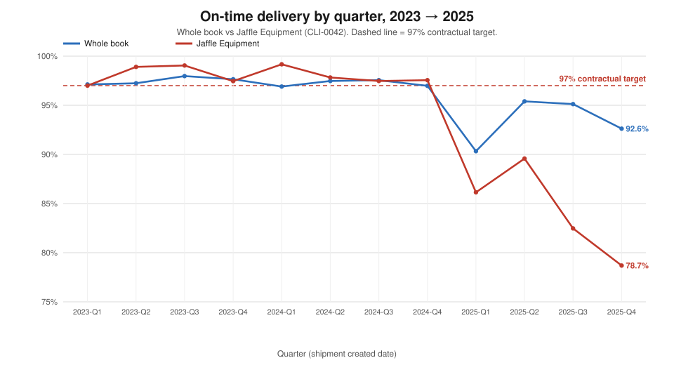
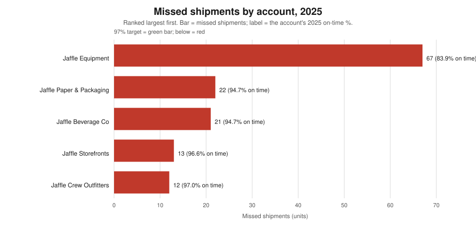
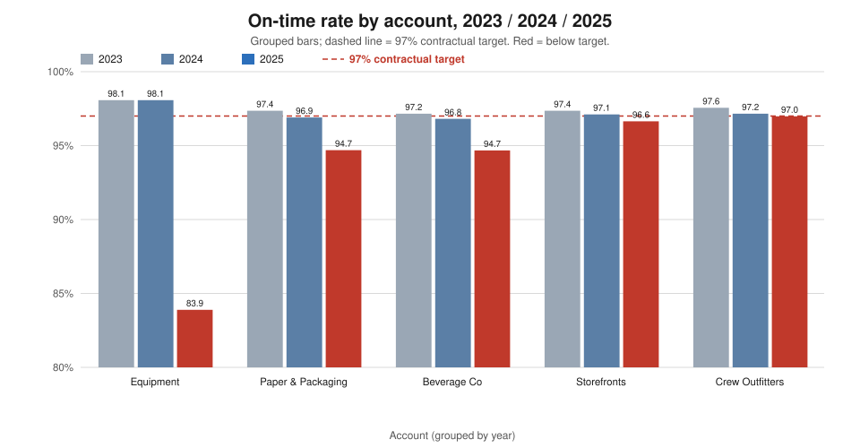
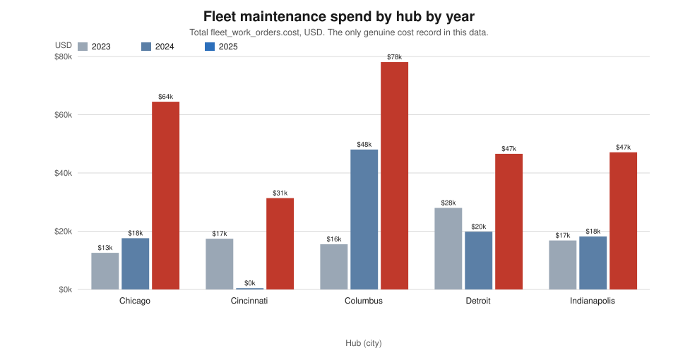
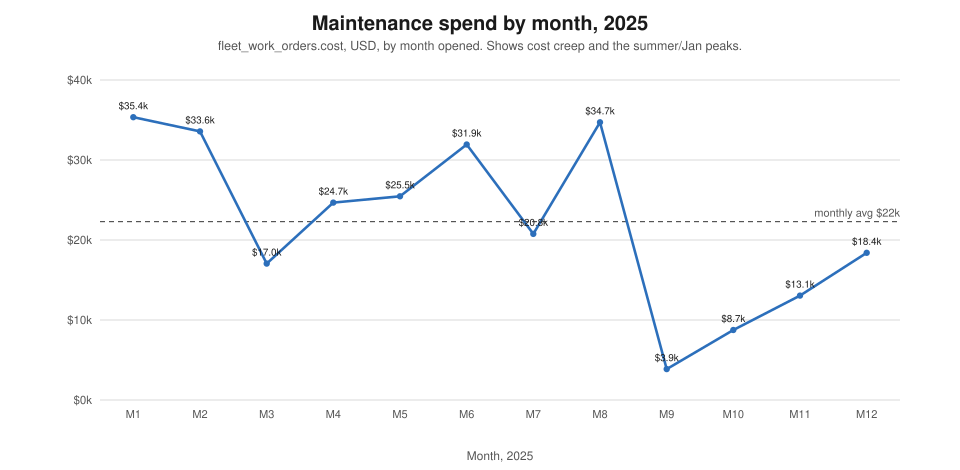
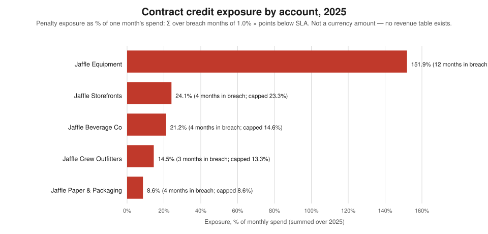
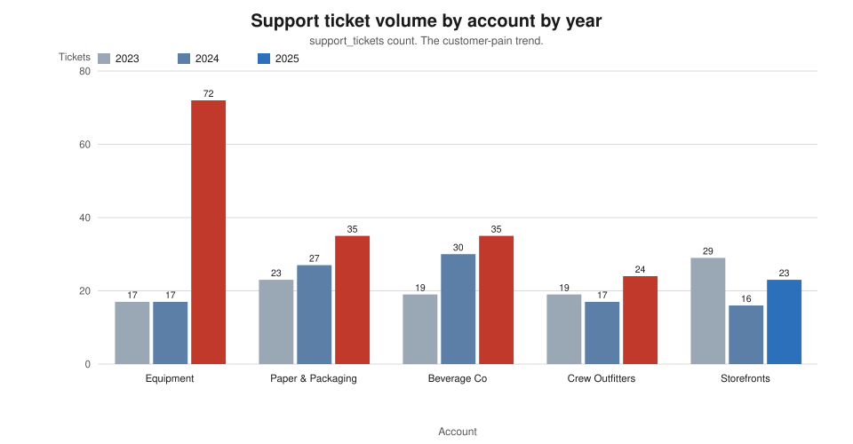
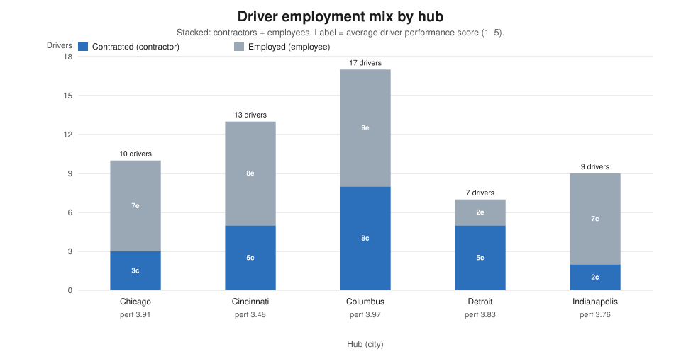

# CFO arrival briefing — the state of Jaffle Logistics

**To:** the incoming Chief Financial Officer, end of week one
**From:** analysis desk (Bruno)
**Data present:** operating history through **2025-12-31**; 2023 and 2024 are the quiet comparison years.
**Source:** every figure below comes from a query run through the dbt Platform remote MCP
(`execute_sql`) against `hive_metastore.dbt_smcintyre_jaffle_logistics_prod`. The SQL is in §8.
On-time means `status = 'delivered'`; `delayed`, `failed` and `returned` are misses.

---

## 1. The state of the business in five bullets

- **Healthy:** the business *can* hit its 97% service target — it did for two full years (2023 = 97.51%,
  2024 = 97.21% on 2,009 shipments each), and two accounts (Crew Outfitters, Storefronts) are still
  within a point of their quiet-year levels.
- **Not healthy:** 2025 missed **135 shipments of 2,009 (93.28%)**, against 50 (2023) and 56 (2024).
  That is **79 extra misses**, and **67 of them — 85% of the deterioration — sit in one account,
  Jaffle Equipment (`CLI-0042`)**, which fell from 98.07% in both quiet years to **83.89%**.
- **What it is costing:** the only true cost record in this data — fleet maintenance
  (`fleet_work_orders.cost`) — **more than doubled, from $104k (2024) to $268k (2025)**, with the
  Columbus hub alone at $78k. There is no expense ledger, no payroll and no revenue table to put
  against it.
- **What is exposed:** on the contract credit terms, the 2025 service misses imply a penalty exposure
  of **152% of one month's spend for Jaffle Equipment** (contract-capped to ~102%) and single digits
  to ~24% for the other four accounts. This is a **percentage of spend, not a currency amount** —
  there is no revenue table, and I have not invented one.
- **What is unknown:** there is **no revenue or cost ledger by account**, no payroll, no promised-
  delivery date, and — because routes serve several clients at once — **cost cannot be attributed to
  an account at all**. The 2025 decline can be *measured* here but not *priced* here.

---

## 2. Where we are performing well

The reference point is the quiet years, not last quarter.

- **The whole book ran at ~97.5% / ~97.2% on time through 2023 and 2024** — 50 and 56 misses on 2,009
  shipments. The target is reachable; 2025 is the outlier, not the norm.
- **Two accounts held their line.** Jaffle Crew Outfitters fell only 0.58 points over three years
  (97.56% → 96.98%) and Jaffle Storefronts 0.72 points (97.36% → 96.64%). Their 2025 miss counts
  (12 and 13) are barely above their quiet-year counts (10 and 10).
- **Expedited service is the strongest service level**: 96.60% on time across 470 shipments in 2025,
  against 95.37% for standard. Expedited volume grew without a service collapse.
- **Cincinnati is the least-stressed hub** on cost: its 2025 maintenance of $31k is the lowest of the
  five hubs and its cost per route ($44) is less than half Columbus's ($110).

**One sentence on the chart below:** the whole book (blue) and Jaffle Equipment (red) track each other
at ~97–98% for eight quarters, then both break in 2025 — and Equipment never recovers, ending the year
at 78.7%.



---

## 3. Where we are not

### 3.1 The deterioration, decomposed

**By account (2025):** the misses are not spread evenly.

| Account (`client_id`) | 2025 shipments | 2025 missed | 2025 on-time | 2023 on-time | 2024 on-time |
|---|---:|---:|---:|---:|---:|
| Jaffle Equipment (`CLI-0042`) | 416 | **67** | **83.89%** | 98.07% | 98.07% |
| Jaffle Paper & Packaging (`CLI-0201`) | 414 | 22 | 94.69% | 97.36% | 96.90% |
| Jaffle Beverage Co (`CLI-0169`) | 394 | 21 | 94.67% | 97.16% | 96.81% |
| Jaffle Storefronts (`CLI-0007`) | 387 | 13 | 96.64% | 97.36% | 97.11% |
| Jaffle Crew Outfitters (`CLI-0155`) | 398 | 12 | 96.98% | 97.56% | 97.16% |
| **Total** | **2,009** | **135** | **93.28%** | **97.51%** | **97.21%** |

*The misses reconcile: 67 + 22 + 21 + 13 + 12 = **135**, the whole-book 2025 total.*

**By hub (2025):** Chicago is where the loss lands physically.

| Hub (city) | 2025 shipments | 2025 missed | 2025 on-time |
|---|---:|---:|---:|
| Chicago (`HUB-CHI`) | 412 | **48** | **88.35%** |
| Indianapolis (`HUB-IND`) | 425 | 28 | 93.41% |
| Detroit (`HUB-DET`) | 427 | 27 | 93.68% |
| Cincinnati (`HUB-CIN`) | 398 | 16 | 95.98% |
| Columbus (`HUB-CMH`) | 347 | 16 | 95.39% |
| **Total** | **2,009** | **135** | **93.28%** |

*Reconciles: 48 + 28 + 27 + 16 + 16 = **135**.*

**By service level (2025):** `freight` is 416 shipments at 83.89% — *the same 416 shipments as Jaffle
Equipment*. In this corpus `freight` and Jaffle Equipment are the same set, so "freight" is a
relabelling of the account, **not** an independent driver. Standard = 1,123 shipments at 95.37%;
expedited = 470 at 96.60%.

**One sentence on the charts below:** the loss concentrates in one account (Equipment, 67 of 135
misses) and its three-year bars show a collapse from 98.1% to 83.9% while the other four accounts sag
only 2–3 points; the grouped bars make the outlier obvious.





### 3.2 Operational efficiency — one hub is out of line

Routes, stops and exceptions per hub, 2025:

| Hub | Routes | Stops | Exceptions | **Exceptions / route** | Routes / driver |
|---|---:|---:|---:|---:|---:|
| Chicago | 748 | 30,427 | 931 | **1.24** | 83.1 (9 drivers) |
| Cincinnati | 712 | 30,523 | 352 | 0.49 | 59.3 (12 drivers) |
| Columbus | 709 | 29,213 | 369 | 0.52 | 47.3 (15 drivers) |
| Detroit | 741 | 30,752 | 382 | 0.52 | **123.5 (6 drivers)** |
| Indianapolis | 719 | 29,787 | 387 | 0.54 | 89.9 (8 drivers) |

**Chicago's exception rate (1.24 per route) is 2.4× every other hub**, and it rose from 0.68 in 2024
and 0.73 in 2023 — the same hub that carries 48 of the year's 135 misses. **Detroit runs 123.5
routes per driver on only 6 drivers**, more than double Columbus's 47.3 — a coverage/overload signal,
not a cost signal. Vehicle counts are Chicago 10, Cincinnati 7, Columbus 11, Detroit 6, Indianapolis
10; odometer spread within each hub is wide (e.g. Columbus 8,850–239,941), so the fleet is a mix of
new and high-mileage units.

### 3.3 Risk and safety

Incidents rose every year: **100 (2023) → 110 (2024) → 174 (2025)**. The move is concentrated in
**damage**: 7 → 8 → **40**, of which **14 in 2025 are severity 3–4** (0 and 0 in the quiet years).
Columbus carries **15 of the 2025 damage incidents** (Detroit 9, Cincinnati 8, Indianapolis 5, Chicago
3). **This is a worsening pattern, and the severity mix is worsening with it.** *(Caveat: the Columbus
handling-damage cluster was forensically examined in a separate report, `columbus-damage-forensics.md`
— the causal claim there rests on a small number of incident reports, so treat "why Columbus" as
narratively supported, not statistically proven.)*

---

## 4. Where the money goes

**The only genuine cost record in this data is fleet maintenance (`fleet_work_orders.cost`).**
Everything else in this section is a *people signal*, not a cost.

**Maintenance by hub by year (USD):**

| Hub | 2023 | 2024 | 2025 | 2025 per route | 2025 per 1,000 shipments |
|---|---:|---:|---:|---:|---:|
| Chicago | 12,576 | 17,588 | 64,456 | $86 | $156k |
| Cincinnati | 17,423 | 437 | 31,362 | $44 | $79k |
| Columbus | 15,538 | 48,044 | 78,083 | $110 | $225k |
| Detroit | 27,990 | 19,829 | 46,581 | $63 | $109k |
| Indianapolis | 16,828 | 18,203 | 47,096 | $66 | $111k |
| **Total** | **90,355** | **104,101** | **267,578** | | |

Maintenance **rose 157% year on year** and work orders doubled (41 → 81). **Columbus is the most
expensive hub per unit of work** ($110 per route, $225k per 1,000 shipments); Chicago's cost per
shipment is also well above its peers and it jumped 3.7× in one year.

**Maintenance by month, 2025:** spend is seasonal and creeping — two peaks (Jan $35k, Aug $35k) and a
collapsed autumn (Sep $3.9k, Oct $8.7k), against a monthly average of $22k. The month pattern
suggests planned peaks rather than a steady drift, but with only one year of monthly detail it is a
**proxy for cost behaviour, not proof of a trend**.

**People signals.** 56 drivers on the books (23 contractors, avg performance 3.93; 33 employees, avg
3.70). Chicago and Detroit run contractor-heavy crews and carry the highest and third-highest miss
loads; Cincinnati and Detroit have the lowest average driver scores (3.48 and 3.83). 133 HR documents
exist (56 onboarding, 30 review, 20 certification, 15 training, 11 disciplinary, 1 exit) — enough to
show a disciplined onboarding process, but with **no wages, hours or rates attached**.

**What is plainly not in this data:** there is **no expense ledger, no payroll table, no revenue
table, no promised-delivery date, and no customer-contract value**. I cannot state a profit, a margin,
a cost-per-shipment in true terms, or the dollar cost of the 2025 decline. Any dollar figure for the
service failure would be fabricated, and I have not produced one.

**One sentence on the charts below:** maintenance more than doubled in 2025 across every hub (Columbus
and Chicago worst), and the monthly line shows the Jan and Aug peaks against a $22k average.





---

## 5. Financial exposure — the contract credit calculation

**What the contracts say.** Each account's standing contract (`contracts.credit_terms`) reads:

> *"1.0% of monthly spend credited per full percentage point below the SLA on-time target, capped at
> 10% of monthly spend."*

and each carries a committed service level (`contracts.sla_ontime_pct`). The standing (latest
effective) targets are:

| Account | Contract | SLA target |
|---|---|---:|
| Jaffle Equipment (`CLI-0042`) | `CON-0042-02` (eff. 2025-05-12) | 97.0% |
| Jaffle Storefronts (`CLI-0007`) | `CON-0007-01` (eff. 2022-04-16) | 97.0% |
| Jaffle Crew Outfitters (`CLI-0155`) | `CON-0155-01` (eff. 2023-07-28) | 95.0% |
| Jaffle Beverage Co (`CLI-0169`) | `CON-0169-01` (eff. 2024-06-24) | 95.0% |
| Jaffle Paper & Packaging (`CLI-0201`) | `CON-0201-01` (eff. 2024-06-14) | 92.0% |

**The formula, and its inputs.** For each account and each month of 2025 I computed the points by
which the month's on-time rate fell below the account's SLA, then:

```
exposure% = Σ over the 12 months of 2025 of  [ credit_rate × max(0, SLA_target − on_time%_month) ]
          = 1.0% × (mean points below, over breach months) × (months in breach)
capped figure = Σ over months of  min( credit_rate × max(0, points below), 10% )
```

`credit_rate = 1.0%` (from the contract text). `points below` is per month, from the monthly on-time
series in §8 (query Q8). The 10% cap is per month.

**Ranking (2025):**

| Rank | Account | Months in breach | Uncapped exposure (% of one month's spend) | Contract-capped |
|---:|---|---:|---:|---:|
| 1 | **Jaffle Equipment (`CLI-0042`)** | 12 / 12 | **151.9%** | 101.9% |
| 2 | Jaffle Storefronts (`CLI-0007`) | 4 / 12 | 24.1% | 23.3% |
| 3 | Jaffle Beverage Co (`CLI-0169`) | 4 / 12 | 21.2% | 14.6% |
| 4 | Jaffle Crew Outfitters (`CLI-0155`) | 3 / 12 | 14.5% | 13.3% |
| 5 | Jaffle Paper & Packaging (`CLI-0201`) | 4 / 12 | 8.6% | 8.6% |

**Read this carefully.**

- **This is a percentage of spend, not a currency amount.** There is no revenue table; a dollar figure
  cannot be derived and has not been invented.
- **Jaffle Equipment is exposed every single month of 2025** and its uncapped exposure (152% of a
  month's spend) exceeds a full year of capped credit (12 × 10% = 120%). The contract's 10%-per-month
  cap therefore binds hard for Equipment — its realistic, contract-bounded exposure is ~102% of one
  month's spend, still an order of magnitude above any other account.
- **The exposure assumes roughly level monthly spend.** Without a revenue table I cannot weight months
  by their true spend; this is a **proxy**, stated as one.
- **The formula is sensitive to the SLA in force.** Equipment's target was 95.5% until the 2025-05-12
  amendment lifted it to 97.0%; on the older 95.5% target its breach is smaller but still dominant.

**One sentence on the chart below:** exposure is a one-account problem — Jaffle Equipment's bar is more
than six times the next account's, and it is the only account that is in breach all twelve months.



---

## 6. Concentration and structural risk

- **Volume is near-equal by design, so the data cannot show true concentration.** In 2025 the five
  accounts each carry 19–21% of shipments (Equipment 416, Paper 414, Crew 398, Beverage 394,
  Storefronts 387) and the five hubs each 17–21% (Detroit 427, Indianapolis 425, Chicago 412,
  Cincinnati 398, Columbus 347). This evenness is a **simulation artefact, not a real diversification
  story** — the year-over-year volumes are identical (2,009 shipments every year). I therefore cannot
  tell the CFO how concentrated the *real* book is, and I will not dress up the flat split as health.
- **What the data *does* show is single-account and single-hub exposure in the loss.** One account
  (Equipment) and one hub (Chicago) carry 85% and 36% of the 2025 deterioration respectively. That is
  the concentration that matters, and it is real within this corpus.
- **Cost cannot be attributed to an account.** **721 of the 3,566 routes serve more than one client**
  (603 serve two, 106 serve three, 12 serve four). Because a single route's cost and exception load
  are shared across clients, no per-account P&L is possible from this data — a structural gap, not a
  query I failed to write.
- **Detroit's staffing is a structural risk:** 741 routes on 6 drivers (123.5 routes/driver) is thin
  cover; one absence is a material share of the hub's capacity.

**One sentence on the charts below:** ticket volume is flat across 2023–2024 and then jumps for Jaffle
Equipment alone (17 → 17 → 72), and the driver mix shows contractor-heavy Chicago and Detroit
alongside the lowest average driver scores at Cincinnati.





---

## 7. What I would demand in my first 90 days

Each item names the gap and the decision it blocks. None of these is a nice-to-have; each one is
standing between this company and a number the CFO can defend.

1. **A revenue and cost ledger, by account and by month.** *Blocks:* every margin, profitability and
   pricing decision, and any true valuation of the 2025 service failure. Without it the contract-credit
   exposure in §5 stays a percentage instead of a dollar figure.
2. **Per-account route and cost attribution.** Routes currently serve up to four clients, so maintenance
   and exception cost cannot be assigned to the account that caused it. *Blocks:* knowing whether
   Jaffle Equipment is profitable at all, and whether its 152% credit exposure is worth absorbing or
   renegotiating.
3. **A promised-delivery date (or an SLA clock) on every shipment.** On-time here is a status flag, not
   a date comparison; there is no way to measure *how* late. *Blocks:* quantifying the customer's real
   pain, prioritising recovery, and defending the 97% figure.
4. **The missing operational feed that flags a decline before the customer calls.** The 2025 collapse
   was visible in the customer's tickets (Equipment tickets 17 → 72) only after the fact. *Blocks:*
   any proactive account-management motion — today we learn about a problem from the complaint, not
   the signal.
5. **Payroll and headcount-cost data.** Driver employment type and 133 HR documents exist, but no wages,
   hours or rates. *Blocks:* any cost-per-route or labour-productivity analysis — the largest cost
   line in a logistics business is invisible.
6. **True volume and concentration figures (or a statement that they are synthetic).** Volumes are
   identical every year in this dataset. *Blocks:* customer- and hub-concentration risk assessment,
   and any credibility in a diversification claim.
7. **Incident severity detail and bay-level records for the Columbus damage cluster.** 40 damage
   incidents in 2025 (14 at severity 3–4) against 7–8 in the quiet years, 15 at one hub — but the
   causal story rests on a handful of reports. *Blocks:* a defensible root-cause claim and any
   capital decision to fix the hub.

---

## 8. Appendix: the queries

All queries were run through the dbt Platform remote MCP `execute_sql` tool. `P` below stands for
`hive_metastore.dbt_smcintyre_jaffle_logistics_prod`. The semantic layer (`list_metrics`) exposes only
four delivered-side metrics (`on_time_rate`, `on_time_shipments`, `shipments`,
`on_time_rate_change_vs_prior_quarter_pts`); it cannot produce miss counts, hub cuts or the exposure
arithmetic, so the work is `execute_sql`.

```sql
-- Q1  schema discovery
SHOW TABLES IN hive_metastore.dbt_smcintyre_jaffle_logistics_prod;

-- Q2  contracts (SLA targets and credit terms)
SELECT * FROM P.contracts ORDER BY client_id, effective_date;

-- Q3  clients
SELECT client_id, name, tier, line_of_business, region, health FROM P.clients ORDER BY client_id;

-- Q4  whole-book on-time by year
SELECT year(created_at) AS yr, count(*) AS n,
       sum(CASE WHEN status='delivered' THEN 1 ELSE 0 END) AS delivered,
       sum(CASE WHEN status<>'delivered' THEN 1 ELSE 0 END) AS missed
FROM P.shipments GROUP BY 1 ORDER BY 1;

-- Q5  status mix
SELECT status, count(*) AS n FROM P.shipments GROUP BY 1 ORDER BY 2 DESC;

-- Q6  on-time and misses by account by year
SELECT c.name, year(s.created_at) AS yr, count(*) AS n,
       sum(CASE WHEN s.status='delivered' THEN 1 ELSE 0 END) AS delivered,
       sum(CASE WHEN s.status<>'delivered' THEN 1 ELSE 0 END) AS missed,
       round(100.0*sum(CASE WHEN s.status='delivered' THEN 1 ELSE 0 END)/count(*),2) AS ontime_pct
FROM P.shipments s JOIN P.clients c ON c.client_id=s.client_id
GROUP BY 1,2 ORDER BY 1,2;

-- Q7  quarterly whole-book + Jaffle Equipment (CLI-0042)
SELECT concat(cast(year(created_at) AS string),'-Q',cast(quarter(created_at) AS string)) AS q,
       count(*) AS n,
       round(100.0*sum(CASE WHEN status='delivered' THEN 1 ELSE 0 END)/count(*),2) AS overall_pct,
       round(100.0*sum(CASE WHEN status='delivered' AND client_id='CLI-0042' THEN 1 ELSE 0 END)
             /nullif(sum(CASE WHEN client_id='CLI-0042' THEN 1 ELSE 0 END),0),2) AS equip_pct
FROM P.shipments GROUP BY 1 ORDER BY 1;

-- Q8  monthly on-time by client, 2025 (input to the exposure calculation)
SELECT client_id, month(created_at) AS m, count(*) AS n,
       round(100.0*sum(CASE WHEN status='delivered' THEN 1 ELSE 0 END)/count(*),2) AS ontime_pct
FROM P.shipments WHERE year(created_at)=2025 GROUP BY 1,2 ORDER BY 1,2;

-- Q9  fleet maintenance by hub by year
SELECT h.city, year(wo.opened_at) AS yr, count(*) AS wo_n, sum(wo.cost) AS total_cost
FROM P.fleet_work_orders wo LEFT JOIN P.hubs h ON h.hub_id=wo.hub_id
GROUP BY 1,2 ORDER BY 1,2;

-- Q10 maintenance by month, 2025
SELECT month(opened_at) AS m, count(*) AS n, sum(cost) AS cost
FROM P.fleet_work_orders WHERE year(opened_at)=2025 GROUP BY 1 ORDER BY 1;

-- Q11 support tickets by account by year
SELECT c.name, year(t.opened_at) AS yr, count(*) AS n
FROM P.support_tickets t JOIN P.clients c ON c.client_id=t.client_id
GROUP BY 1,2 ORDER BY 1,2;

-- Q12 driver employment mix by hub (with average performance)
SELECT h.city, d.employment_type, count(*) AS n, round(avg(d.perf_score),2) AS avg_perf
FROM P.drivers d JOIN P.hubs h ON h.hub_id=d.hub_id GROUP BY 1,2 ORDER BY 1,2;

-- Q13 incidents by year, type, severity
SELECT year(occurred_at) AS yr, type, severity, count(*) AS n
FROM P.incidents GROUP BY 1,2,3 ORDER BY 1,2,3;

-- Q14 routes, stops and exceptions by hub by year
SELECT h.city, year(r.service_date) AS yr, count(*) AS routes,
       sum(r.stop_count) AS stops, sum(r.exceptions_count) AS exceptions
FROM P.routes r JOIN P.hubs h ON h.hub_id=r.hub_id GROUP BY 1,2 ORDER BY 1,2;

-- Q15 shipments by hub by year
SELECT h.city, year(s.created_at) AS yr, count(*) AS n,
       round(100.0*sum(CASE WHEN s.status='delivered' THEN 1 ELSE 0 END)/count(*),2) AS pct
FROM P.shipments s JOIN P.hubs h ON h.hub_id=s.origin_hub_id GROUP BY 1,2 ORDER BY 1,2;

-- Q16 vehicles per hub and odometer spread
SELECT h.city, count(*) AS vehicles, min(v.odometer) AS min_odo, max(v.odometer) AS max_odo,
       round(avg(v.odometer),0) AS avg_odo
FROM P.vehicles v JOIN P.hubs h ON h.hub_id=v.hub_id GROUP BY 1 ORDER BY 1;

-- Q17 routes per driver, 2025
SELECT h.city, count(DISTINCT r.driver_id) AS drivers, count(*) AS routes,
       round(count(*)*1.0/count(DISTINCT r.driver_id),1) AS routes_per_driver
FROM P.routes r JOIN P.hubs h ON h.hub_id=r.hub_id
WHERE year(r.service_date)=2025 GROUP BY 1 ORDER BY 1;

-- Q18 service-level mix, 2025
SELECT service_level, count(*) AS n,
       round(100.0*sum(CASE WHEN status='delivered' THEN 1 ELSE 0 END)/count(*),2) AS pct
FROM P.shipments WHERE year(created_at)=2025 GROUP BY 1 ORDER BY 1;

-- Q19 2025 damage incidents by hub
SELECT h.city, count(*) AS damage_incidents
FROM P.incidents i JOIN P.hubs h ON h.hub_id=i.hub_id
WHERE year(i.occurred_at)=2025 AND i.type='damage' GROUP BY 1 ORDER BY 2 DESC;

-- Q20 routes serving more than one client (cost-attribution gap)
SELECT multi_client_routes, count(*) AS n FROM (
  SELECT route_id, count(DISTINCT client_id) AS multi_client_routes
  FROM P.shipments WHERE route_id IS NOT NULL GROUP BY 1) GROUP BY 1 ORDER BY 1;

-- Q21 driver mix overall
SELECT employment_type, count(*) AS n, round(avg(perf_score),2) AS avg_perf,
       min(hire_date) AS earliest, max(hire_date) AS latest
FROM P.drivers GROUP BY 1 ORDER BY 1;

-- Q22 maintenance totals by year
SELECT year(opened_at) AS yr, count(*) AS wo_n, sum(cost) AS total_cost
FROM P.fleet_work_orders GROUP BY 1 ORDER BY 1;

-- Q23 HR document types
SELECT doc_type, count(*) AS n FROM P.hr_docs GROUP BY 1 ORDER BY 2 DESC;
```

**Chart generation.** The eight figures are produced by `scripts/cfo_charts.py` — plain-text SVG built
in Python from the numbers above, no charting library. Re-run it to regenerate
`reports/assets/cfo/*.svg`.
