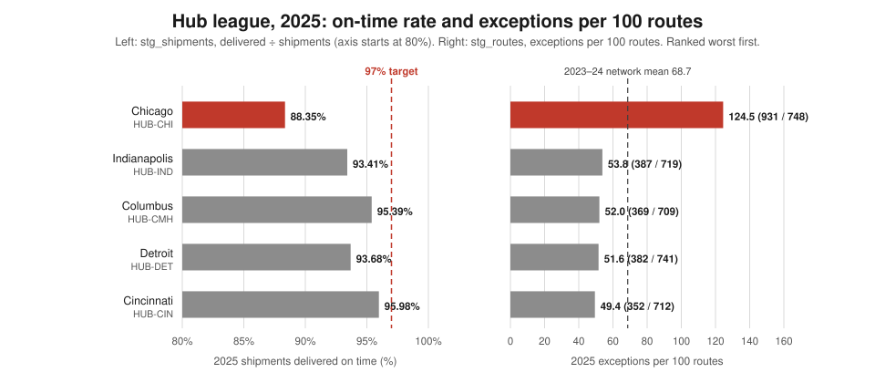
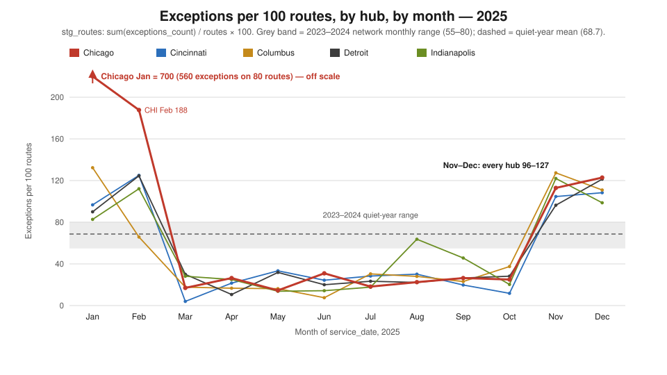
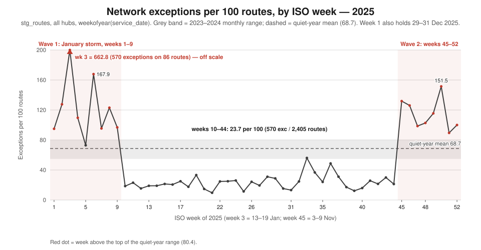
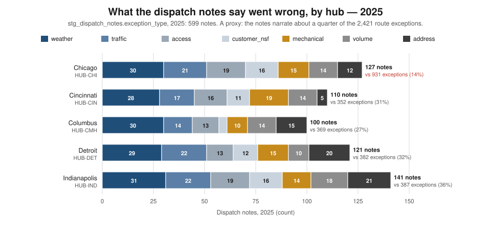
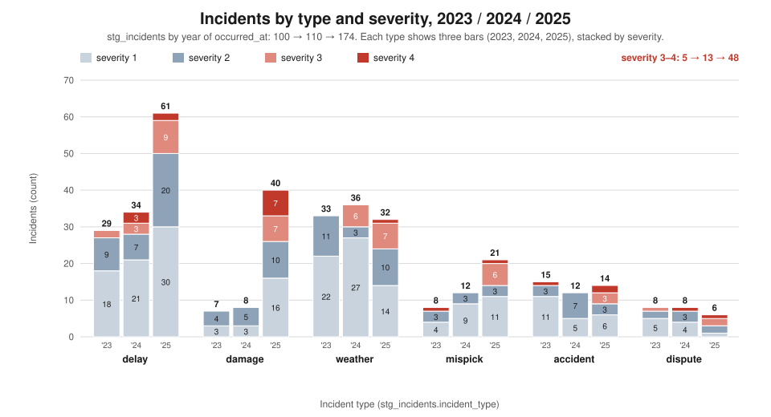
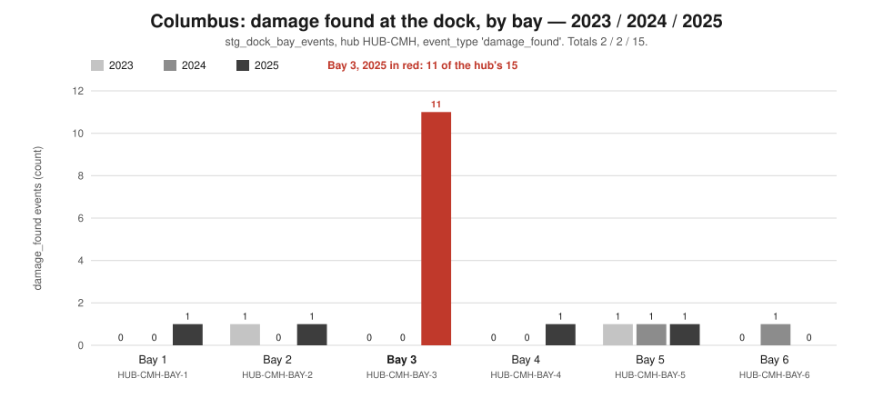
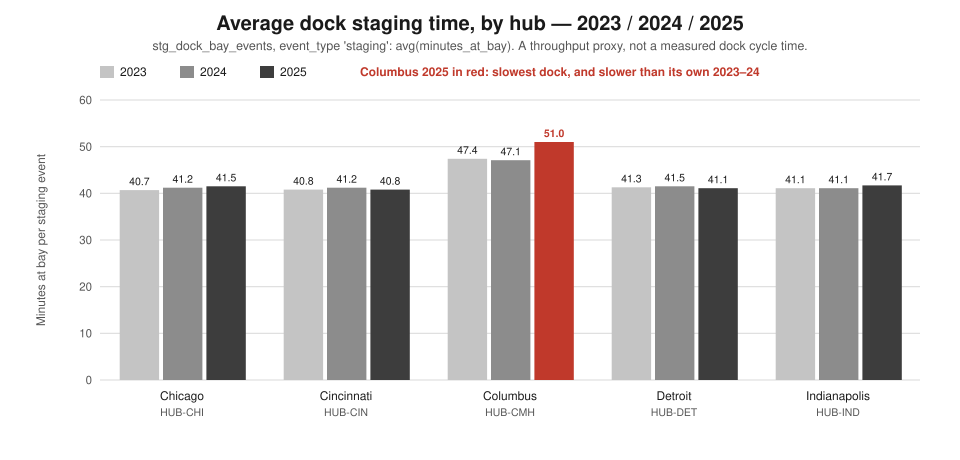
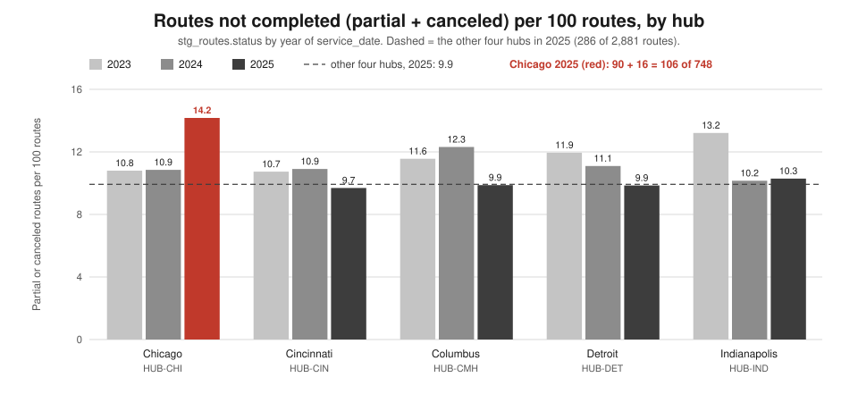

# COO — is the operation under control this week?

*Persona report for the Chief Operating Officer. Jaffle Logistics, 2025 review. Every figure comes from
`execute_sql` queries run through the dbt Platform remote MCP against
`hive_metastore.dbt_smcintyre_jaffle_logistics_prod` (data pack dated 2026-10-10; the data runs to
2025-12-31). The SQL for each figure is in the appendix, labelled Q1–Q23. Where a number below is
arithmetic on the query output (a ratio, a share, a difference), the calculation is shown. Charts are
generated by `scripts/persona_coo_charts.py` from the same figures.*

**Verdict: no. At the end of 2025 the operation was not under control, and most of the problem is
network-wide rather than one hub's.** Chicago's bad year is mostly one January storm. The thing that
should worry this seat is November: from ISO week 45 the network ran far above its normal exception
rate every week through year-end, and every hub was above it in both November and December. On-time fell below the 97% target at all five hubs. Columbus has a separate
dock problem, and it is concentrated in one bay.

> **Numbers that have moved since earlier reports.** The shipment history was expanded after the
> [CFO arrival briefing](cfo-arrival-briefing.md) was written. That briefing says 2023 and 2024 each held
> "2,009 shipments". The current counts are **1,848 (2023), 1,949 (2024) and 2,009 (2025)**, and this
> report uses them. As a result, quiet-year misses are now **46 and 54**, not 50 and 56. 2024 on-time is
> **97.23%**, not 97.21%. The 2025 deterioration is **81** extra misses, not 79. Route history moved as
> well. The CFO briefing gives Chicago 0.73 (2023) and 0.68 (2024) exceptions per route; current figures
> are 0.79 and 0.71. The [Columbus damage forensics](columbus-damage-forensics.md) report gives Columbus
> 712 and 684 routes for 2023 and 2024; the current figure is 666 in both years. The 2025 figures did not
> change. The forensics report also said bay-level data did not exist. It now does
> (`stg_dock_bay_events`), and §3.5 uses it.

---

## 1. The two-minute read

- **What is fine.** Between the two bad stretches the network ran better than it ever had. In ISO weeks
  10–44 (3 March to early November 2025) it recorded **23.7 exceptions per 100 routes** (570 on 2,405
  routes), against a 2023–2024 norm of about 69, provided the way exceptions were counted held steady
  (§4). Excluding January, Chicago ran at **55.5**, in line with the other four hubs' 51.7.
- **What is not.** From week 45 (w/c 3 Nov 2025) to year-end, **the network ran above the quiet-year
  range every week, and every hub did in both months**: 113.6 per 100 routes (660 exceptions on 581
  routes). On-time fell at all five hubs, to
  93.28% for the whole book. Misses rose from 54 to **135**, and **46 of the 81 extra misses were outside
  Chicago**. At Columbus, **11 of the hub's 15 dock damage events were at one bay, BAY-3**.
- **What it costs.** The cost shows up as lost capacity; the data has no dollar cost of an exception.
  669 routes (18.4 per 100) carried at least one exception, and **392 routes ended partial or canceled**.
  Chicago had 106 of them, 14.2 per 100 against 9.9 at the other hubs, or about 32 more than its share.
  The only dollar record is fleet maintenance. The CFO briefing shows it more than doubled, from $104,101
  to $267,578.
- **What is exposed.** Chicago in winter. One storm week (week 3, 13–19 Jan) produced **570 exceptions,
  23.5% of the year's**, and Chicago's January on-time was 56.60%. The next winter is weeks away.
  Incident severity is also exposed: severity 3–4 incidents rose **5 → 13 → 48**.
- **What we do not know.** We do not know what changed in week 45. We also do not know whether the way
  exceptions are counted changed in March and November, since every hub moved in the same month (see §4).
  The data cannot say what time of day exceptions happen, or what a repeat visit costs.

---

## 2. What this seat owns

The Chief Operating Officer owns delivery execution: hub performance, route reliability, dock and
linehaul throughput, rework, and the operational cost of failure. For this seat, "under control" means
three things. Exception rates stay inside the band the network has shown it can hold. When a rate leaves
that band, the cause can be named. And the remedy fits the cause, so a fix aimed at one hub is not
applied to a network-wide problem. This report therefore treats every hub problem the same way the
Columbus forensics report treated damage: first ask whether it is the place or everywhere, and normalise
by exposure (per 100 routes) so a busy hub is not called bad simply for being busy.

---

## 3. Findings

### 3.1 The network in one table: Chicago is the outlier, but only on its annual figures

Ranked by 2025 exceptions per 100 routes, worst first (Q2, Q3):

| Hub | Routes 2023 / 2024 / 2025 | Exceptions per 100 routes 2023 / 2024 / 2025 | On-time 2023 / 2024 / 2025 | 2025 misses |
|---|---|---|---|---|
| **Chicago `HUB-CHI`** | 676 / 691 / 748 | 78.70 / 71.06 / **124.47** | 96.48% / 96.90% / **88.35%** | **48** of 412 |
| Indianapolis `HUB-IND` | 666 / 719 / 719 | 69.52 / 71.35 / 53.82 | 98.45% / 98.66% / 93.41% | 28 of 425 |
| Columbus `HUB-CMH` | 666 / 666 / 709 | 58.11 / 65.17 / 52.05 | 97.91% / 95.93% / 95.39% | 16 of 347 |
| Detroit `HUB-DET` | 678 / 730 / 741 | 68.88 / 63.70 / 51.55 | 95.48% / 98.09% / 93.68% | 27 of 427 |
| Cincinnati `HUB-CIN` | 652 / 715 / 712 | 66.56 / 72.31 / 49.44 | 98.94% / 96.73% / 95.98% | 16 of 398 |
| **Network** | 3,338 / 3,521 / 3,629 | 68.39 / 68.73 / 66.71 | 97.51% / 97.23% / 93.28% | **135** of 2,009 |

*Reconciliation, 2025.* Routes: 748 + 712 + 709 + 741 + 719 = **3,629**. Exceptions: 931 + 352 + 369 +
382 + 387 = **2,421**. Shipments: 412 + 398 + 347 + 427 + 425 = **2,009**. Misses: 48 + 16 + 16 + 27 + 28
= **135** = 2,009 − 1,874 delivered. Late buckets (Q20) give the same total: 72 more than two days late,
35 one to two days late, 2 four to twelve hours late, and 26 with no lateness recorded. 72 + 35 + 2 + 26 =
135, so **more than half the misses (72) were over two days late**.

Chicago ran 20.6% of 2025 routes (748 / 3,629) but recorded **38.5% of the network's exceptions** (931 /
2,421). Its rate was about 2.3–2.5× each of the other four hubs, and its on-time rate was 5 to 8 points
below theirs. That much matches the CFO briefing. The annual table hides two things, and §3.2–3.3 show
both:

- The network's 2025 annual rate of **66.71** is *lower* than 2023 (68.39) and 2024 (68.73). The year
  as a whole did not produce more exceptions. The difference is in when they happened.
- **None of the five hubs met the 97% on-time target in 2025.** In 2024, Detroit (98.09%) and
  Indianapolis (98.66%) beat it. Excluding Chicago, misses went from 41 (2024: 13 + 16 + 7 + 5) to 87
  (2025: 16 + 16 + 27 + 28). The 81 extra misses split as Chicago +35, Detroit +20, Indianapolis +23,
  Cincinnati +3, Columbus 0 (35 + 20 + 23 + 3 + 0 = 81). Chicago accounts for 43% of the deterioration,
  and **the other four hubs account for 57%**.



*What this says: Chicago is the worst hub on both measures in 2025, but every hub's on-time bar stops
short of the 97% line, so the miss problem is not Chicago's alone.*

### 3.2 The trend that matters: two waves, and the second hit every hub at once

**Monthly, by hub (Q4), against the 2023–2024 band (Q5).** In 2023 and 2024 the network stayed between
**54.80 and 80.43** exceptions per 100 routes in every one of 24 months, with a mean of 68.7. There was
no seasonal peak: November was 76.21 in 2023 and 57.39 in 2024. In 2025 every hub followed the same
three-stage pattern:

| 2025 stretch | Chicago | Cincinnati | Columbus | Detroit | Indianapolis |
|---|---|---|---|---|---|
| Jan | **700.00** | 96.67 | 132.31 | 90.00 | 82.76 |
| Feb | 187.72 | 125.00 | 65.79 | 124.53 | 112.12 |
| Mar–Oct, monthly range | 14.55–30.91 | 4.00–33.33 | 7.55–37.50 | 10.61–31.82 | 13.73–63.64 |
| Nov | 112.90 | 104.69 | 127.42 | 96.36 | 122.00 |
| Dec | 122.86 | 108.33 | 110.94 | 121.31 | 98.67 |



*What this says: the January storm was Chicago's (700 per 100 routes, or 560 exceptions on 80 routes).
In November and December, by contrast, all five hubs rose above the quiet-year band together.*

**Weekly, network (Q6). This is the week-over-week view.**

| ISO weeks, 2025 | Routes | Exceptions | Per 100 routes |
|---|---|---|---|
| 1–9 (January storm and February) | 643 | 1,191 | **185.2** |
| 10–44 (3 Mar to early Nov) | 2,405 | 570 | **23.7** |
| 45–52 (w/c 3 Nov to 28 Dec) | 581 | 660 | **113.6** |
| **All** | **3,629** | **2,421** | **66.7** |

*Reconciliation:* 643 + 2,405 + 581 = 3,629 routes, and 1,191 + 570 + 660 = 2,421 exceptions. Week 3
(13–19 Jan) alone recorded **570 exceptions on 86 routes (662.8 per 100)**, which is 23.5% of the year
in one week. All eight weeks from 45 to 52 ran between 89.5 and 151.5, against a quiet-year range that
tops out at 80.4. Week 50 was the worst of them (151.5). *Caveat on the query:* `weekofyear()` is the ISO
week, so routes from 29–31 Dec 2025 fall into week 1 (ISO week 1 of 2026). Week 1's 99 routes therefore
include three late-December days.



*What this says: 2025 had two waves above the quiet-year line, a January storm and an eight-week surge
from early November. Between them the network ran at about a third of its normal rate.*

### 3.3 Is it one hub or all of them? Mostly all of them, with two exceptions

Each "hub problem" was tested against the other hubs over the same months:

- **Chicago's slide is mostly the storm.** January accounts for 560 of Chicago's 931 exceptions (60%).
  The rest of Chicago's year is 371 exceptions on 668 routes (931 − 560; 748 − 80), or **55.5 per 100**.
  The other four hubs together ran 1,490 on 2,881, or **51.7 per 100**. Outside January, Chicago is an
  ordinary hub on exceptions. *The remedy is a winter-storm plan for Chicago, not a Chicago turnaround.*
- **Chicago still has a problem of its own, in completion and on-time.** Its incomplete routes rose
  while every other hub's held or fell (§3.6). Its on-time was below 90% in October (89.74%), November
  (85.29%) and December (88.37%), as well as January (56.60%) and February (84.38%) (Q22). Monthly
  shipment counts per hub are around 30–40, so single months are noisy. The direction, though, is
  consistent.
- **November–December rose everywhere.** All five hubs were between 96 and 127 per 100 in both months.
  The four non-Chicago hubs also lost on-time in the same months: in November–December, 9 of 10
  hub-months were below 97%, and only Cincinnati in November (97.67%) was above it. Because the surge
  appears in two independent records (route exceptions and shipment status), it is unlikely to be only a
  counting artefact. *The remedy is network-wide. A Chicago-only fix would not touch it.*
- **Columbus is not an exceptions problem.** Its 2025 rate of 52.05 sits in the middle of the pack. Its
  problem is at the dock: damage and staging time (§3.5).
- **Damage rose at four of five hubs, not at all five.** The forensics report says "every hub's damage
  count rose in 2025". On current data, Chicago held flat at 3 (2024) → 3 (2025), up only from 0 in 2023.
  Columbus 2 → 15, Detroit 1 → 9, Cincinnati 1 → 8, Indianapolis 1 → 5 (Q13). The forensics conclusion
  still stands: the damage rise is mostly network-wide, and Columbus is its worst cell.
- **Driver concentration is a hub effect, not a few individuals.** Q18 returns the top 15 drivers by
  2025 exception *count*. Nine are Chicago drivers, and their figures sum to exactly Chicago's totals:
  routes 78 + 78 + 80 + 79 + 98 + 76 + 97 + 90 + 72 = **748**, and exceptions 154 + 135 + 108 + 105 + 114 +
  78 + 98 + 86 + 53 = **931**. So the whole Chicago roster sits in the top ten. The lowest of them,
  `DRV-01048`, ran at 73.6 per 100, still above the quiet-year network mean. The highest is `DRV-01007`
  at 197.4. The cause sits at the hub level (the storm hit everyone there). Coaching individual drivers
  would not address it. *Two cautions.* First, the ranking is by count, so the five Detroit drivers in
  the list (47–64 per 100 routes) are there because they each ran 112–143 routes, not because their
  rates are high. A driver with few routes and a high rate could be missing from the list. Second,
  Indianapolis's `DRV-01188` (94 exceptions on 100 routes) is the contractor whose relationship ended
  2025-09-15, according to the [People report](persona-people.md). Indianapolis was elevated in August
  (63.64) and September (45.65), then fell to 20.27 in October. That timing is suggestive, but driver-by-
  month data is not in this pack, so it is a lead and not a finding.

### 3.4 Exception anatomy: what the notes say, and what they cannot say

**The dispatch notes are a proxy, not a census.** There were 599 dispatch notes in 2025 against 2,421
route exceptions, so the notes narrate **24.7%** of exceptions. Coverage varies a lot by hub. Chicago's
127 notes cover **13.6%** of its 931 exceptions; Cincinnati 31.3% (110 / 352), Columbus 27.1% (100 / 369),
Detroit 31.7% (121 / 382), Indianapolis 36.4% (141 / 387). In practice the notes record barely any of the
January storm. Note volume does not track exceptions either: notes rose 350 → 350 → 599 while exceptions
went 2,283 → 2,420 → 2,421.

Exception-type mix from the notes, 2025 (Q7):

| Hub | weather | traffic | access | customer_nsf | mechanical | volume | address | total |
|---|---|---|---|---|---|---|---|---|
| Chicago | 30 | 21 | 19 | 16 | 15 | 14 | 12 | 127 |
| Cincinnati | 28 | 17 | 16 | 11 | **19** | 14 | 5 | 110 |
| Columbus | 30 | 14 | 13 | 4 | 10 | 14 | 15 | 100 |
| Detroit | 29 | 22 | 13 | 12 | 15 | 10 | 20 | 121 |
| Indianapolis | 31 | 22 | 19 | 16 | 14 | 18 | **21** | 141 |
| **2025 total** | **148** | **96** | **80** | **59** | **73** | **70** | **73** | **599** |

*Reconciliation:* 148 + 96 + 80 + 59 + 73 + 70 + 73 = 599, and 127 + 110 + 100 + 121 + 141 = 599. Across
all three years: 314 + 205 + 195 + 156 + 152 + 148 + 129 = 1,299 notes.

What the mix does and does not show:

- **The mix barely varies by hub.** Weather is 22–30% of notes at every hub (Chicago 23.6%, Columbus
  30.0%). The notes cannot explain why Chicago differs. They read like a sample of routine trouble rather
  than an account of what drove the spikes.
- **Some note types point at fixable causes.** Address problems are concentrated at Indianapolis (21)
  and Detroit (20), against Cincinnati's 5, which points at account address data rather than driving.
  Mechanical notes are highest at Cincinnati (19). Reattempt-type notes (access 80 + customer_nsf 59 +
  address 73 = **212**) make up 35.4% of 2025 notes. This is the closest the data gets to repeat visits,
  and it is a proxy.
- **Quoted notes (Q8: the first 2025 note of each type).** Q8 does not select the note id, so the notes
  are cited by the route and driver ids they carry:
  - access, `HUB-CMH`, route `RTE-CMH-20250102-004`, `DRV-01015`: *"Dock closed early. 5 LTL stops could
    not unload. Rescheduling AM."*
  - address: *"Suite # missing, 6 stops undeliverable. Contacting account for update."*
  - customer_nsf: *"the stop NSF - business closed. ATT 1440. Reattempt next biz day."*
  - mechanical: *"Liftgate fault mid-route. DRV-01002 completed 51 stops manual, 1 deferred. VEH flagged
    for shop."* (`DRV-01002` is a Cincinnati driver, according to the People report.)
  - traffic: *"I-74 closure, major backup. ETA +90m. 1 stops missed cutoff."*
  - volume: *"Peak volume, truck full. 4 pkgs bumped to overflow route."*
  - weather: *"Freezing rain. Driver DRV-01007 pulled early for safety. 3 stops rolled to tomorrow."*
    `DRV-01007` is Chicago's highest-exception driver (154 exceptions on 78 routes).
- **Storm-naming notes: at most 215 of 1,299 across all years (Q9).** This is an *upper bound*. The
  `'%ice%'` pattern also matches ordinary words such as "service" or "notice", so the true count of storm
  notes is lower.

**By time of day.** This pack has hour-of-day only for *incidents* (Q21), not for exceptions. Routes
carry a date but no clock time (see §4). Across 2025's 174 incidents, the hours from 06:00 to 20:00 each
hold between 8 and 16 incidents (8 + 15 + 12 + 11 + 16 + 10 + 10 + 13 + 11 + 11 + 12 + 10 + 9 + 13 + 13 =
174). **No hour dominates.** Damage incidents (40) lean slightly towards the morning: 15 of 40 fall
between 07:00 and 09:59, against 38 of 174 for all incidents. On 40 events, with no exposure
denominator, that is a lean and not a peak. It is consistent with damage being found at loading.



*What this says: every hub's notes carry roughly the same mix, about a quarter weather. Chicago's notes
cover only 14% of its exceptions, so the free text cannot explain the Chicago spike.*

**Incidents (Q12)** rose **100 → 110 → 174**. By type in 2025: delay 61, damage 40, weather 32, mispick
21, accident 14, dispute 6 (61 + 40 + 32 + 21 + 14 + 6 = 174). The 2023 totals by type are 29 + 7 + 33 +
8 + 15 + 8 = 100, and 2024 is 34 + 8 + 36 + 12 + 12 + 8 = 110. Two of the increases happen on the dock:
**damage 8 → 40** and **mispick 12 → 21**. Severity worsened more than the count did. **Severity 3–4
incidents went 5 → 13 → 48**, and 14 of the 48 are damage. By hub, 2025 incidents were Chicago 30,
Cincinnati 32, Columbus 47, Detroit 33, Indianapolis 32 (sum 174). Columbus carries the most.



*What this says: incidents rose at every severity, but the rise is concentrated in damage and delay, and
most of the new severity 3–4 incidents are damage.*

### 3.5 Columbus: the damage is concentrated in one bay, and it is the slowest dock

The forensics report concluded that the 2025 Columbus damage cluster was "a Columbus dock-staging process
fault in 2025, not a fleet or driver defect — at low-to-moderate confidence". Its evidence was one incident report
(`IR-9003`, filed 2025-10-11) naming bay 3. It said that settling the question needed bay-level data the
warehouse did not then hold. **That data now exists, and it supports the report's conclusion** (Q15):

| Columbus `damage_found` dock events | 2023 | 2024 | 2025 |
|---|---|---|---|
| `HUB-CMH-BAY-1` | 0 | 0 | 1 |
| `HUB-CMH-BAY-2` | 1 | 0 | 1 |
| **`HUB-CMH-BAY-3`** | **0** | **0** | **11** |
| `HUB-CMH-BAY-4` | 0 | 0 | 1 |
| `HUB-CMH-BAY-5` | 1 | 1 | 1 |
| `HUB-CMH-BAY-6` | 0 | 1 | 0 |
| **Total** | **2** | **2** | **15** |

*Reconciliation, 2025:* 1 + 1 + 11 + 1 + 1 + 0 = 15. The dock record matches the incident record hub
for hub. 2025 `damage_found` events (Q17) were Chicago 3, Cincinnati 8, Columbus 15, Detroit 9,
Indianapolis 5 = 40, which equals the 40 damage incidents in Q12 and Q13.

- **11 of Columbus's 15 damage events (73%) were found at BAY-3.** BAY-3 had none in 2023 or 2024. With
  six bays, an even spread would put about 2.5 events at each.
- Columbus damage excluding BAY-3 was 4 events in 2025, against 2 a year before. That is a smaller rise
  than Detroit's (1 → 9) or Cincinnati's (1 → 8). **BAY-3 is the Columbus-specific part of the problem. The network-wide rise
  is the rest**, which is 29 of the network's 40 damage events.
- **Columbus is also the slowest dock, and it got slower** (Q16). Average staging time was **51.0
  minutes** in 2025, up from 47.4 and 47.1 in 2023 and 2024. Every other hub ran 40.7–41.7 in all three
  years. Columbus was already about 6 minutes slower before 2025, so part of the gap is structural. The
  2025 increase of about 4 minutes coincides with the BAY-3 cluster. *Staging minutes are a throughput
  proxy, not a measured dock cycle time.*
- Damage incidents by month (Q23) show Columbus's damage spread across the year (Jan 1, Feb 1, Mar 2, May
  1, Jun 1, Jul 1, Aug 1, Sep 2, Oct 3, Dec 2 = 15), so it is not storm-driven. The cordon that `IR-9003`
  ordered in October was followed by 2 damage incidents in December. This pack does not split BAY-3 by
  month, so whether the cordon worked is not yet known (§4).



*What this says: Columbus's 2025 damage is one bay, BAY-3, with 11 of 15 events and none in the two
years before.*



*What this says: four hubs stage freight in about 41 minutes. Columbus takes 51 and was the only hub to
get slower in 2025.*

### 3.6 Capacity lost to rework

Each measure is expressed per 100 routes so that hubs of different sizes compare fairly.

| Measure | 2023 | 2024 | 2025 |
|---|---|---|---|
| Routes with at least one exception (Q10) | 641 of 3,338 (19.2) | 677 of 3,521 (19.2) | 669 of 3,629 (**18.4**) |
| Exceptions per 100 routes | 68.4 | 68.7 | 66.7 |
| Exceptions per 1,000 stops | 16.5 (2,283 / 138,516) | 16.6 (2,420 / 145,784) | 16.1 (2,421 / 150,702) |
| Routes partial or canceled per 100 (Q19) | 11.7 (389) | 11.0 (389) | 10.8 (392) |

**Measured across the whole network, rework did not grow.** It was rearranged. In 2025, **29 routes
carried 11 or more exceptions each, 583 exceptions in total**. That is 24.1% of the year's exceptions on
0.8% of routes, and the data pack identifies these as the January-storm routes. The other 640 routes
with exceptions carried 1 to 6 each: 149 × 1 + 156 × 2 + 151 × 3 + 61 × 4 + 58 × 5 + 65 × 6 = 1,838.
*Reconciliation:* 2,960 routes with no exception + 640 + 29 = 3,629 routes, and 1,838 + 583 = 2,421
exceptions. *(The 29 and the 583 are derived from the totals. Q11's itemised tail, as copied into the
pack, lists counts summing to 28 routes, so one row of the tail did not carry over. The totals are the
reconciled figures.)*

**By hub, completion is where Chicago differs** (Q19). Partial plus canceled routes per 100:

| Hub | 2023 | 2024 | 2025 | 2025 partial + canceled |
|---|---|---|---|---|
| **Chicago** | 10.8 | 10.9 | **14.2** | 90 + 16 = **106** of 748 |
| Cincinnati | 10.7 | 10.9 | 9.7 | 68 + 1 = 69 of 712 |
| Columbus | 11.6 | 12.3 | 9.9 | 65 + 5 = 70 of 709 |
| Detroit | 11.9 | 11.1 | 9.9 | 67 + 6 = 73 of 741 |
| Indianapolis | 13.2 | 10.2 | 10.3 | 74 + 0 = 74 of 719 |

*Reconciliation:* 106 + 69 + 70 + 73 + 74 = 392. Every hub's completed + partial + canceled equals its
route count (e.g. Chicago 642 + 90 + 16 = 748). The other four hubs together ran 286 incomplete of 2,881,
or **9.9 per 100**. At that rate Chicago would have had about 74 incomplete routes rather than 106, so
**about 32 extra Chicago routes did not complete**. Chicago also had 16 of the network's 28 cancellations
(16 + 1 + 5 + 6 + 0).

**Extra stops and repeat visits are not recorded as fields.** Stops per route hardly moved (41.5, 41.4,
41.5 network-wide), so the routes did not get longer. The only repeat-visit measure available is the 212
reattempt-type dispatch notes (§3.4), which is a proxy covering about a quarter of exceptions.



*What this says: Chicago is the only hub where the share of routes left unfinished rose in 2025, from
about 11 to 14 per 100, while the other four fell to about 10.*

**What failure costs in dollars.** This data cannot price an exception, a partial route or a
reattempt (§4). The only cost record is fleet maintenance. The [CFO briefing](cfo-arrival-briefing.md)
reports it at $104,101 in 2024 and $267,578 in 2025, with Columbus the most expensive hub per route
($110). That fits Columbus's dock and damage picture, but it is maintenance cost and not the cost of
failed delivery.

---

## 4. What the data cannot tell you

1. **Whether exception recording was consistent through 2025.** Every hub dropped to about a third of
   its normal rate in the same month (March) and returned in the same month (November); the network
   series steps down in week 10 and up in week 45. On-time did not
   improve over March–October (several hub-months were in the 80s and low 90s). A change in counting
   would produce exactly this pattern. *Blocks:* whether to treat 23.7 per 100 as an achievable standard
   or as an artefact, and therefore what weekly target to set. (The November surge is corroborated by
   on-time, so it is very likely real.)
2. **What changed in week 45.** Route volumes were normal (68–86 a week) and nothing in this pack
   identifies a cause. *Blocks:* the remedy for the network-wide surge, which is the main control problem.
3. **Clock time on routes and exceptions.** Routes carry a date only, and this pack has hour-of-day for
   incidents but not for exceptions or notes. *Blocks:* an exception breakdown by time of day, and any
   shift-level staffing or cut-off decision.
4. **The cost of an exception, a reattempt or a partial route.** There is no rework cost, no reattempt
   cost and no overtime-per-failure field. *Blocks:* deciding whether a remedy (extra winter capacity at
   Chicago, BAY-3 equipment) pays for itself.
5. **Repeat visits and extra stops as measured fields.** The only signal is reattempt-type notes, which
   are a proxy covering a quarter of exceptions. *Blocks:* a true size for the capacity lost to rework.
6. **A census of exception causes.** The notes cover 24.7% of exceptions and only 13.6% at Chicago.
   *Blocks:* targeting a remedy by cause (address data versus access versus mechanical) with confidence.
7. **Linehaul throughput.** This pack holds no linehaul or trailer movements. Dock staging minutes are
   the only throughput proxy. *Blocks:* any linehaul capacity or scheduling decision.
8. **Weather.** There is no external weather feed. The storm is inferred from the exception spike and the
   notes. *Blocks:* setting objective storm triggers for a winter plan.
9. **Questions the warehouse can answer that this pack did not ask.** These need no new data: BAY-3
   damage by month before and after the 2025-10-11 cordon; bay-level damage at Detroit (9) and Cincinnati
   (8); drivers ranked by *rate* with a minimum route count, split storm versus non-storm. *Blocks:*
   respectively, whether the cordon worked, whether other hubs have a bay of their own, and whether any
   individual needs coaching.

---

## 5. The Monday-morning list

1. **Keep Columbus BAY-3 out of staging until it has been inspected, and prove the fix with the dock
   log.** *Finding:* §3.5 (11 of 15 damage events at BAY-3, none before 2025; staging 51.0 minutes).
   *Measure:* `damage_found` at `HUB-CMH-BAY-3` by month (Q15 split by month) at zero; Columbus
   `damage_found` back to its 2023–2024 level of 2 a year; Columbus average staging back to 47 minutes
   or below, its own 2023–2024 level.
2. **Run a one-hour cross-hub review of week 45, and ask the routing-system owner whether exception
   logging changed in early March or early November 2025.** *Finding:* §3.2–3.3 (all hubs above the
   band together in November–December; all hubs below it together from March). *Measure:* the weekly network
   rate (Q6), reviewed every Monday; any week above 80.4, the top of the quiet-year range, triggers a
   review. November–December on-time back above 97% at each hub.
3. **Agree a Chicago winter-storm plan before the season starts.** Set triggers to consolidate or cancel
   routes *before* dispatch, rather than sending 80 routes out into 560 exceptions. *Finding:* §3.3 and
   §3.6 (60% of Chicago's exceptions in January; 14.2 incomplete routes per 100). *Measure:* Chicago
   partial plus canceled routes at or below 9.9 per 100 (the other hubs' 2025 rate); Chicago monthly
   on-time at or above 97%; Chicago's share of network exceptions in any storm week.
4. **Make every exception carry a cause code, not one note in four.** *Finding:* §3.4 (notes cover 24.7%
   of exceptions and 13.6% at Chicago). *Measure:* coded exceptions divided by exceptions, from 24.7% to
   near 100% within a quarter, at every hub.
5. **Run the bay cut at Detroit and Cincinnati.** *Finding:* §3.3 and §3.5 (damage up 1 → 9 and 1 → 8;
   29 of 40 damage events are outside BAY-3). *Measure:* share of each hub's damage in its worst bay. If
   one bay dominates, apply the Columbus remedy there. If damage is spread across bays, treat it as a
   network handling issue (packaging, loading training) and track damage per 100 routes against the 2024
   level of 8 a year network-wide.

---

## Appendix: the queries

All queries were run through the dbt Platform remote MCP `execute_sql` tool against
`hive_metastore.dbt_smcintyre_jaffle_logistics_prod`. They are reproduced verbatim.

**Q1. Corpus size and freshness.** UNION ALL of `count(*), min, max` over stg_routes, stg_shipments,
stg_incidents, stg_dispatch_notes, stg_dock_bay_events, stg_fleet_work_orders.

| relation | rows | window |
|---|---|---|
| stg_routes | 10,488 | 2023-01-01 .. 2025-12-31 |
| stg_shipments | 5,806 | 2023-01-01 .. 2025-12-31 |
| stg_incidents | 384 | 2023-01-04 .. 2025-12-31 |
| stg_dispatch_notes | 1,299 | 2023-01-01 .. 2025-12-31 (350 / 350 / 599) |
| stg_dock_bay_events | 98,274 | 2023-01-01 .. 2025-12-31 (32,315 / 32,673 / 33,286) |
| stg_fleet_work_orders | 163 | 2023-01-02 .. 2025-12-27 |

*(Reconciliation: routes 3,338 + 3,521 + 3,629 = 10,488; shipments 1,848 + 1,949 + 2,009 = 5,806;
incidents 100 + 110 + 174 = 384.)*

**Q2. Routes, stops and exceptions by hub × year** (§3.1)
```sql
SELECT hub_id, substr(cast(service_date as string),1,4) yr, count(*) routes, sum(stop_count) stops, sum(exceptions_count) exc, round(100.0*sum(exceptions_count)/count(*),2) exc_per_100
FROM hive_metastore.dbt_smcintyre_jaffle_logistics_prod.stg_routes GROUP BY 1,2 ORDER BY 1,2
```
**Q3. On-time by hub × year** (§3.1)
```sql
SELECT origin_hub_id, substr(cast(created_at as string),1,4) yr, count(*) shipments, sum(case when status='delivered' then 1 else 0 end) delivered, round(100.0*sum(case when status='delivered' then 1 else 0 end)/count(*),2) ontime
FROM hive_metastore.dbt_smcintyre_jaffle_logistics_prod.stg_shipments GROUP BY 1,2 ORDER BY 1,2
```
**Q4. Monthly exceptions per 100 routes by hub, 2025** (§3.2)
```sql
SELECT hub_id, substr(cast(service_date as string),1,7) ym, count(*) routes, sum(exceptions_count) exc, round(100.0*sum(exceptions_count)/count(*),2) exc_per_100
FROM hive_metastore.dbt_smcintyre_jaffle_logistics_prod.stg_routes WHERE substr(cast(service_date as string),1,4)='2025' GROUP BY 1,2 ORDER BY 1,2
```
**Q5. Network monthly exceptions per 100 routes, 2023–2024** (§3.2, quiet-year band)
```sql
SELECT substr(cast(service_date as string),1,7) ym, count(*) routes, sum(exceptions_count) exc, round(100.0*sum(exceptions_count)/count(*),2) exc_per_100
FROM hive_metastore.dbt_smcintyre_jaffle_logistics_prod.stg_routes WHERE substr(cast(service_date as string),1,4) IN ('2023','2024') GROUP BY 1 ORDER BY 1
```
**Q6. Network weekly exceptions per 100 routes, 2025** (§3.2)
```sql
SELECT weekofyear(service_date) wk, count(*) routes, sum(exceptions_count) exc, round(100.0*sum(exceptions_count)/count(*),1) exc_per_100
FROM hive_metastore.dbt_smcintyre_jaffle_logistics_prod.stg_routes WHERE substr(cast(service_date as string),1,4)='2025' GROUP BY 1 ORDER BY 1
```
**Q7. Dispatch-note exception type mix by hub, 2025** (§3.4)
```sql
SELECT hub_id, exception_type, count(*) n FROM hive_metastore.dbt_smcintyre_jaffle_logistics_prod.stg_dispatch_notes WHERE substr(cast(noted_at as string),1,4)='2025' GROUP BY 1,2 ORDER BY 1,3 DESC
```
**Q8. One representative note per exception type, 2025** (§3.4)
```sql
SELECT exception_type, hub_id, cast(noted_at as string) dt, body FROM (SELECT *, row_number() over (partition by exception_type order by noted_at) rn FROM hive_metastore.dbt_smcintyre_jaffle_logistics_prod.stg_dispatch_notes WHERE substr(cast(noted_at as string),1,4)='2025') t WHERE rn=1 ORDER BY exception_type
```
**Q9. Storm-naming notes** (§3.4; an upper bound, since `'%ice%'` also matches words like "service")
```sql
SELECT count(*) n_storm FROM hive_metastore.dbt_smcintyre_jaffle_logistics_prod.stg_dispatch_notes WHERE lower(body) like '%storm%' or lower(body) like '%snow%' or lower(body) like '%ice%' or lower(body) like '%blizzard%'
```
**Q10. Routes with at least one exception, by year** (§3.6)
```sql
SELECT substr(cast(service_date as string),1,4) yr, count(*) routes, sum(case when exceptions_count>0 then 1 else 0 end) routes_with_exc, sum(exceptions_count) exc, sum(stop_count) stops, round(avg(stop_count),2) avg_stops
FROM hive_metastore.dbt_smcintyre_jaffle_logistics_prod.stg_routes GROUP BY 1 ORDER BY 1
```
**Q11. Exceptions-per-route distribution, 2025** (§3.6)
```sql
SELECT exceptions_count, count(*) routes FROM hive_metastore.dbt_smcintyre_jaffle_logistics_prod.stg_routes WHERE substr(cast(service_date as string),1,4)='2025' GROUP BY 1 ORDER BY 1
```
**Q12. Incidents by type × severity × year** (§3.4)
```sql
SELECT incident_type, severity, substr(cast(occurred_at as string),1,4) yr, count(*) n FROM hive_metastore.dbt_smcintyre_jaffle_logistics_prod.stg_incidents GROUP BY 1,2,3 ORDER BY 1,2,3
```
**Q13. Damage and all incidents by hub × year** (§3.3, §3.4)
```sql
SELECT hub_id, substr(cast(occurred_at as string),1,4) yr, sum(case when incident_type='damage' then 1 else 0 end) damage, count(*) all_inc FROM hive_metastore.dbt_smcintyre_jaffle_logistics_prod.stg_incidents GROUP BY 1,2 ORDER BY 1,2
```
**Q14.** Same as Q13. The damage-only view is the `damage` column.

**Q15. Columbus `damage_found` by bay × year** (§3.5)
```sql
SELECT substr(cast(event_at as string),1,4) yr, bay_id, count(*) n FROM hive_metastore.dbt_smcintyre_jaffle_logistics_prod.stg_dock_bay_events WHERE hub_id='HUB-CMH' AND event_type='damage_found' GROUP BY 1,2 ORDER BY 1,2
```
**Q16. Staging minutes by hub × year** (§3.5)
```sql
SELECT hub_id, substr(cast(event_at as string),1,4) yr, count(*) n, round(avg(minutes_at_bay),1) avg_stage_min FROM hive_metastore.dbt_smcintyre_jaffle_logistics_prod.stg_dock_bay_events WHERE event_type='staging' GROUP BY 1,2 ORDER BY 1,2
```
**Q17. `damage_found` by hub, 2025** (§3.5)
```sql
SELECT hub_id, count(*) n FROM hive_metastore.dbt_smcintyre_jaffle_logistics_prod.stg_dock_bay_events WHERE event_type='damage_found' AND substr(cast(event_at as string),1,4)='2025' GROUP BY 1 ORDER BY 1
```
**Q18. Top drivers, 2025** (§3.3; note that it orders by exception *count*, column 4, not by rate)
```sql
SELECT driver_id, hub_id, count(*) routes, sum(exceptions_count) exc, round(100.0*sum(exceptions_count)/count(*),1) exc_per_100 FROM hive_metastore.dbt_smcintyre_jaffle_logistics_prod.stg_routes WHERE substr(cast(service_date as string),1,4)='2025' GROUP BY 1,2 ORDER BY 4 DESC LIMIT 15
```
**Q19. Route status by hub × year** (§3.6)
```sql
SELECT hub_id, substr(cast(service_date as string),1,4) yr, status, count(*) n FROM hive_metastore.dbt_smcintyre_jaffle_logistics_prod.stg_routes GROUP BY 1,2,3 ORDER BY 1,2,3
```
**Q20. Late buckets, 2025** (§3.1)
```sql
SELECT late_bucket, count(*) n FROM hive_metastore.dbt_smcintyre_jaffle_logistics_prod.stg_shipments WHERE substr(cast(created_at as string),1,4)='2025' GROUP BY 1 ORDER BY 2 DESC
```
**Q21. Incidents by hour, 2025** (§3.4; run once for all incidents and once with `incident_type='damage'` added)
```sql
SELECT substr(cast(occurred_at as string),12,2) hr, count(*) n FROM hive_metastore.dbt_smcintyre_jaffle_logistics_prod.stg_incidents WHERE substr(cast(occurred_at as string),1,4)='2025' GROUP BY 1 ORDER BY 1
```
**Q22. On-time by hub by month, 2025** (§3.3)
```sql
SELECT origin_hub_id, substr(cast(created_at as string),1,7) ym, count(*) shipments, round(100.0*sum(case when status='delivered' then 1 else 0 end)/count(*),2) ontime FROM hive_metastore.dbt_smcintyre_jaffle_logistics_prod.stg_shipments WHERE substr(cast(created_at as string),1,4)='2025' GROUP BY 1,2 ORDER BY 1,2
```
**Q23. Damage incidents by hub by month, 2025** (§3.5)
```sql
SELECT hub_id, substr(cast(occurred_at as string),1,7) ym, count(*) damage FROM hive_metastore.dbt_smcintyre_jaffle_logistics_prod.stg_incidents WHERE incident_type='damage' AND substr(cast(occurred_at as string),1,4)='2025' GROUP BY 1,2 ORDER BY 1,2
```
