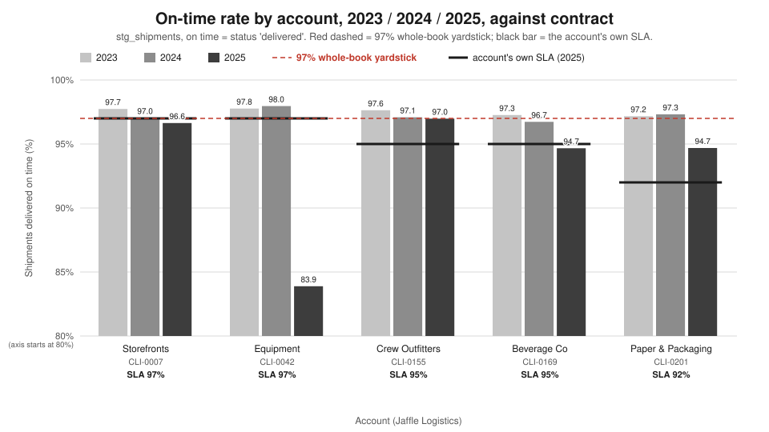
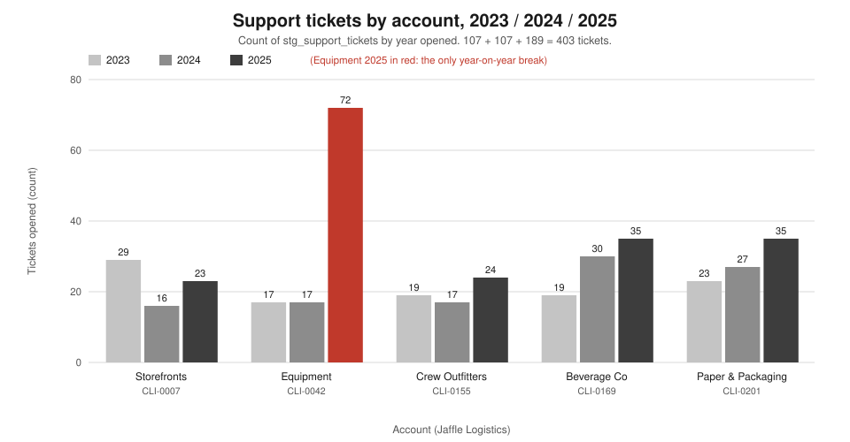
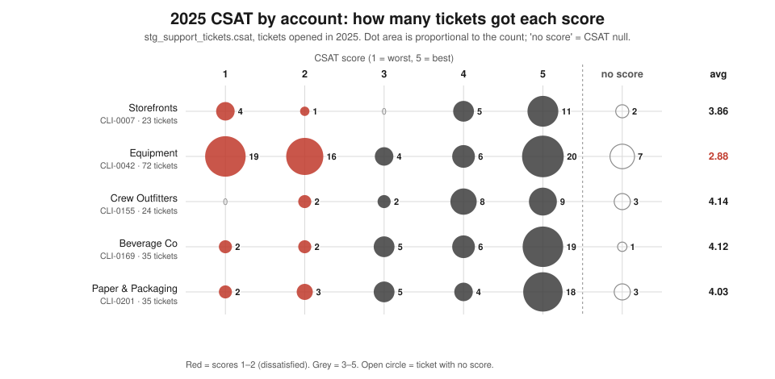
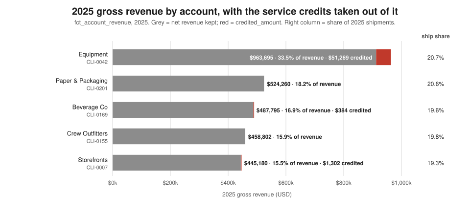
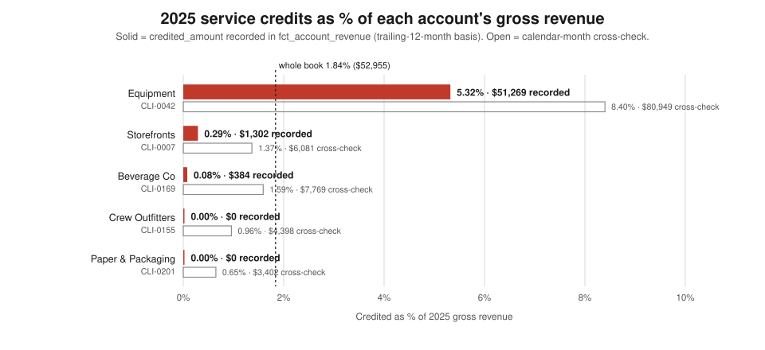

# Revenue and retention — the 2025 review for the Chief Revenue Officer

*Persona report. Jaffle Logistics, 2025 review. Every figure comes from `execute_sql` queries run
through the dbt Platform remote MCP against `hive_metastore.dbt_smcintyre_jaffle_logistics_prod`
(called `P` below). The data runs to 2025-12-31. The SQL for each figure is in the appendix.
On time means `status = 'delivered'`. Ticket sentiment is a **machine-graded label**
(`eval_ticket_triage.true_sentiment`), not the customer's own score. Money comes from the revenue
ledger `P.fct_account_revenue`, which was added after the CFO briefing (see 3.3).*

---

## 1. The two-minute read

- **What is fine.** Four of five accounts are commercially intact. Crew Outfitters and Paper &
  Packaging beat their SLAs (96.98% against 95%, 94.69% against 92%) and paid **$0** in credits. Without
  Jaffle Equipment the book ran at **95.73%** on time in 2025.
- **What is not.** Jaffle Equipment (`CLI-0042`) fell from **97.96% to 83.89%** on time and was below
  its 97% SLA in **all 12 months** of 2025. Its tickets went **17 → 72**, and **35 of its 65** scored 2025
  tickets have a CSAT of 1 or 2.
- **What it costs.** The ledger records **$52,954.86** of service credits in 2025, or **1.84%** of
  **$2,879,732** gross revenue. That is the first credit in six years of ledger. **$51,269 (96.8%)**
  is Equipment's, equal to **5.32%** of its spend. Equipment hit the 10% cap in November and December.
- **What is exposed.** Equipment is **33.5% of 2025 revenue on 20.7% of shipments**. Its revenue per
  shipment rose **75%** in the year its service collapsed. Losing it takes out **$963,695 gross,
  $912,426 net and 416 shipments**. Two contract readings could also cost us more than the ledger shows:
  "measured monthly" (another **$49,644**) and the January credit memo (another **$7,913**).
- **What we do not know.** When Equipment can leave and what it is worth to us. No table holds a
  renewal date, notice period, churn record, win/loss record or account margin. Only maintenance
  (**3.7%** of 2025 hub cost) is assigned to accounts.

---

## 2. What this seat owns

The Chief Revenue Officer owns the revenue line and the customer relationships behind it: renewals,
pricing, the credits we pay when service falls short, and the risk that a service failure becomes a
lost account. This seat reads on-time delivery as a **commercial** number. A point below SLA is a
credit on the invoice and a reason for the buyer to take calls from competitors. Operations owns
*why* a shipment was late. This seat owns *what it cost and who might leave*.

---

## 3. Findings

### 3.1 The account league table: one account broke; two more sit just under their line

**Claim.** In 2025 one account, Jaffle Equipment, went wrong on every measure this seat watches. Two
more, Storefronts and Beverage Co, finished the year **a fraction of a point** below their SLA on the
basis the ledger uses for credits. A small slip at either one starts the credits again.

**Evidence** — the league table (Q1, Q2, Q3, Q4, Q5d, Q7):

| account | tier · health | 2025 shipments | on-time 2023 / 2024 / 2025 | SLA | 2025 vs SLA (pts) · months below | 2025 credited, % of spend ($) | tickets 2023 → 2024 → 2025 | 2025 CSAT avg · share scored 1–2 |
|---|---|---:|---|---:|---|---|---|---|
| **CLI-0042 Equipment** | strategic · **at-risk** | 416 | 97.77 / 97.96 / **83.89** | 97.0 | **−13.11** · **12 / 12** | **5.32%** ($51,269.00) | 17 → 17 → **72** | **2.88** · **35 of 65** |
| CLI-0007 Storefronts | strategic · healthy | 387 | 97.74 / 97.04 / 96.64 | 97.0 | −0.36 · 4 / 12 | 0.29% ($1,301.98) | 29 → 16 → 23 | 3.86 · 5 of 21 |
| CLI-0169 Beverage Co | mid · watch | 394 | 97.26 / 96.73 / 94.67 | 95.0 | −0.33 · 4 / 12 | 0.08% ($383.88) | 19 → 30 → 35 | 4.12 · 4 of 34 |
| CLI-0201 Paper & Packaging | small · healthy | 414 | 97.17 / 97.32 / 94.69 | 92.0 | +2.69 · 4 / 12 | 0.00% ($0) | 23 → 27 → 35 | 4.03 · 5 of 32 |
| CLI-0155 Crew Outfitters | mid · healthy | 398 | 97.64 / 97.09 / 96.98 | 95.0 | +1.98 · 3 / 12 | 0.00% ($0) | 19 → 17 → 24 | **4.14** · 2 of 21 |
| **Whole book** | | **2,009** | 97.51 / 97.23 / **93.28** | — | — · 27 account-months | **1.84%** ($52,954.86) | 107 → 107 → 189 | — |

"Months below" counts calendar months in `fct_account_health` where on-time fell below the SLA (Q4).
"2025 vs SLA" is the full-year on-time rate minus the SLA. CSAT shares exclude tickets with no score.

**Reconciliation.** 2025 shipments: 416 + 387 + 394 + 414 + 398 = **2,009**. 2025 misses: 67 + 13 +
21 + 22 + 12 = **135** (Q3). Credits: 51,269.00 + 1,301.98 + 383.88 + 0 + 0 = **$52,954.86** (Q5a).
Months below SLA: 12 + 4 + 4 + 4 + 3 = **27** (Q4 and Q5d agree). Tickets: 107 + 107 + 189 = **403**,
the same total as the CX report.



*What this says: in 2023 and 2024 every account cleared 96.7%; in 2025 Equipment fell to 83.9%, 13
points under its own 97% SLA, while no other account moved more than 2.7 points.*



*What this says: every account logged 16–35 tickets a year except Equipment in 2025, at 72, four
times its own 2023 and 2024 level.*



*What this says: Equipment is the only account where scores of 1 and 2 (35 tickets) outnumber 4 and
5 (26); every other account is weighted toward 5, and 1 to 7 tickets per account carry no score.*

**The near-miss accounts.** The ledger tests credits against a **trailing-12-month** on-time rate
(Q5e). On that basis Storefronts was below its 97% SLA in **all 12 months** of 2025, and Beverage Co
was below its 95% SLA in **10 of 12**. They were credited in only 4 months and 1 month because the
shortfall usually stayed under one full point, and the contract pays only per full point. At December
the gaps were **0.4 points** (Storefronts, 96.6) and **0.3 points** (Beverage, 94.7). Another 0.6 to
0.7 points of slippage at either account starts a credit every month.

Our account team describes the same account differently. Storefronts' Q4 QBR note (`CRM-5003`,
2025-12-22) records "trailing-quarter on-time landed at 98.4% (above target)". The customer's invoice
uses the trailing-12-month rate, which was below target all year. The QBR, the invoice and the
contract measure over three different windows (see 3.3).

**Sources that differ from earlier reports.** The shipment table now has different volumes each year:
1,848 in 2023, 1,949 in 2024 and 2,009 in 2025. The CFO briefing and `where-the-year-was-lost.md` had
2,009 in every year. The 2025 figures agree with both reports exactly. The 2023 and 2024 figures have
moved. Equipment now reads 97.77% / 97.96% in `stg_shipments`, against the published 98.07% and the
CX report's 98.1% from `fct_account_health`. On today's data, Equipment's misses rose by 59 (8 → 67)
and the book's rose by 81 (54 → 135), so Equipment is **73%** of the deterioration. The published
figure is 75%, measured against a 56-miss 2024.

### 3.2 Concentration: Equipment is a third of the revenue and half the misses

**Claim.** Shipments are spread almost evenly across the five accounts (19.3% to 20.7% each). Revenue
is not. Equipment brings in **33.5%** of 2025 gross revenue, carries **49.6%** of the year's missed
shipments and receives **96.8%** of the credits. This is the concentration the CFO briefing could not
see without a revenue table.

**Evidence** — 2025 shares (Q6):

| account | gross revenue | share of revenue | net revenue | shipments | share of shipments | missed | share of misses | share of credits |
|---|---:|---:|---:|---:|---:|---:|---:|---:|
| **CLI-0042 Equipment** | **$963,695.00** | **33.46%** | $912,426.00 | 416 | 20.71% | 67 | **49.63%** | **96.82%** |
| CLI-0201 Paper & Packaging | $524,260.00 | 18.21% | $524,260.00 | 414 | 20.61% | 22 | 16.30% | 0.00% |
| CLI-0169 Beverage Co | $487,795.00 | 16.94% | $487,411.12 | 394 | 19.61% | 21 | 15.56% | 0.72% |
| CLI-0155 Crew Outfitters | $458,802.00 | 15.93% | $458,802.00 | 398 | 19.81% | 12 | 8.89% | 0.00% |
| CLI-0007 Storefronts | $445,180.00 | 15.46% | $443,878.02 | 387 | 19.26% | 13 | 9.63% | 2.46% |
| **Whole book** | **$2,879,732.00** | 100% | **$2,826,777.14** | **2,009** | 100% | **135** | 100% | 100% |

**Reconciliation.** Gross: 963,695 + 524,260 + 487,795 + 458,802 + 445,180 = **2,879,732**. Revenue
shares add to 100.00%. Shipment shares add to 100.00%. Miss shares add to 100.01% (rounding).



*What this says: Equipment's revenue bar is nearly twice any other account's on the same share of
shipments, and almost every credited dollar comes out of that one bar.*

**Why Equipment is worth so much more per load.** Equipment's revenue per shipment rose from
**$1,323.48** (2024) to **$2,316.57** (2025), up **75%** (Q5a). Its base charge in 2025 was exactly
$2,300 per shipment in every month (Q5b). In the same year its entire book moved to the `freight`
service level: **416 of 416** shipments in 2025, against 70 of 392 in 2024 (Q3b). Gross revenue rose
from $518,805 to $963,695 (+85.8%). The other four accounts went the other way. Crew Outfitters and
Paper & Packaging shipped **no** freight in 2025 (71 and 82 loads in 2024). Revenue across those four
accounts fell **14.3%** ($2,235,601.50 → $1,916,037) while their shipments rose. The ledger records
amounts, not a rate card, so it cannot tell us whether this was a negotiated price rise or a change in
service mix (see section 4). Either way, the customer that pays us most per load got the worst
service.

**Freight service is not the cause.** In 2025, `freight` is 479 shipments, and **416 (86.8%)** of them
are Equipment's. The other 63 freight loads (Storefronts 31, Beverage 32) were **all on time** (Q3b).
In this corpus "freight" mostly relabels the Equipment account. It is not a separate driver.

**If we lose Equipment.** On 2025 figures we would lose **416 shipments (20.7% of volume)**,
**$963,695 gross (33.5%)** and **$912,426 net (32.3%)** (Q6). The remaining book would run at **95.73%**
on time (1,525 of 1,593). The service problem would go, and a third of revenue would go with it.

### 3.3 Credits, both ways: 1.84% of spend, $52,955 recorded

**Claim.** The CFO briefing's caveat that there is "no revenue table" is no longer true. Since that
briefing, the revenue and cost ledger has landed (`P.fct_account_revenue`, one row per client-month,
2020-01 to 2025-12). It lets us state the credit as a **share of spend** and as a **dollar amount**.
In 2025 the ledger recorded **$52,954.86, or 1.84% of gross revenue**. That is the first credit of any
kind since the ledger starts in 2020 (Q5a). The CFO briefing stated exposure only as a percentage of
spend because the ledger did not yet exist. That method still holds, and it serves below as a
cross-check.

**Evidence** — 2025 credit by account, recorded and cross-checked (Q5d):

| account | 2025 gross | credited, recorded | % of spend | months credited | cross-check: calendar-month method | % of spend |
|---|---:|---:|---:|---:|---:|---:|
| CLI-0042 Equipment | $963,695.00 | **$51,269.00** | **5.32%** | 12 | $80,948.80 | 8.40% |
| CLI-0007 Storefronts | $445,180.00 | $1,301.98 | 0.29% | 4 | $6,081.00 | 1.37% |
| CLI-0169 Beverage Co | $487,795.00 | $383.88 | 0.08% | 1 | $7,768.98 | 1.59% |
| CLI-0155 Crew Outfitters | $458,802.00 | $0.00 | 0.00% | 0 | $4,397.75 | 0.96% |
| CLI-0201 Paper & Packaging | $524,260.00 | $0.00 | 0.00% | 0 | $3,402.35 | 0.65% |
| **Whole book** | **$2,879,732.00** | **$52,954.86** | **1.84%** | **17** | **$102,598.88** | **3.56%** |

**Reconciliation.** The recorded column sums to $52,954.86. Recomputing the ledger's own rule from its
inputs gives $52,954.85, one cent of rounding, and matches every account to the cent (Q5d). Credited
months: 12 + 4 + 1 = **17**, the 17 rows with a credit in Q5c.



*What this says: Equipment gave back 5.3% of its spend ($51,269) and every other account under 0.3%;
on the calendar-month cross-check, Equipment would have been 8.4% ($80,949).*

**Why the ledger's dollars differ from the CFO briefing's percentages.** The ledger sets each month's
credit from the **trailing-12-month** on-time rate ending in that billing month. It credits 1.0% of
that month's spend for each **full** point below the SLA in force, capped at 10% of the month's spend.
The CFO briefing used **calendar-month** on-time. A trailing window reacts slowly in both directions.
Equipment's January 2025 was 76.3% for the month, but its trailing rate was still 95.9%, so the ledger
credited 1% and not the 10% cap (Q5b). The two methods agree once the dollars are expressed in months
of spend. The calendar-month cross-check comes to $80,948.80, or **1.01 average months** of
Equipment's 2025 spend. The CFO briefing put it at 101.9% of one month's spend, contract-capped. **This report
uses the ledger's figure as the recorded credit. The calendar-month figure appears only as a
cross-check.**

**Equipment, month by month** (Q5b):

| 2025 | gross | trailing-12m on-time | SLA | full points below | credited | credit % |
|---|---:|---:|---:|---:|---:|---:|
| Jan | $87,925 | 95.9 | 97.0 | 1 | $879.25 | 1% |
| Feb | $67,075 | 95.0 | 97.0 | 2 | $1,341.50 | 2% |
| Mar | $78,790 | 94.5 | 97.0 | 2 | $1,575.80 | 2% |
| Apr | $81,025 | 94.1 | 97.0 | 2 | $1,620.50 | 2% |
| May | $76,350 | 93.3 | 97.0 | 3 | $2,290.50 | 3% |
| Jun | $64,915 | 92.5 | 97.0 | 4 | $2,596.60 | 4% |
| Jul | $74,050 | 91.5 | 97.0 | 5 | $3,702.50 | 5% |
| Aug | $74,050 | 90.5 | 97.0 | 6 | $4,443.00 | 6% |
| Sep | $76,490 | 89.3 | 97.0 | 7 | $5,354.30 | 7% |
| Oct | $83,745 | 87.9 | 97.0 | 9 | $7,537.05 | 9% |
| Nov | $85,905 | 86.4 | 97.0 | 10 (cap) | $8,590.50 | 10% |
| Dec | $113,375 | 83.9 | 97.0 | 13 → 10 (cap) | $11,337.50 | 10% |
| **2025** | **$963,695** | | | | **$51,269.00** | **5.32%** |

**Two readings of the contract cost more than the ledger shows.**

1. **"Measured monthly."** Every master services agreement says the target is "on-time delivery of
   … measured monthly" (`LGL-4000` for Equipment, Q9c). The ledger measures over a trailing 12 months.
   If a customer reads "monthly" as the calendar month, 2025 credits come to **$102,598.88**, which is
   **$49,644.02** more than recorded (Q5d). We should settle which reading is right before a customer's
   procurement team raises it.
2. **January's credit memo.** `LGL-9001` (2025-02-05) commits to "a credit of 1.0% of January spend per
   full percentage point below target, capped at 10%". January's calendar-month rate was 76.3%, 20.7
   points below target. On the memo's wording the credit is the 10% cap, **$8,792.50**. The ledger
   recorded **$879.25** (Q5b). The customer acknowledged a credit ("I saw the credit, thank you",
   `CT-99020`, 2025-04-15), but the data does not show which amount they expected.

**The SLA in force.** The card and the CFO briefing both say Equipment's SLA was 95.5% until
2025-05-12. `stg_contracts` and the MSA text say otherwise. The 95.5% target (`CON-0042-00`,
`LGL-4016`) ran from 2021-11-14. It was raised to 97.0% on **2023-11-14** (`CON-0042-01`, `LGL-4000`),
and `CON-0042-02` (2025-05-12) keeps 97.0%. All of 2025 is therefore measured against 97.0%, and the
ledger applies 97.0 in every 2025 month (Q2, Q5b).

### 3.4 Are we pricing the risk we carry? No: the tightest SLAs got the worst service

**Claim.** The two accounts on the strictest SLA (97%) are the two that finished 2025 below it. The
two on the loosest SLAs (92% and 95%) beat theirs. The tight-SLA accounts bring in **48.9%** of
revenue ($1,408,875) and took **99.3%** of credits ($52,570.98). Equipment pays the highest price per
shipment and received the worst service.

**Evidence** (Q2, Q3, Q5a, Q5d):

| account | SLA | 2025 on-time | margin to SLA | revenue per shipment 2025 | credited % of spend |
|---|---:|---:|---:|---:|---:|
| CLI-0042 Equipment | 97.0 | 83.89 | **−13.11** | **$2,316.57** | 5.32% |
| CLI-0007 Storefronts | 97.0 | 96.64 | −0.36 | $1,150.34 | 0.29% |
| CLI-0169 Beverage Co | 95.0 | 94.67 | −0.33 | $1,238.06 | 0.08% |
| CLI-0155 Crew Outfitters | 95.0 | 96.98 | +1.98 | $1,152.77 | 0.00% |
| CLI-0201 Paper & Packaging | 92.0 | 94.69 | +2.69 | $1,266.33 | 0.00% |

So the service guarantee does not decide the service delivered. In 2023 and 2024 every account ran
96.7–98.0% whatever its SLA (Q3). A 92% SLA bought the same service as a 97% SLA. The gap opened only
in 2025, and it opened on the tight-SLA accounts. Commercially, the 97% contracts carry the risk:
every point below 97 now costs 1% of spend. Paper & Packaging's 92% SLA leaves 2.7 points of headroom
on 94.69% service. Pricing has not followed the SLA either. Storefronts pays **$1,150.34** a shipment
for a 97% guarantee, and Paper & Packaging pays **$1,266.33** for a 92% one.

### 3.5 The at-risk narrative, per account

**Claim.** Equipment's customer warned us in January ("consider this a warning shot") and got a
credit. The root cause came **159 days** after the customer first reported the second, weather-free
problem. The other four accounts' 2025 account record is routine, but at each one the customer's
ticket came first (CX report §3.4). One account, Paper & Packaging, had **no QBR at all** in 2025.

**Jaffle Equipment (CLI-0042): two problems, one relationship.**

| date | what happened | id |
|---|---|---|
| 2025-01-14 09:00 | **Customer, first 2025 record:** "Where is SHP-202501-900001?? Nothing's moved for days. I know Chicago got hit but I need a real ETA." Three tickets that morning. | `TKT-900000`, `TKT-900004`, `TKT-900008` |
| 2025-01-15 09:05 | First internal record that names the account: the ops Slack storm thread (jackknife, `INC-2025-00417`). | `SLK-99001` |
| 2025-01-16 14:00 | Incident report, Chicago jackknife, severity 3. | `IR-9001` |
| 2025-01-21 | QBR. Customer: "My question is whether you can actually handle our peak volume … consider this a warning shot." **We promised** "an SLA credit for January per your contract, and … a written recovery plan." | `CRM-9001`, `CT-99001` |
| 2025-02-05 | Credit memo for January. The ledger records $879.25 (see 3.3). | `LGL-9001` |
| 2025-04-15 | QBR. "Recovering is fine. Not-there-yet is the part I'm watching." | `CRM-9020`, `CT-99020` |
| 2025-05-14 14:00 | **Customer, first report of the second problem:** "another late LTL load", with no storm this time. | `TKT-910000` |
| 2025-06-18 | First internal signal of the handling pattern (Columbus damage), 35 days after the customer. | `INC-2025-00136` |
| 2025-07-16 | QBR. **We said:** "I don't have a root cause yet … I'll bring findings next time, not just a promise." | `CRM-9021`, `CT-99021` |
| 2025-07-18 | Account owner on Slack: "on-time for Jaffle Equipment (CLI-0042) has been sliding since Q2, and tickets are up." | `SLK-99010` |
| 2025-10-14 / 10-20 | Root cause named: Columbus bay-3 handling. **We committed** to an SOP audit and to tracking on-time by cause from Q4, with a "Review at Q1 2026 QBR." | `CRM-9022`, `CT-99022`, `CRM-9030` |

The storm was handled quickly. The customer wrote first, and our records followed within 1 day
(Slack), 2 days (incident report) and 7 days (QBR). That matches the published latency analysis
(`what-did-we-know-and-when.md` §4.5). The weather-free decline was handled slowly. The customer
reported it on 2025-05-14. Our first internal signal came 35 days later (the published worst case),
and the named root cause came on 2025-10-20, **159 days** after the customer. In that time the trailing
credit rate rose from 3% to 9% (Q5b). We promised a "written recovery plan" in January. No such plan
appears in Equipment's 2025 CRM notes, transcripts or legal documents before the October review. The
revenue ledger adds the price of the delay: the credits from May to October total **$25,923.95**, half
the year's Equipment credit. Every 2025 note still cites `CON-0042-01`, even though `CON-0042-02` took
effect on 2025-05-12. No legal document exists for `CON-0042-02` (Q9c).

**The other four accounts** (Q9f; first ticket and first account note from the CX report §3.4):

| account | what the customer experienced in 2025 | customer first wrote | our first account note | what we said we would do |
|---|---|---|---|---|
| CLI-0007 Storefronts | 86.2% in January and 87.5% in February, then 100% in five months; trailing rate below SLA all year | 2025-01-15 | 2025-03-10 (`CRM-5025`), 54 days | "account owner to follow up with ops"; QBRs record the client "exploring expanded lanes" (`CRM-5001`–`5003`) |
| CLI-0155 Crew Outfitters | January 83.9%, then 93–100%; never below SLA on the trailing rate | 2025-01-11 | 2025-03-21 (`CRM-5012`), 69 days | "Discussed expanding volume into new lanes" (`CRM-5013`, 2025-06-16) |
| CLI-0169 Beverage Co | January 78.4%, the worst storm month after Equipment; below SLA on the trailing rate 10 of 12 months | 2025-01-03 | 2025-03-13 (`CRM-5028`), 69 days | "reassured on remediation" (`CRM-5028`); "exploring expanded lanes" (`CRM-5018`) |
| CLI-0201 Paper & Packaging | Below its 92% SLA in January, May (87.9%), August and December (90.0%); trailing rate down from 97.8 (April) to 94.7 (December) | 2025-01-06 | 2025-09-20 (`CRM-5031`), 257 days | "account owner to follow up with ops". **No 2025 QBR.** The customer said "Mostly fine" on `CT-10031` (CX report §3.4) |

### 3.6 Renewal logic for Jaffle Equipment: absorb the credits and fix the service

**Claim.** The evidence favours **keeping the account, paying the credits and fixing the service**,
while rewriting the measurement clause. Exiting costs about **18 times** what the credits cost.
Renegotiating the SLA level saves little, because the service is 13 points short, not 1.

**The three options, on 2025 numbers:**

| option | what it costs | what it saves | verdict |
|---|---|---|---|
| **Absorb the credits and fix the service** | 2025 credits were $51,269. The cap limits any year to 10% of spend: on 2025 spend, at most **$96,369.50**. | Keeps $912,426 of net revenue and 33.5% of the book. | **Favoured.** Even at the cap, the account returns 90% of its gross. |
| **Renegotiate the SLA** | Little in money. A lower target gives the customer less, in a year it already got less. | Returning to the old 95.5% target would still leave 2025 about 11.6 points short on the full-year rate. Against 95.5, Equipment's trailing rates (Q5b) would still have credited in 10 of 12 months. | **Not on the level. Yes on the clause:** settle "measured monthly" (worth $49,644 in 2025) and add a force-majeure weather exclusion, which Storefronts (`LGL-4010`), Crew Outfitters (`LGL-4013`) and Paper & Packaging (`LGL-4023`) already have and Equipment does not. |
| **Exit the volume** | **$963,695 gross, $912,426 net, 416 shipments** (20.7% of volume). | About $51k a year of credits and the service drag. The book without Equipment ran at 95.73%. | **Rejected on the numbers.** It gives up $17.8 of net revenue for each $1 of 2025 credit avoided. |

**Credits will not stop when the service is fixed.** Because the credit runs on a trailing 12 months,
the bad months keep counting after they end. A worked example from Q4 and Q5b: suppose Equipment ships
35 loads a month at 100% from January 2026. By June 2026 the trailing window holds July–December 2025
(219 shipments, 176 on time) plus 210 perfect loads. That is 386 of 429, **90.0%**, still 7 points under
97% and a **7% credit**. A turnaround that starts in January would show on the invoice in the second
half of 2026. Tell the customer this before they see it on a bill.

**What it would take to be sure:**

1. **The renewal date and notice period for `CON-0042-02`.** The data holds no renewal or expiry
   date. The MSA text (`LGL-4000`) gives a 24-month first term, auto-renewing for 12 months. On that
   reading the current term rolls on **2026-11-13**, but only if `CON-0042-02` did not restart the
   clock, and no document for it exists. No MSA gives a notice period.
2. **Account margin.** At $2,300 a load, Equipment may be our most profitable account or our least.
   We cannot say, because only maintenance is assigned to accounts (see section 4).
3. **Proof that the Columbus fix works.** `CRM-9030` commits to on-time "tracked separately by cause
   (weather vs. handling) starting Q4". The numbers do not show it yet. December, at 77.6%, was Equipment's
   second-worst month of 2025, after storm-hit January (76.3%) (Q4).
4. **Whether the customer is shopping.** No win/loss or competitor record exists. Equipment's question
   to us, "whether you can actually handle our peak volume" (`CT-99001`), is the closest signal.

### 3.7 Growth candidates: Crew Outfitters first, Paper & Packaging second

**Claim.** `stg_clients` rates three accounts healthy (Storefronts, Crew Outfitters, Paper &
Packaging) and one on watch (Beverage Co). The card described four healthy accounts. **Crew
Outfitters** has the most room to take more volume: it beat its SLA, paid no credits, has the best
CSAT and asked us about new lanes. Paper & Packaging has more headroom against its contract but a
falling trend.

**Evidence** (Q1, Q3, Q5a, Q5e, Q7, Q9f):

| account | health | on-time 2023 → 2025 | Dec 2025 trailing rate vs SLA | 2025 credits | 2025 CSAT · graded negative | signal from the account | ready for more volume? |
|---|---|---|---|---:|---|---|---|
| **CLI-0155 Crew Outfitters** | healthy | 97.64 → 96.98 | 97.0 vs 95.0 (**+2.0**); never below in 2025 | $0 | **4.14** · 2 of 24 | "Discussed expanding volume into new lanes" (`CRM-5013`); "exploring expanded lanes" (`CRM-5014`, `CRM-5015`) | **Yes, first.** |
| CLI-0201 Paper & Packaging | healthy | 97.17 → 94.69 | 94.7 vs 92.0 (+2.7), but down 3.1 points since April | $0 | 4.03 · 9 of 35 | No 2025 QBR; "This is unacceptable for the rates we pay" (`TKT-200040`, CX report §3.3) | **Second, once a QBR re-establishes the relationship.** |
| CLI-0007 Storefronts | healthy | 97.74 → 96.64 | 96.6 vs 97.0 (**−0.4**); below all 12 months | $1,301.98 | 3.86 · 5 of 23 | "exploring expanded lanes next quarter" (`CRM-5001`–`5003`) | **Not yet.** More volume on a 97% SLA we already miss adds credit exposure. |
| CLI-0169 Beverage Co | **watch** | 97.26 → 94.67 | 94.7 vs 95.0 (**−0.3**); below 10 of 12 months | $383.88 | 4.12 · 5 of 35 | "exploring expanded lanes" (`CRM-5018`); Q4 QBR back to neutral (`CRM-5019`) | **Not yet.** It is liked, but it sits under its line. |

Crew Outfitters and Paper & Packaging were the two accounts never below SLA on the trailing rate in
2025. Crew's trailing rate rose through the year, from 95.5 in May to 97.0 in December. Paper's fell
(Q5e). Crew's only bad month was January's storm (83.9%), and from March it delivered 93–100%. Its Q4
QBR records 98.3% trailing-quarter on-time (`CRM-5015`). It is also the clearest **win-back**. Crew Outfitters shipped 71 freight loads with us in
2024 and none in 2025 (Q3b), and its revenue fell from $527,089 to $458,802 (−13.0%) on more shipments
(378 → 398). The volume it took away is the obvious first conversation.

---

## 4. What the data cannot tell you

| gap | why | decision it blocks |
|---|---|---|
| **When an account can leave** | There is still **no churn record and no renewal or contract-expiry date**. `stg_contracts` holds only `effective_date`. Term length appears only in MSA free text ("24 months, auto-renewing for successive twelve (12) month terms"), no MSA gives a notice period, and `CON-0042-02` has no legal document. Derived term ends: Storefronts 2026-04-15, Paper & Packaging 2026-06-13, Beverage Co 2026-06-23, Crew Outfitters 2026-07-27, Equipment 2026-11-13. These are our reading, not a recorded date. | When to open the Equipment renewal conversation, and whether the customer can leave in 2026. |
| **Whether we are winning or losing deals** | There is **no win/loss, pipeline, quote or opportunity table** (Q11 lists every relation in `P`). | Sizing the growth candidates. Knowing whether Equipment is being quoted by a competitor. |
| **Margin by account** | Per-account **cost attribution is partial**. `fct_client_cost_attribution` assigns only **maintenance** ($267,578 in 2025, 3.73% of the $7,180,014 hub cost ledger). Fuel, subcontractor, facility and technology stay at hub level. Routes serve several clients at once: **8,333 of 10,488 routes** (79.5%) serve two to four clients (3,904 serve two, 2,910 three, 1,519 four). The hub cost ledger ($7.18M) is also not on a comparable basis with gross revenue ($2.88M), so no margin can be stated. | Whether Equipment is profitable at $2,300 a load. Whether absorbing up to 10% in credits is worth it. Which growth account earns the most per load. |
| **Why Equipment's price rose 75%** | The ledger records invoiced amounts, not a rate card or a pricing history. Its revenue per shipment rose as its book moved to `freight`, but no table records the price agreed or the reason. | Whether the price rise is part of the retention risk, and what room exists to concede on price at renewal. |
| **Which credit reading is contractual** | The ledger uses a trailing 12 months. The MSAs say "measured monthly". The January memo (`LGL-9001`) refers to "January spend". | A possible claim of $49,644 (2025, all accounts) plus $7,913 (Equipment, January). |
| **Whether addenda were applied** | Three accounts have force-majeure weather exclusions and Equipment has a peak-season window extension (`LGL-4021`), but the ledger has no exclusion flag and on-time is a status flag. | Whether recorded credits for those accounts are right, and what a force-majeure clause would save Equipment. |
| **How big each customer's wallet is** | No data on what each customer ships with other carriers. | Share-of-wallet targets for the growth accounts. |

The ledger **has** closed one gap. Credits are now a recorded dollar figure, and the CFO briefing's
"no revenue table" caveat no longer applies.

---

## 5. Appendix: the queries

All run through `execute_sql` on the dbt Platform remote MCP, with every relation written in full.
`list_metrics` was called once for the record. It now returns **10** metrics, not the 4 that earlier
reports cite: the delivered-side `on_time_rate`, `on_time_shipments`, `shipments`,
`on_time_rate_change_vs_prior_quarter_pts` and `late_hours`, plus revenue-side `gross_revenue`,
`net_revenue`, `credited_amount`, `credit_rate` and `accessorial_revenue` on the `account_month`
semantic model. All figures in this report come from `execute_sql`.

**Q1. Account roster** (§3.1, §3.7)

```sql
SELECT client_id, client_name, tier, line_of_business, region, health FROM hive_metastore.dbt_smcintyre_jaffle_logistics_prod.stg_clients ORDER BY client_id
```

**Q2. Contract roster** (§3.1, §3.3, §3.4)

```sql
SELECT contract_id, client_id, cast(effective_date AS string) AS effective_date, sla_ontime_pct, credit_terms FROM hive_metastore.dbt_smcintyre_jaffle_logistics_prod.stg_contracts ORDER BY client_id, effective_date
```

**Q3. Volume and on-time by account by year** (§3.1, §3.4, chart 1)

```sql
SELECT coalesce(client_id,'ALL') AS client_id, yr, count(*) AS shipments,
 sum(case when status='delivered' then 1 else 0 end) AS delivered,
 sum(case when status<>'delivered' then 1 else 0 end) AS missed,
 round(100.0*sum(case when status='delivered' then 1 else 0 end)/count(*),2) AS ontime_pct
FROM (SELECT client_id, status, substr(cast(created_at AS string),1,4) AS yr
      FROM hive_metastore.dbt_smcintyre_jaffle_logistics_prod.stg_shipments
      WHERE substr(cast(created_at AS string),1,4) IN ('2023','2024','2025'))
GROUP BY GROUPING SETS ((client_id, yr), (yr)) ORDER BY client_id, yr
```

**Q3b. Service level by account by year** (§3.2, §3.7)

```sql
SELECT client_id, substr(cast(created_at AS string),1,4) AS yr, service_level, count(*) AS shipments,
 sum(case when status='delivered' then 1 else 0 end) AS delivered
FROM hive_metastore.dbt_smcintyre_jaffle_logistics_prod.stg_shipments
WHERE substr(cast(created_at AS string),1,4) IN ('2023','2024','2025')
GROUP BY 1,2,3 ORDER BY 1,2,3
```

**Q4. Monthly on-time against SLA, 2025** (§3.1, §3.6)

```sql
SELECT client_id, substr(cast(month AS string),1,7) AS mo, sla_target, shipments, ontime_pct, ontime_vs_target, ticket_count, incident_count
FROM hive_metastore.dbt_smcintyre_jaffle_logistics_prod.fct_account_health
WHERE substr(cast(month AS string),1,4)='2025' ORDER BY client_id, month
```

**Q5a. Revenue and credits by account by year** (§1, §3.1–§3.4)

```sql
SELECT coalesce(client_id,'ALL') AS client_id, substr(cast(revenue_month AS string),1,4) AS yr,
 count(*) AS months, sum(shipment_count) AS shipments,
 round(sum(contracted_base_revenue),2) AS base, round(sum(accessorial_revenue),2) AS accessorial,
 round(sum(gross_revenue),2) AS gross, round(sum(credited_amount),2) AS credited, round(sum(net_revenue),2) AS net,
 round(100.0*sum(credited_amount)/sum(gross_revenue),2) AS credit_pct,
 sum(case when credited_amount>0 then 1 else 0 end) AS months_credited,
 round(sum(gross_revenue)/sum(shipment_count),2) AS rev_per_ship
FROM hive_metastore.dbt_smcintyre_jaffle_logistics_prod.fct_account_revenue
GROUP BY GROUPING SETS ((client_id, substr(cast(revenue_month AS string),1,4)), (substr(cast(revenue_month AS string),1,4)))
ORDER BY client_id, yr
```

**Q5b. Jaffle Equipment month by month, 2024–2025** (§3.2, §3.3, §3.5, §3.6)

```sql
SELECT client_id, substr(cast(revenue_month AS string),1,7) AS mo, tier, health, shipment_count, invoice_count,
 contracted_base_revenue, accessorial_revenue, gross_revenue, credited_amount, net_revenue, credit_rate_pct, revenue_per_shipment,
 ontime_pct, trailing_12m_ontime_pct, sla_ontime_pct, ontime_vs_target, measurement_basis
FROM hive_metastore.dbt_smcintyre_jaffle_logistics_prod.fct_account_revenue
WHERE client_id='CLI-0042' AND substr(cast(revenue_month AS string),1,4) IN ('2024','2025') ORDER BY revenue_month
```

**Q5c. Every credited month, all accounts, all years** (§3.3)

```sql
SELECT client_id, substr(cast(revenue_month AS string),1,7) AS mo, gross_revenue, credited_amount, credit_rate_pct,
 ontime_pct, trailing_12m_ontime_pct, sla_ontime_pct, measurement_basis
FROM hive_metastore.dbt_smcintyre_jaffle_logistics_prod.fct_account_revenue
WHERE credited_amount > 0 ORDER BY client_id, revenue_month
```

**Q5d. Credit recomputation: recorded vs trailing-12-month rule vs calendar-month cross-check, 2025** (§3.3, chart 2)

```sql
SELECT coalesce(client_id,'ALL') AS client_id,
 round(sum(gross_revenue),2) AS gross,
 round(sum(credited_amount),2) AS credited_recorded,
 round(sum(gross_revenue*least(floor(greatest(round(sla_ontime_pct - round(trailing_12m_ontime_pct,1),1),0)),10)/100.0),2) AS credit_t12m_recomputed,
 round(sum(gross_revenue*least(floor(greatest(round(sla_ontime_pct - round(ontime_pct,1),1),0)),10)/100.0),2) AS credit_calendar_month,
 sum(case when round(ontime_pct,1) < sla_ontime_pct then 1 else 0 end) AS cal_months_below,
 sum(case when floor(greatest(round(sla_ontime_pct - round(ontime_pct,1),1),0)) >= 1 then 1 else 0 end) AS cal_months_creditable,
 sum(case when round(trailing_12m_ontime_pct,1) < sla_ontime_pct then 1 else 0 end) AS t12m_months_below
FROM hive_metastore.dbt_smcintyre_jaffle_logistics_prod.fct_account_revenue
WHERE substr(cast(revenue_month AS string),1,4)='2025'
GROUP BY ROLLUP(client_id) ORDER BY client_id
```

**Q5e. The other four accounts month by month, 2025** (§3.1, §3.7)

```sql
SELECT client_id, substr(cast(revenue_month AS string),1,7) AS mo, gross_revenue, credited_amount,
 round(ontime_pct,1) AS cal_ontime, round(trailing_12m_ontime_pct,1) AS t12m_ontime, sla_ontime_pct
FROM hive_metastore.dbt_smcintyre_jaffle_logistics_prod.fct_account_revenue
WHERE substr(cast(revenue_month AS string),1,4)='2025' AND client_id<>'CLI-0042' ORDER BY client_id, revenue_month
```

**Q5f. Ledger staging sample** (§3.3: confirms the ledger begins 2020-01 with `measurement_basis = 'no_shipment_record'` before shipments exist)

```sql
SELECT * FROM hive_metastore.dbt_smcintyre_jaffle_logistics_prod.stg_revenue_ledger LIMIT 3
```

**Q6. Concentration, 2025** (§1, §3.2, chart 5)

```sql
WITH r AS (SELECT client_id, sum(gross_revenue) AS gross, sum(net_revenue) AS net, sum(credited_amount) AS credited, sum(shipment_count) AS ships
 FROM hive_metastore.dbt_smcintyre_jaffle_logistics_prod.fct_account_revenue WHERE substr(cast(revenue_month AS string),1,4)='2025' GROUP BY 1),
s AS (SELECT client_id, count(*) AS ships, sum(case when status<>'delivered' then 1 else 0 end) AS missed
 FROM hive_metastore.dbt_smcintyre_jaffle_logistics_prod.stg_shipments WHERE substr(cast(created_at AS string),1,4)='2025' GROUP BY 1)
SELECT r.client_id, round(r.gross,2) AS gross, round(100*r.gross/sum(r.gross) over (),2) AS gross_share_pct,
 round(r.net,2) AS net, round(100*r.net/sum(r.net) over (),2) AS net_share_pct,
 s.ships, round(100.0*s.ships/sum(s.ships) over (),2) AS ship_share_pct,
 s.missed, round(100.0*s.missed/sum(s.missed) over (),2) AS missed_share_pct,
 round(100*r.credited/sum(r.credited) over (),2) AS credit_share_pct
FROM r JOIN s ON r.client_id=s.client_id ORDER BY gross DESC
```

**Q7. Tickets, graded sentiment and CSAT by account by year** (§3.1, §3.7, charts 3 and 4)

```sql
SELECT t.client_id, substr(cast(t.opened_at AS string),1,4) AS yr, count(*) AS tickets,
 sum(case when e.true_sentiment='negative' then 1 else 0 end) AS neg,
 sum(case when e.true_sentiment='neutral' then 1 else 0 end) AS neu,
 sum(case when e.true_sentiment='positive' then 1 else 0 end) AS pos,
 sum(case when t.csat=1 then 1 else 0 end) AS csat1, sum(case when t.csat=2 then 1 else 0 end) AS csat2,
 sum(case when t.csat=3 then 1 else 0 end) AS csat3, sum(case when t.csat=4 then 1 else 0 end) AS csat4,
 sum(case when t.csat=5 then 1 else 0 end) AS csat5, sum(case when t.csat is null then 1 else 0 end) AS csat_null,
 round(avg(t.csat),2) AS avg_csat
FROM hive_metastore.dbt_smcintyre_jaffle_logistics_prod.stg_support_tickets t
JOIN hive_metastore.dbt_smcintyre_jaffle_logistics_prod.eval_ticket_triage e ON t.ticket_id=e.ticket_id
GROUP BY 1,2 ORDER BY 1,2
```

**Q8. Are we pricing the risk?** (§3.4). No separate query. The table combines Q2 (SLA), Q3 (on-time),
Q5a (revenue per shipment) and Q5d (credited % of spend).

**Q9a. Jaffle Equipment CRM notes, 2025** (§3.5, §3.6)

```sql
SELECT * FROM hive_metastore.dbt_smcintyre_jaffle_logistics_prod.stg_crm_notes WHERE client_id='CLI-0042' AND substr(cast(call_date AS string),1,4)='2025' ORDER BY call_date
```

**Q9b. Jaffle Equipment legal documents** (§3.3, §3.5, §3.6, §4)

```sql
SELECT * FROM hive_metastore.dbt_smcintyre_jaffle_logistics_prod.stg_legal_docs WHERE client_id='CLI-0042' ORDER BY 1
```

**Q9c. Legal documents, other accounts** (§3.6, §4)

```sql
SELECT doc_id, client_id, cast(effective_date AS string) AS eff, doc_type, replace(body, '\n', ' | ') AS body
FROM hive_metastore.dbt_smcintyre_jaffle_logistics_prod.stg_legal_docs
WHERE client_id IS NOT NULL AND client_id<>'CLI-0042' ORDER BY client_id, effective_date
```

**Q9d. Jaffle Equipment call transcripts, 2025** (§3.5, §3.6)

```sql
SELECT transcript_id, cast(call_date AS string) AS dt, replace(body,'~~NL~~',' | ') AS body
FROM hive_metastore.dbt_smcintyre_jaffle_logistics_prod.stg_call_transcripts
WHERE client_id='CLI-0042' AND substr(cast(call_date AS string),1,4)='2025' ORDER BY call_date
```

**Q9e. Jaffle Equipment 2025 timeline, first three records per source** (§3.5)

```sql
SELECT src, id, cast(ts AS string) AS ts, substr(txt,1,260) AS excerpt FROM (
 SELECT 'ticket' AS src, ticket_id AS id, opened_at AS ts, replace(body,'~~NL~~',' | ') AS txt,
   row_number() over (order by opened_at) AS rn FROM hive_metastore.dbt_smcintyre_jaffle_logistics_prod.stg_support_tickets
   WHERE client_id='CLI-0042' AND substr(cast(opened_at AS string),1,4)='2025'
 UNION ALL
 SELECT 'incident_report', r.report_id, r.filed_at, replace(r.body,'~~NL~~',' | '),
   row_number() over (order by r.filed_at) FROM hive_metastore.dbt_smcintyre_jaffle_logistics_prod.stg_incident_reports r
   JOIN hive_metastore.dbt_smcintyre_jaffle_logistics_prod.stg_shipments s ON r.shipment_id=s.shipment_id
   WHERE s.client_id='CLI-0042' AND substr(cast(r.filed_at AS string),1,4)='2025'
 UNION ALL
 SELECT 'slack', thread_id, started_at, replace(body,'~~NL~~',' | '),
   row_number() over (order by started_at) FROM hive_metastore.dbt_smcintyre_jaffle_logistics_prod.stg_slack_threads
   WHERE (body ILIKE '%CLI-0042%' OR body ILIKE '%Jaffle Equipment%') AND substr(cast(started_at AS string),1,4)='2025'
) WHERE rn<=3 ORDER BY src, ts
```

The 2025-05-14 (`TKT-910000`), 2025-06-18 (`INC-2025-00136`) and −35-day figures come from the
published `what-did-we-know-and-when.md` §4 table. They were cited, not re-queried.

**Q9f. CRM notes, other accounts, 2025** (§3.5, §3.7)

```sql
SELECT note_id, client_id, cast(call_date AS string) AS dt, note_type, sentiment, substr(replace(body, '\n', ' | '),1,400) AS body
FROM hive_metastore.dbt_smcintyre_jaffle_logistics_prod.stg_crm_notes
WHERE client_id<>'CLI-0042' AND substr(cast(call_date AS string),1,4)='2025' ORDER BY client_id, call_date
```

**Q10. Growth candidates** (§3.7). No separate query. The table combines Q1, Q3, Q3b, Q5a, Q5e, Q7
and Q9f.

**Q11. Which relations exist** (§4)

```sql
SHOW TABLES IN hive_metastore.dbt_smcintyre_jaffle_logistics_prod
```

Two queries failed and are recorded here for honesty. Both were run before Q11:

```sql
-- failed: TABLE_OR_VIEW_NOT_FOUND (no information_schema on hive_metastore)
SELECT table_name FROM hive_metastore.information_schema.tables WHERE table_schema='dbt_smcintyre_jaffle_logistics_prod' ORDER BY table_name
-- failed: TABLE_OR_VIEW_NOT_FOUND — the cost model is named fct_client_cost_attribution, not fct_account_cost_attribution
SELECT * FROM hive_metastore.dbt_smcintyre_jaffle_logistics_prod.fct_account_cost_attribution LIMIT 3
```

**Q12. Cost-side structure: samples and route sharing** (§4)

```sql
SELECT * FROM hive_metastore.dbt_smcintyre_jaffle_logistics_prod.stg_cost_ledger LIMIT 3
```

```sql
SELECT * FROM hive_metastore.dbt_smcintyre_jaffle_logistics_prod.fct_client_cost_attribution LIMIT 3
```

```sql
SELECT * FROM hive_metastore.dbt_smcintyre_jaffle_logistics_prod.stg_route_client_attribution LIMIT 3
```

```sql
WITH rc AS (SELECT route_id, count(DISTINCT client_id) AS n_clients, round(sum(stop_share),3) AS share_sum
  FROM hive_metastore.dbt_smcintyre_jaffle_logistics_prod.stg_route_client_attribution GROUP BY 1)
SELECT n_clients, count(*) AS routes, sum(case when abs(share_sum-1)>0.01 then 1 else 0 end) AS routes_share_not_1,
 (SELECT count(*) FROM hive_metastore.dbt_smcintyre_jaffle_logistics_prod.stg_routes) AS routes_total
FROM rc GROUP BY 1 ORDER BY 1
```

**Q13. How much 2025 cost is attributed to accounts** (§1, §4)

```sql
SELECT 'client_alloc' AS src, client_id AS k, round(sum(allocated_maintenance_cost),0) AS maint, round(sum(cast(gross_revenue AS double)),0) AS gross,
 round(100*sum(allocated_maintenance_cost)/sum(cast(gross_revenue AS double)),2) AS maint_pct_gross, sum(cast(route_count AS int)) AS route_client_months
FROM hive_metastore.dbt_smcintyre_jaffle_logistics_prod.fct_client_cost_attribution WHERE substr(cast(month AS string),1,4)='2025' GROUP BY 1,2
UNION ALL
SELECT 'hub_ledger', 'ALL', sum(maintenance_cost), sum(total_cost), round(100.0*sum(maintenance_cost)/sum(total_cost),2), NULL
FROM hive_metastore.dbt_smcintyre_jaffle_logistics_prod.stg_cost_ledger WHERE substr(cast(cost_month AS string),1,4)='2025'
ORDER BY 1,2
```

(In the `hub_ledger` row the `gross` column holds hub **total cost**, $7,180,014. The column name
comes from the union.)

Charts are regenerated by `python3 scripts/persona_cro_charts.py`, which embeds the Q2, Q3, Q5d, Q6
and Q7 results as literals.
