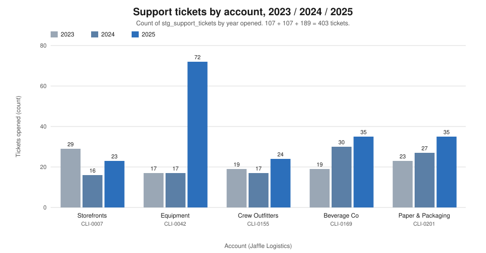
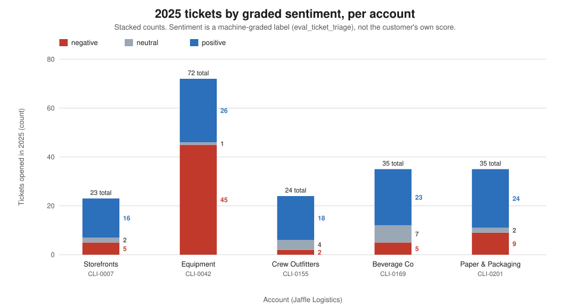
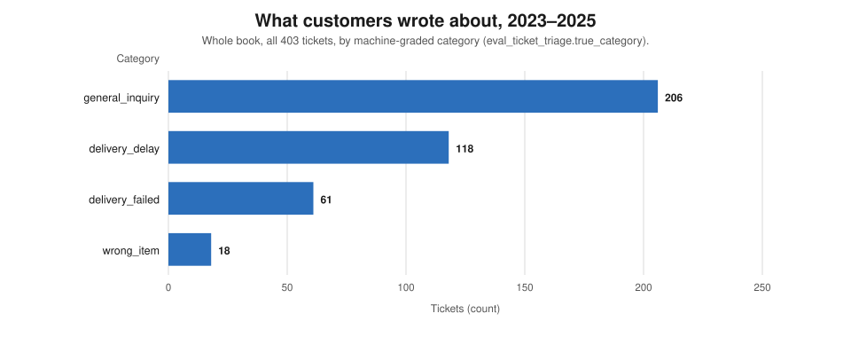
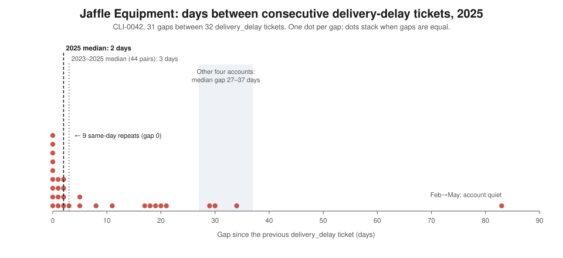
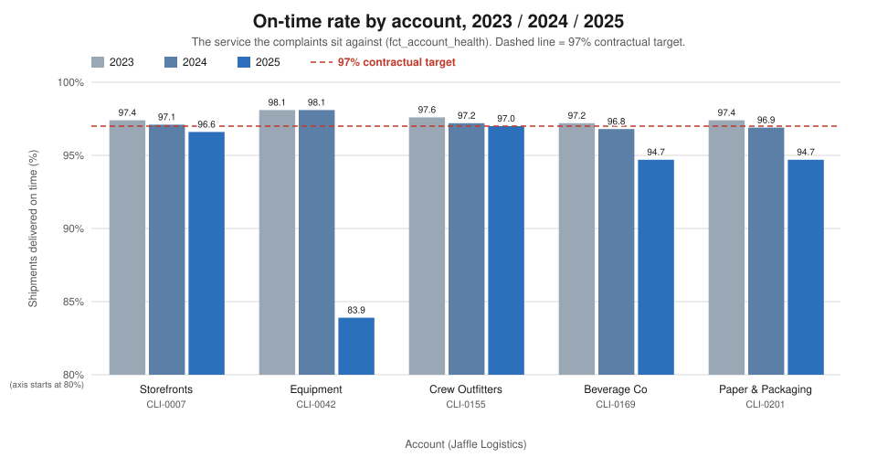

# Customer Experience — the 2025 review for the Head of Customer Experience

*Persona report. Jaffle Logistics, 2025 review. Every figure comes from `execute_sql` queries run
through the dbt Platform remote MCP against `hive_metastore.dbt_smcintyre_jaffle_logistics_prod`
(data pack dated 2026-10-10; the data runs to 2025-12-31). The SQL for each figure is in the appendix.
Sentiment and category in this report are **machine-graded labels** (`eval_ticket_triage.true_sentiment`
/ `true_category`), not the customer's own score — read "negative" as "graded negative".*

---

## 1. The two-minute read

- **What is fine.** Four of five accounts had an ordinary year: ticket volumes flat (Storefronts 29 → 16
  → 23, Crew Outfitters 19 → 17 → 24), mostly positive tickets, and no new kind of complaint anywhere
  except one wrong-item ticket at Crew Outfitters.
- **What is not.** Jaffle Equipment (CLI-0042). Its tickets went 17 → 17 → **72** and its graded-negative
  tickets 2 → 3 → **45**. Its delivery-delay complaints repeat every **3 days** (median, 2023–2025),
  against 27–37 days at every other account — and at least **21 of 44** times the earlier complaint is
  still open or pending today.
- **What it costs.** This data cannot put a currency figure on it. What it can count: 45 graded-negative
  tickets from one account in one year, and a customer who writes "Our account team keeps promising
  improvement and we're not seeing it." A service credit was already issued in February (`LGL-9001`,
  per the published latency analysis; the amount is not in this data).
- **What is exposed.** Our retention reporting. **124 of 327 tickets closed `resolved` (37.9%) did not
  read positive**, so "resolved" overstates how many customers we actually satisfied. And our own account
  record trails the customer: for every account the customer's ticket is the first dated record of the
  year, and the account manager's note follows 7 days to about eight and a half months later.
- **What we do not know.** How fast we answer. The ticket table has no first-response or resolution
  timestamp, so no claim about our responsiveness can be made or defended, and complaint themes cannot be
  traced to a hub or lane without a join we do not have.

---

## 2. What this seat owns

The Head of Customer Experience owns what the customer goes through when something goes wrong: how
complaints are handled, how we communicate while a delivery is failing, which escalation route a customer
can use and whether it works, and the gap between what we promised and what the customer felt. This seat
is judged on **retention and sentiment**, not on the on-time rate — the on-time rate (chart 5) is the
backdrop the complaints sit against, not the measure of this seat.

---

## 3. Findings

### 3.1 Only one account's complaints changed in 2025 — and they got angrier, not just louder

**Claim.** Across three years and 403 tickets, the only account whose complaint volume and tone moved is
Jaffle Equipment (CLI-0042). Its 2025 tickets quadrupled and turned graded-negative; the other four look
the same in 2025 as in 2023. 2025 brought no new complaint *types* — the only client-and-category pair
first seen in 2025 is Crew Outfitters × wrong_item (1 ticket, 2025-05-16, part of the Indianapolis
mispick cluster `INC-2025-02233`). It was a year of *intensification* of existing complaints, on one
account: CLI-0042's delivery_delay went 7 → 6 → 32 and delivery_failed 3 → 1 → 15.



*What this says: every account sits between 16 and 35 tickets a year except Jaffle Equipment in 2025,
at 72.*



*What this says: in 2025 Jaffle Equipment is the only account where graded-negative tickets (45 of 72)
outnumber positive ones; at the other four, negatives are 2 to 9 tickets.*

**Evidence** — ticket volume, category and graded sentiment by account and year (Q2):

| client | yr | total | delay | failed | inquiry | wrong | neg | neu | pos |
|---|---|---|---|---|---|---|---|---|---|
| CLI-0007 Storefronts | 2023 | 29 | 6 | 6 | 15 | 2 | 8 | 3 | 18 |
| CLI-0007 Storefronts | 2024 | 16 | 5 | 2 | 7 | 2 | 5 | 1 | 10 |
| CLI-0007 Storefronts | 2025 | 23 | 5 | 1 | 16 | 1 | 5 | 2 | 16 |
| CLI-0042 Equipment | 2023 | 17 | 7 | 3 | 7 | 0 | 2 | 7 | 8 |
| CLI-0042 Equipment | 2024 | 17 | 6 | 1 | 7 | 3 | 3 | 5 | 9 |
| **CLI-0042 Equipment** | **2025** | **72** | **32** | **15** | 25 | 0 | **45** | 1 | 26 |
| CLI-0155 Crew Outfitters | 2023 | 19 | 7 | 3 | 9 | 0 | 3 | 6 | 10 |
| CLI-0155 Crew Outfitters | 2024 | 17 | 8 | 2 | 7 | 0 | 2 | 8 | 7 |
| CLI-0155 Crew Outfitters | 2025 | 24 | 5 | 1 | 17 | 1 | 2 | 4 | 18 |
| CLI-0169 Beverage Co | 2023 | 19 | 5 | 4 | 9 | 1 | 3 | 5 | 11 |
| CLI-0169 Beverage Co | 2024 | 30 | 5 | 3 | 19 | 3 | 5 | 4 | 21 |
| CLI-0169 Beverage Co | 2025 | 35 | 9 | 2 | 23 | 1 | 5 | 7 | 23 |
| CLI-0201 Paper & Packaging | 2023 | 23 | 6 | 2 | 15 | 0 | 2 | 5 | 16 |
| CLI-0201 Paper & Packaging | 2024 | 27 | 2 | 11 | 11 | 3 | 10 | 4 | 13 |
| CLI-0201 Paper & Packaging | 2025 | 35 | 10 | 5 | 19 | 1 | 9 | 2 | 24 |

**Reconciliation.** Year totals 2023 = 107, 2024 = 107, 2025 = 189; 107 + 107 + 189 = **403**, the full
ticket count (Q1: 403 tickets, 403 graded labels). Categories: delivery_delay 118 + delivery_failed 61 +
general_inquiry 206 + wrong_item 18 = **403**. Sentiments: negative 109 + neutral 64 + positive 230 =
**403**.

One smaller signal worth keeping on the list: Paper & Packaging (CLI-0201) had a delivery_failed spike in
2024 (11 tickets, 10 graded negative that year) that did not recur in 2025.



*What this says: half the book's tickets are general inquiries; the delivery complaints this report is
about — delay and failure — are 179 of 403.*

### 3.2 The sharpest finding: Jaffle Equipment complains about the same thing every few days, and the last complaint is often still open

**Claim.** At Jaffle Equipment, delivery-delay complaints repeat at a median of **3 days** (all 44
consecutive pairs, 2023–2025); delivery-failed every **5 days**. The other four accounts' delay complaints
repeat at a median of **27 to 37 days**, and their failed-delivery complaints at 22 to 160 days. This is
not a chatty customer: Equipment's *general inquiries* repeat every 19 days, in line with the other
accounts (14–20 days). Only the delivery complaints run hot.

Worse: of those 44 delay pairs, the earlier ticket is **resolved in 23 — and still open (9) or pending
(12) in 21**. Because the table carries each ticket's *current* status and no resolution time, 21 is a
floor: those tickets are unresolved even now, so they were certainly unresolved when the customer wrote
again; we cannot tell how many of the 23 "resolved" ones were closed before the next complaint arrived.

**Evidence** — repeat analysis, same client and category, consecutive tickets (Q4, delivery categories):

| client | category | tickets | repeat pairs | median gap (days) | earlier ticket resolved | still open | still pending |
|---|---|---|---|---|---|---|---|
| CLI-0007 | delivery_delay | 16 | 15 | 37 | 14 | 0 | 1 |
| **CLI-0042** | **delivery_delay** | 45 | 44 | **3** | 23 | **9** | **12** |
| **CLI-0042** | **delivery_failed** | 19 | 18 | **5** | 9 | 3 | 6 |
| CLI-0042 | general_inquiry | 39 | 38 | 19 | 35 | 0 | 3 |
| CLI-0155 | delivery_delay | 20 | 19 | 35 | 17 | 1 | 1 |
| CLI-0169 | delivery_delay | 19 | 18 | 27 | 16 | 2 | 0 |
| CLI-0201 | delivery_delay | 18 | 17 | 33 | 15 | 1 | 1 |

What the stacking looks like in the tickets (Q4b, CLI-0042 delivery_delay, 2025; status as of today):

- **January storm:** `TKT-900000` (2025-01-14 09:00), `TKT-900004` (10:34) and `TKT-900008` (12:26) —
  three tickets the same morning, all three **still pending**.
- **August:** `TKT-910012` (2025-08-11, open) → `TKT-910007` (08-13, pending) → `TKT-910008` (08-21,
  pending) → `TKT-910011` and `TKT-910010` (08-21, resolved) → `TKT-910009` (08-22, open).
- **September:** `TKT-910016` (2025-09-10, open) → `TKT-910015` (09-12, pending) → `TKT-910014` (09-14,
  open) → `TKT-910018` (09-19) — four tickets in nine days, each written while the one before it is still
  unresolved.
- **The year ends unresolved:** `TKT-910023` (10-15), `TKT-910031` (11-14) and `TKT-910032` (11-25) are
  all still open.



*What this says: almost every 2025 delay complaint from Jaffle Equipment arrived within days of the last
one — nine on the same day — far left of the 27–37-day band where the other accounts sit.*

(The 31 gaps plotted are 2025 only; their median is 2 days. The 3-day median quoted above is the Q4
figure across all 44 pairs, 2023–2025. Both are marked on the chart. The long gaps — 83 and 34 days —
are February to June, when the account went quiet; see 3.6.)

### 3.3 What the customers said

**Claim.** One line from each account, verbatim (Q5b). Two patterns stand out: our replies promise a
next step but the customer's last word is that the promise is not enough, and Equipment's complaint is
explicitly about the *relationship* ("our account team keeps promising"), not the parcel.

| account | ticket · date · status | the customer, verbatim |
|---|---|---|
| CLI-0007 Storefronts | `TKT-920000` · 2025-05-13 · resolved, CSAT 1 | "We received the WRONG items for SHP-202505-950001. This isn't what we ordered at all — looks like it was meant for someone else." |
| CLI-0042 Equipment | `TKT-910006` · 2025-07-10 · resolved, CSAT 1 | "This keeps happening. Following up on SHP-202507-000334 — another late LTL load. Our account team keeps promising improvement and we're not seeing it." |
| CLI-0155 Crew Outfitters | `TKT-920003` · 2025-05-16 · resolved, CSAT 2 | "We received the WRONG items for SHP-202505-950004. This isn't what we ordered at all — looks like it was meant for someone else." |
| CLI-0169 Beverage Co | `TKT-200018` · 2025-01-05 · resolved, CSAT 1 | "Extremely disappointed. SHP-202501-000308 was marked delayed with zero communication. Please escalate." |
| CLI-0201 Paper & Packaging | `TKT-200040` · 2025-09-01 · open | "This is the second time I'm reaching out about SHP-202508-000026. It was due days ago and I still have nothing. This is unacceptable for the rates we pay." |

Three things these tickets show about how we communicate during a failure:

- **The escalation request was not escalated.** `TKT-200018` asks for escalation; the only reply on the
  ticket is "I've opened an investigation and looped in the Indianapolis operations team." It is closed
  `resolved` with CSAT 1.
- **Equipment's customer reply is a warning.** On `TKT-910006` the customer closes with "This needs to
  actually get fixed, not just promised." The opening line ("This keeps happening. …") recurs on
  `TKT-910003` through `TKT-910032`, to 2025-11-25.
- **"Second time" tickets are a failure of the first contact.** `TKT-200040` (Paper & Packaging) and
  `TKT-200070` (Beverage Co, 2025-09-18) both open with "This is the second time I'm reaching out";
  `TKT-200040` is still open.

### 3.4 The customer is the first to write it down — and our account record is weeks to months behind

**Claim.** For every one of the five accounts, the customer's first 2025 ticket is the **earliest dated
record** of the year. The account manager's own written record (CRM note and call transcript, which fall
on the same day) follows 7 days later at Equipment and 54 days to about eight and a half months later at
the other four.

This **extends** the published latency analysis (`reports/what-did-we-know-and-when.md`), it does not
replace it. That analysis measured our first internal *signal of a problem* from any source — ops
incidents, Slack, incident reports — against the customer's first *complaint*, and found the customer
first on the accounts that went wrong, a median lag of about zero days, and a worst case of −35 days
(Equipment's handling pattern). The table below isolates one internal source — the account manager's
record — and shows it is the slowest of them: where the ops floor sometimes keeps pace with the customer,
the account conversation runs a quarter behind.

**Evidence** — first 2025 dated record per source and account (Q6); "days after" is the calendar-date
difference from the customer's first ticket:

| account | first ticket (customer) | first CRM note / transcript (account manager) | days after | first incident report | days after |
|---|---|---|---|---|---|
| CLI-0007 Storefronts | 2025-01-15 12:20 | 2025-03-10 | 54 | 2025-04-24 | 99 |
| CLI-0042 Equipment | 2025-01-14 09:00 | 2025-01-21 | 7 | 2025-01-16 | 2 |
| CLI-0155 Crew Outfitters | 2025-01-11 17:56 | 2025-03-21 | 69 | 2025-02-21 | 41 |
| CLI-0169 Beverage Co | 2025-01-03 17:06 | 2025-03-13 | 69 | 2025-08-31 | 240 |
| CLI-0201 Paper & Packaging | 2025-01-06 14:22 | 2025-09-20 | 257 | 2025-01-12 | 6 |

The 7-day Equipment figure matches the published analysis (§4.5: customer ticket 2025-01-14 → QBR
`CRM-9001` 2025-01-21). Note this table compares *first records of any kind*, not first complaints, so
it is a different measurement from the published −35-day worst case and should be read alongside it.

What the quarterly record misses is visible in the transcripts. At Paper & Packaging's first account
conversation of the year, `CT-10031` (2025-09-20), the customer says: *"Mostly fine. A couple of late ones
but nothing we lost sleep over."* Six of that account's nine graded-negative 2025 tickets (Q5:
`TKT-900010`, `TKT-200030`, `TKT-920005`, `TKT-200008`, `TKT-200014`, `TKT-200040`) were opened before
that call. At Equipment, the account manager at the July QBR (`CT-99021`, 2025-07-16): *"I don't have a
root cause yet, and I don't want to guess at one."* — two months after `TKT-910000` (2025-05-14) first
said "another late LTL load".

### 3.5 "Resolved" is not the same as "satisfied"

**Claim.** 327 tickets are closed `resolved`. Of those, **68 (20.8%) read negative and a further 56
(17.1%) read neutral — 124 of 327, 37.9%, closed resolved but not positive.** A retention report that
counts resolved tickets as saves overstates the save rate by that margin. Report *resolved and positive*
(203 of 327) instead, and treat resolved-negative tickets as open relationship risk.

**Evidence** — ticket status × graded sentiment, all years (Q3):

| status | tickets | negative | neutral | positive | average CSAT (1–5) |
|---|---|---|---|---|---|
| open | 33 | 17 | 5 | 11 | 1.64 |
| pending | 43 | 24 | 3 | 16 | 2.93 |
| resolved | 327 | 68 | 56 | 203 | 3.77 |

CSAT cannot stand in for this measure on its own: 37 tickets have no CSAT, and open chat and portal
tickets carry none at all (see section 4).

### 3.6 Is there ever a good month?

**Claim.** Not a clean one. Across the whole book there is no month in 2025 without a graded-negative
ticket; the best are **March and April 2025, with 1 negative each**. For Jaffle Equipment, March and April
are also its only months with no negatives — but only because the customer went quiet (3 tickets in
March, 1 in April), not because the service recovered. From July to November Equipment logged 4 to 8
graded-negative tickets every month.

**Evidence** — 2025 tickets by month: total / graded negative / graded positive (Q8):

| month | whole book | Jaffle Equipment (CLI-0042) |
|---|---|---|
| Jan | 24 / 11 / 8 | 8 / 8 / 0 |
| Feb | 19 / 7 / 10 | 9 / 3 / 5 |
| **Mar** | **11 / 1 / 9** | **3 / 0 / 3** |
| **Apr** | **8 / 1 / 7** | **1 / 0 / 1** |
| May | 13 / 6 / 6 | 2 / 1 / 1 |
| Jun | 11 / 2 / 9 | 7 / 2 / 5 |
| Jul | 12 / 4 / 7 | 6 / 4 / 2 |
| Aug | 18 / 8 / 10 | 7 / 6 / 1 |
| Sep | 15 / 9 / 6 | 8 / 7 / 1 |
| Oct | 15 / 8 / 7 | 10 / 8 / 2 |
| Nov | 22 / 6 / 11 | 8 / 5 / 3 |
| Dec | 21 / 3 / 17 | 3 / 1 / 2 |

The Equipment customer said as much at the April QBR (`CT-99020`, 2025-04-15): *"Recovering is fine.
Not-there-yet is the part I'm watching."* A quiet month from an unhappy account is a reason to call, not
a reason to relax.

For context, the service level behind these complaints (Q11):



*What this says: Jaffle Equipment fell from 98.1% to 83.9% on time in 2025 — the only fall large enough
to explain a quadrupling of complaints; the other accounts sit within about two and a half points of the
97% line.*

(The 97% line is the whole-book contractual reference. Individual contracts differ — the published
latency analysis cites a 95.0% target for Beverage Co — so read the line as a common yardstick, not each
account's own SLA.)

### 3.7 What to demand from the data

Two additions would turn this report from "how much did they complain" into "how well did we respond":

1. **Response and closure timestamps on every ticket — `first_response_at` and `resolved_at`.** Today
   `stg_support_tickets` has `opened_at` and nothing after it. With these two fields we can report
   time-to-first-response and time-to-resolve by account, set an internal service level on our own
   responsiveness, and settle exactly how many of Equipment's repeat complaints arrived while the
   previous one was open (section 3.2 can only give a floor of 21).
2. **A per-account link from each ticket to a hub and a lane.** Tickets carry a `shipment_id`, but the
   complaint themes cannot be rolled to a hub or lane in the current models. Today the only hub on a
   ticket is the agent's free text ("an exception at our Chicago hub" in `TKT-200040`, "our Cincinnati
   hub" in `TKT-200070`). A structured ticket → shipment → route → hub link would let us say *where* each
   account's complaints come from — and would give the ops floor the account key the published latency
   analysis (§4.8) asks for.

---

## 4. What the data cannot tell you

| gap | why | decision it blocks |
|---|---|---|
| **How fast we answer** | `stg_support_tickets` has `opened_at` but no `first_response_at` or `resolved_at`. | Any service level on our own responsiveness; any "we replied within X hours" claim to a customer or the board; an exact count of repeat complaints filed while the previous one was open. |
| **Where complaints come from** | No structured per-ticket link to a hub or lane; hub names appear only in free text. | Sending a complaint theme to the right hub manager; deciding whether Equipment's problem is one hub (published work points to Columbus) or the network. |
| **How satisfied a customer really was** | CSAT is sparse: 37 nulls overall, and none on open chat or portal tickets. The graded sentiment label is a machine label, not the customer's own score. | Using CSAT alone as the closure measure; quoting a customer-reported satisfaction score for the year. |
| **How a customer felt in a given week** | CRM notes (56) and transcripts (55) over three years are quarterly-review cadence. | Spotting a souring account between reviews from the account record alone — the ticket queue is the only weekly signal. |
| **What the ops floor saw** | Dispatch notes and Slack carry no graded label, and `knowledge_base` does not yet include them. | Linking customer sentiment to operational chatter; searching both in one place. |
| **What it costs** | No revenue, credit amount or churn figure is in this data. | Pricing the Equipment relationship or the value of fixing it. |

---

## 5. Appendix: the queries

All run via `execute_sql` on the dbt Platform remote MCP, copied from the data pack with every relation
written in full.

**Q1. Corpus size and freshness**

```sql
SELECT 'stg_support_tickets' AS t, count(*) AS n, cast(min(opened_at) AS string) AS mn, cast(max(opened_at) AS string) AS mx FROM hive_metastore.dbt_smcintyre_jaffle_logistics_prod.stg_support_tickets
UNION ALL SELECT 'eval_ticket_triage', count(*), NULL, NULL FROM hive_metastore.dbt_smcintyre_jaffle_logistics_prod.eval_ticket_triage
UNION ALL SELECT 'stg_crm_notes', count(*), cast(min(call_date) as string), cast(max(call_date) as string) FROM hive_metastore.dbt_smcintyre_jaffle_logistics_prod.stg_crm_notes
UNION ALL SELECT 'stg_call_transcripts', count(*), cast(min(call_date) as string), cast(max(call_date) as string) FROM hive_metastore.dbt_smcintyre_jaffle_logistics_prod.stg_call_transcripts
UNION ALL SELECT 'stg_slack_threads', count(*), cast(min(started_at) as string), cast(max(started_at) as string) FROM hive_metastore.dbt_smcintyre_jaffle_logistics_prod.stg_slack_threads
UNION ALL SELECT 'stg_incident_reports', count(*), cast(min(filed_at) as string), cast(max(filed_at) as string) FROM hive_metastore.dbt_smcintyre_jaffle_logistics_prod.stg_incident_reports
UNION ALL SELECT 'knowledge_base', count(*), cast(min(ts) as string), cast(max(ts) as string) FROM hive_metastore.dbt_smcintyre_jaffle_logistics_prod.knowledge_base
```

**Q2. Ticket volume and mix by account and year** (§3.1, charts 1–3)

```sql
SELECT t.client_id AS client, substr(cast(t.opened_at AS string),1,4) AS yr, count(*) AS total,
 sum(case when e.true_category='delivery_delay' then 1 else 0 end) AS cat_delay,
 sum(case when e.true_category='delivery_failed' then 1 else 0 end) AS cat_failed,
 sum(case when e.true_category='general_inquiry' then 1 else 0 end) AS cat_inquiry,
 sum(case when e.true_category='wrong_item' then 1 else 0 end) AS cat_wrong,
 sum(case when e.true_sentiment='negative' then 1 else 0 end) AS sent_neg,
 sum(case when e.true_sentiment='neutral' then 1 else 0 end) AS sent_neu,
 sum(case when e.true_sentiment='positive' then 1 else 0 end) AS sent_pos
FROM hive_metastore.dbt_smcintyre_jaffle_logistics_prod.stg_support_tickets t
JOIN hive_metastore.dbt_smcintyre_jaffle_logistics_prod.eval_ticket_triage e ON t.ticket_id=e.ticket_id
GROUP BY 1,2 ORDER BY 1,2
```

**Q3. Closure quality — status × graded sentiment** (§3.5)

```sql
SELECT t.status, count(*) AS total,
 sum(case when e.true_sentiment='negative' then 1 else 0 end) AS neg,
 sum(case when e.true_sentiment='neutral' then 1 else 0 end) AS neu,
 sum(case when e.true_sentiment='positive' then 1 else 0 end) AS pos,
 round(avg(t.csat),2) AS avg_csat
FROM hive_metastore.dbt_smcintyre_jaffle_logistics_prod.stg_support_tickets t
JOIN hive_metastore.dbt_smcintyre_jaffle_logistics_prod.eval_ticket_triage e ON t.ticket_id=e.ticket_id
GROUP BY 1 ORDER BY 1
```

**Q4. Repeat-complaint analysis** (§3.2)

```sql
WITH tt AS (SELECT t.ticket_id, t.client_id, t.status, t.opened_at, e.true_category AS cat
            FROM hive_metastore.dbt_smcintyre_jaffle_logistics_prod.stg_support_tickets t
            JOIN hive_metastore.dbt_smcintyre_jaffle_logistics_prod.eval_ticket_triage e ON t.ticket_id=e.ticket_id),
g AS (SELECT *, lag(opened_at) over (partition by client_id, cat order by opened_at) AS prev_at,
             lag(status)   over (partition by client_id, cat order by opened_at) AS prev_status FROM tt)
SELECT client_id, cat, count(*) AS n,
 sum(case when prev_at is not null then 1 else 0 end) AS repeat_pairs,
 cast(median(case when prev_at is not null then datediff(opened_at, prev_at) end) as int) AS median_gap_days,
 min(case when prev_at is not null then datediff(opened_at, prev_at) end) AS min_gap_days,
 max(case when prev_at is not null then datediff(opened_at, prev_at) end) AS max_gap_days,
 sum(case when prev_status='resolved' then 1 else 0 end) AS prev_resolved,
 sum(case when prev_status='open' then 1 else 0 end) AS prev_open,
 sum(case when prev_status='pending' then 1 else 0 end) AS prev_pending
FROM g GROUP BY 1,2 HAVING count(*)>=2 ORDER BY 1,2
```

**Q4b. CLI-0042 delivery_delay intervals, 2025** (§3.2, chart 4)

```sql
SELECT t.ticket_id, cast(t.opened_at AS string) AS dt, t.status, t.csat,
 datediff(t.opened_at, lag(t.opened_at) over (order by t.opened_at)) AS gap_days
FROM hive_metastore.dbt_smcintyre_jaffle_logistics_prod.stg_support_tickets t
JOIN hive_metastore.dbt_smcintyre_jaffle_logistics_prod.eval_ticket_triage e ON t.ticket_id=e.ticket_id
WHERE t.client_id='CLI-0042' AND e.true_category='delivery_delay'
  AND substr(cast(t.opened_at AS string),1,4)='2025'
ORDER BY t.opened_at
```

**Q5. 2025 graded-negative tickets, first line** (§3.3, §3.4)

```sql
SELECT t.client_id AS client, t.ticket_id, cast(t.opened_at AS string) AS dt, t.status, t.csat,
 e.true_category AS cat, substr(split_part(t.body,'~~NL~~',1),1,240) AS first_line
FROM hive_metastore.dbt_smcintyre_jaffle_logistics_prod.stg_support_tickets t
JOIN hive_metastore.dbt_smcintyre_jaffle_logistics_prod.eval_ticket_triage e ON t.ticket_id=e.ticket_id
WHERE e.true_sentiment='negative' AND substr(cast(t.opened_at AS string),1,4)='2025'
ORDER BY t.client_id, t.opened_at
```

**Q5b. Full verbatim bodies of the quoted tickets** (§3.3)

```sql
SELECT t.ticket_id, t.client_id, cast(t.opened_at AS string) AS dt, t.status, t.csat,
 e.true_category AS cat, replace(t.body,'~~NL~~',' || ') AS full_body
FROM hive_metastore.dbt_smcintyre_jaffle_logistics_prod.stg_support_tickets t
JOIN hive_metastore.dbt_smcintyre_jaffle_logistics_prod.eval_ticket_triage e ON t.ticket_id=e.ticket_id
WHERE t.ticket_id IN ('TKT-200064','TKT-910006','TKT-900000','TKT-920000','TKT-920003','TKT-200018','TKT-200070','TKT-200040')
ORDER BY t.client_id, t.opened_at
```

**Q6. Internal-versus-external timeline, 2025** (§3.4)

```sql
SELECT src, client_id, cast(mn as string) AS first_2025 FROM (
 SELECT 'ticket(customer)' AS src, client_id, min(opened_at) AS mn FROM hive_metastore.dbt_smcintyre_jaffle_logistics_prod.stg_support_tickets WHERE substr(cast(opened_at AS string),1,4)='2025' GROUP BY 1,2
 UNION ALL SELECT 'crm_note(internal)', client_id, min(call_date) FROM hive_metastore.dbt_smcintyre_jaffle_logistics_prod.stg_crm_notes WHERE substr(cast(call_date AS string),1,4)='2025' GROUP BY 1,2
 UNION ALL SELECT 'transcript(internal)', client_id, min(call_date) FROM hive_metastore.dbt_smcintyre_jaffle_logistics_prod.stg_call_transcripts WHERE substr(cast(call_date AS string),1,4)='2025' GROUP BY 1,2
 UNION ALL SELECT 'incident_report(internal)', s.client_id, min(r.filed_at) FROM hive_metastore.dbt_smcintyre_jaffle_logistics_prod.stg_incident_reports r JOIN hive_metastore.dbt_smcintyre_jaffle_logistics_prod.stg_shipments s ON r.shipment_id=s.shipment_id WHERE substr(cast(r.filed_at AS string),1,4)='2025' GROUP BY 1,2
) ORDER BY client_id, src
```

**Q7. First year each client + category appears** (§3.1)

```sql
SELECT client_id, cat, min(yr) AS first_yr, count(*) AS n, sum(case when yr='2025' then 1 else 0 end) AS n_2025 FROM (
 SELECT t.client_id, e.true_category AS cat, substr(cast(t.opened_at AS string),1,4) AS yr
 FROM hive_metastore.dbt_smcintyre_jaffle_logistics_prod.stg_support_tickets t
 JOIN hive_metastore.dbt_smcintyre_jaffle_logistics_prod.eval_ticket_triage e ON t.ticket_id=e.ticket_id
) GROUP BY 1,2 ORDER BY 1,2
```

**Q8. Monthly ticket volume and sentiment, 2025** (§3.6)

```sql
SELECT client, mo, count(*) AS n, sum(neg) AS neg, sum(pos) AS pos FROM (
 SELECT t.client_id AS client, substr(cast(t.opened_at AS string),1,7) AS mo,
   case when e.true_sentiment='negative' then 1 else 0 end AS neg,
   case when e.true_sentiment='positive' then 1 else 0 end AS pos
 FROM hive_metastore.dbt_smcintyre_jaffle_logistics_prod.stg_support_tickets t
 JOIN hive_metastore.dbt_smcintyre_jaffle_logistics_prod.eval_ticket_triage e ON t.ticket_id=e.ticket_id
 WHERE substr(cast(t.opened_at AS string),1,4)='2025' AND t.client_id='CLI-0042'
 UNION ALL
 SELECT 'ALL', substr(cast(t.opened_at AS string),1,7),
   case when e.true_sentiment='negative' then 1 else 0 end,
   case when e.true_sentiment='positive' then 1 else 0 end
 FROM hive_metastore.dbt_smcintyre_jaffle_logistics_prod.stg_support_tickets t
 JOIN hive_metastore.dbt_smcintyre_jaffle_logistics_prod.eval_ticket_triage e ON t.ticket_id=e.ticket_id
 WHERE substr(cast(t.opened_at AS string),1,4)='2025'
) GROUP BY 1,2 ORDER BY 1,2
```

**Q9. Jaffle Equipment transcript moments, 2025** (§3.4, §3.6)

```sql
SELECT transcript_id, cast(call_date AS string) AS dt, substr(replace(body,'~~NL~~',' | '),1,420) AS excerpt
FROM hive_metastore.dbt_smcintyre_jaffle_logistics_prod.stg_call_transcripts
WHERE client_id='CLI-0042' AND substr(cast(call_date AS string),1,4)='2025' ORDER BY call_date
```

**Q9b. One 2025 transcript moment for each other account** (§3.4)

```sql
SELECT transcript_id, client_id, cast(call_date AS string) AS dt, substr(replace(body,'~~NL~~',' | '),1,300) AS excerpt
FROM hive_metastore.dbt_smcintyre_jaffle_logistics_prod.stg_call_transcripts
WHERE substr(cast(call_date AS string),1,4)='2025' AND client_id<>'CLI-0042' ORDER BY client_id, call_date
```

**Q10. What the data cannot tell you** (§4) — no separate query: the gaps follow from the column list of
`hive_metastore.dbt_smcintyre_jaffle_logistics_prod.stg_support_tickets` returned with Q1 (ticket_id,
client_id, shipment_id, opened_at, channel, status, csat, body), the CSAT nulls in Q3, and the row counts
in Q1.

**Q11. On-time rate by account and year** (chart 5)

```sql
SELECT client_id, substr(cast(month AS string),1,4) AS yr, sum(shipments) AS ship, sum(ticket_count) AS tickets,
 round(100.0*sum(round(ontime_pct*shipments/100.0))/sum(shipments),1) AS ontime_pct
FROM hive_metastore.dbt_smcintyre_jaffle_logistics_prod.fct_account_health GROUP BY 1,2 ORDER BY 1,2
```

Charts are regenerated by `python3 scripts/persona_cx_charts.py`, which embeds the Q2, Q4b and Q11
results as literals.
