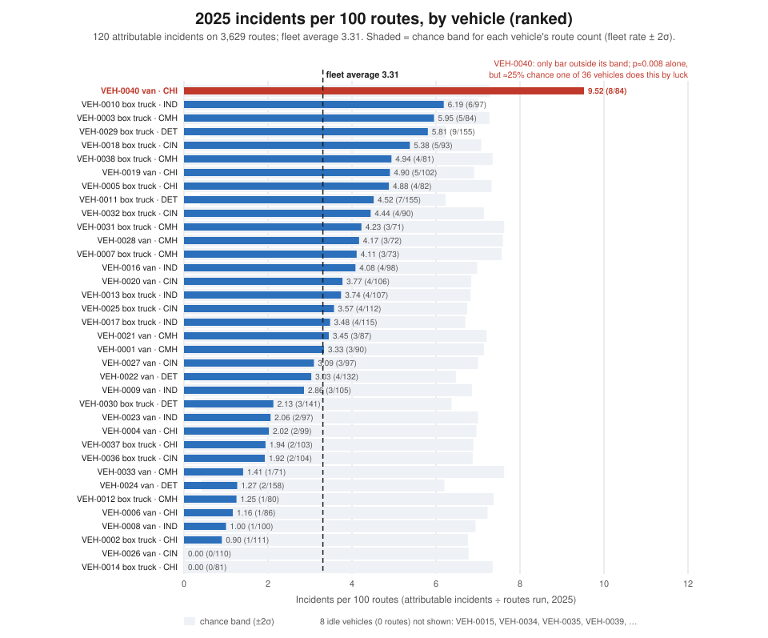
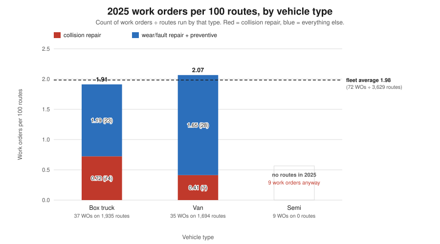
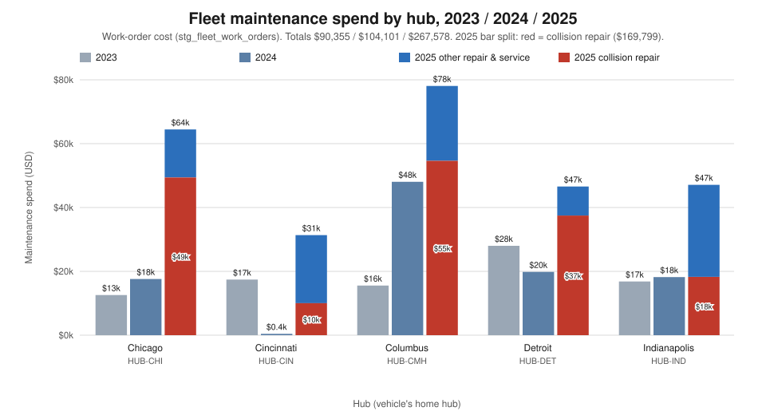
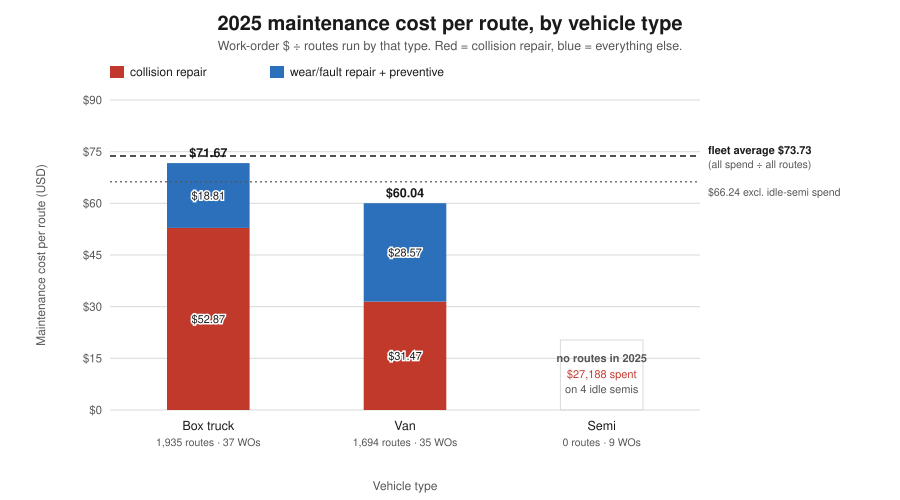
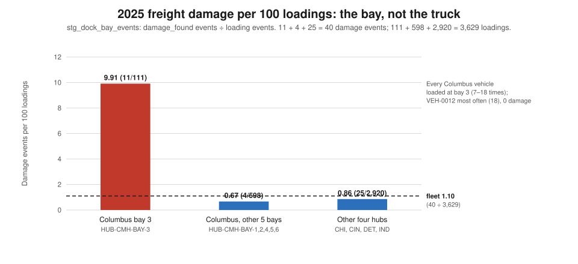
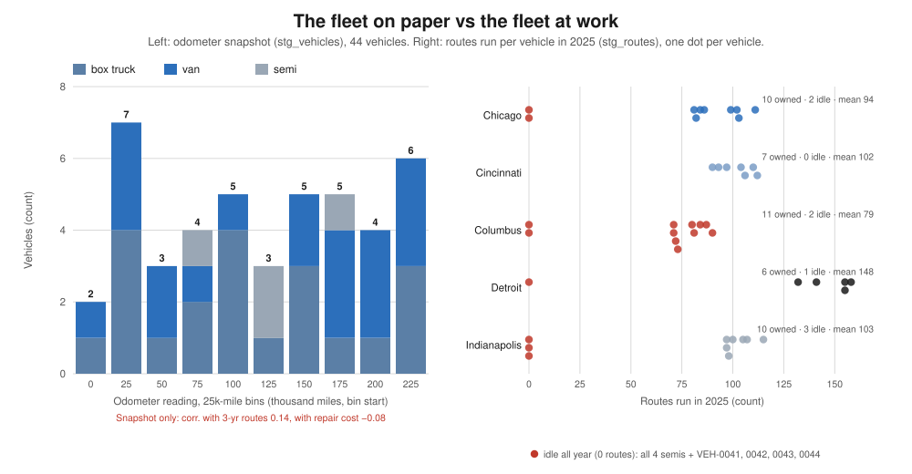

# Fleet / Maintenance: what the fleet costs to keep running, and whether it is to blame

*Persona report for the Head of Fleet / Maintenance. Jaffle Logistics, 2025 review. Every figure comes
from `execute_sql` queries run through the dbt Platform remote MCP against
`hive_metastore.dbt_smcintyre_jaffle_logistics_prod`. The data pack is dated 2026-10-10 and the data runs
to 2025-12-31. The SQL for each figure is in the appendix, numbered Q1–Q26. Where a number is arithmetic
on a query result (a ratio, a share, a difference), the calculation is shown in the text. Charts are
generated by `scripts/persona_fleet_charts.py` from the same figures.*

> **Two corrections to earlier reports, up front.**
> 1. **The Columbus bay-3 explanation is no longer a single document.** The Columbus forensic report said
>    the bay-3 cause rested on one incident report and that settling it "needs bay-level data the
>    warehouse does not hold". That data now exists: `stg_dock_bay_events` landed after that report, and it
>    puts **11 of Columbus's 15 damage events in 2025 at bay 3** (§3.5). The forensic report's conclusion
>    stands, and is now much better supported.
> 2. **The CFO briefing's January and August "planned peaks" were crash bills.** January's maintenance
>    was 96% collision repair and August's 72% (§3.2). Neither month was planned work.

---

## 1. The two-minute read

- **What is fine.** The vehicles are not why deliveries failed. After adjusting for how much each
  vehicle runs, no vehicle and no vehicle type stands out on incidents, damage or work orders. Columbus's
  damage follows a loading bay, not a truck. This seat's instinct to blame the equipment is not
  supported.
- **What is not.** Spend went up **157%** (from $104,101 to $267,578) while routes went up **3.1%**. The
  record of the fleet itself cannot be trusted:
  - Six vehicles listed `retired` or `maintenance` ran 638 routes in 2025.
  - Eight vehicles listed as available, including all four semis, ran none.
  - The odometer never changes.
  - 31 of 44 vehicles have no preventive service on file in three years.
- **What it costs.** Collision repair was **$169,799, 63% of 2025 spend and 69% of the increase**. The
  rest, wear and fault repair plus preventive service, also doubled per route, from $13.40 to $26.94.
  The eight idle vehicles still took $27,188 of work orders.
- **What is exposed.** Collisions are under-reported. Eight 2025 collision repairs ($64,191) cite
  incident numbers that do not exist. The fleet therefore had **at least 22 collisions in 2025, not
  the 14 in the incident log**, and for those eight we cannot say who was driving. VEH-0007 alone had
  three collision repairs in 2025, two of them on consecutive days.
- **What we do not know.** Whether servicing is on time. There is no service schedule, no inspection
  log, no odometer history, no vehicle age or price, and no telematics. That blocks every
  repair-versus-replace decision and every "driver or equipment?" ruling.

---

## 2. What this seat owns

The Head of Fleet / Maintenance owns the vehicles: 44 on the books across five hubs (21 box trucks, 19
vans, 4 semis). The seat also owns what it costs to keep them on the road and whether they are available
when operations need them. It holds the engineering view of damage: when freight arrives broken, did the
equipment fail, or did the handling? This seat's instinct, when delivery fails, is that the equipment
is to blame. This report tests that instinct against exposure-normalised evidence. The unit of exposure
throughout is the **route**: one driver-day in one vehicle at one hub (`stg_routes`). A work order linked to
an incident is treated as a **consequence** of that incident, not a cause, and the two are kept apart.

---

## 3. Findings

### 3.1 No vehicle survives normalisation. The fleet is not the problem.

**Claim.** In 2025 the fleet averaged **3.31 incidents per 100 routes** (120 attributable incidents on
3,629 routes). Only one vehicle sits outside the range that chance alone would produce for its route
count: **VEH-0040**, a Chicago van, at 9.52 (8 incidents on 84 routes). Taken alone, that result would
happen by luck about 0.8% of the time. But 36 vehicles were tested, and the chance that at least one of
them looks this bad by luck is about **25%**. Its result is also above the stricter cut-off for 36 tests
(0.14%). **No vehicle is a demonstrated problem.** Work orders per 100 routes tell the same story by
type: box trucks 1.91, vans 2.07, fleet 1.98.



*What this says: 35 of 36 working vehicles sit inside their chance band. The one that does not,
VEH-0040, is the kind of outlier you expect to see once among 36 vehicles by luck.*

**Evidence: the league, 2025** (Q8). The top ten and bottom five are shown here; the full 36 are in the
chart and in Q8.

| rank | vehicle | type | hub | routes | incidents | of which damage / accident | per 100 routes | chance band upper (±2σ) | work orders | WOs per 100 routes |
|---|---|---|---|---:|---:|---|---:|---:|---:|---:|
| 1 | VEH-0040 | van | HUB-CHI | 84 | 8 | 0 / 2 | **9.52** | 7.27 | 2 | 2.38 |
| 2 | VEH-0010 | box | HUB-IND | 97 | 6 | 0 / 0 | 6.19 | 7.00 | 2 | 2.06 |
| 3 | VEH-0003 | box | HUB-CMH | 84 | 5 | 3 / 0 | 5.95 | 7.27 | 1 | 1.19 |
| 4 | VEH-0029 | box | HUB-DET | 155 | 9 | 1 / 1 | 5.81 | 6.23 | 2 | 1.29 |
| 5 | VEH-0018 | box | HUB-CIN | 93 | 5 | 3 / 0 | 5.38 | 7.08 | 2 | 2.15 |
| 6 | VEH-0038 | box | HUB-CMH | 81 | 4 | 3 / 0 | 4.94 | 7.35 | 0 | 0.00 |
| 7 | VEH-0019 | van | HUB-CHI | 102 | 5 | 1 / 1 | 4.90 | 6.91 | 1 | 0.98 |
| 8 | VEH-0005 | box | HUB-CHI | 82 | 4 | 0 / 2 | 4.88 | 7.32 | 3 | 3.66 |
| 9 | VEH-0011 | box | HUB-DET | 155 | 7 | 2 / 0 | 4.52 | 6.23 | 4 | 2.58 |
| 10 | VEH-0032 | box | HUB-CIN | 90 | 4 | 0 / 0 | 4.44 | 7.14 | 0 | 0.00 |
| … | | | | | | | | | | |
| 32 | VEH-0006 | van | HUB-CHI | 86 | 1 | 0 / 0 | 1.16 | 7.23 | 2 | 2.33 |
| 33 | VEH-0008 | van | HUB-IND | 100 | 1 | 0 / 0 | 1.00 | 6.94 | 3 | 3.00 |
| 34 | VEH-0002 | box | HUB-CHI | 111 | 1 | 0 / 0 | 0.90 | 6.76 | 1 | 0.90 |
| 35 | VEH-0026 | van | HUB-CIN | 110 | 0 | 0 / 0 | 0.00 | 6.77 | 1 | 0.91 |
| 36 | VEH-0014 | box | HUB-CHI | 81 | 0 | 0 / 0 | 0.00 | 7.35 | 0 | 0.00 |
| | **fleet (36 vehicles that ran routes)** | | | **3,629** | **120** | 26 / 13 | **3.31** | | **72** | **1.98** |

**Reconciliation.** Over the 36 vehicles that ran routes:
- Incidents sum to **120** and routes to **3,629**.
- Adding the one incident on idle VEH-0015 (`INC-2025-00417`) gives the 121 incidents that can be tied
  to a vehicle, out of 174 in 2025 (Q25). The other 53 name no vehicle and no route.
- Their work orders, 72 costing $240,390, plus the idle semis' 9 costing $27,188, give **81 work orders
  and $267,578**, the 2025 total.

**How the chance band works.** For a vehicle that ran *n* routes at the fleet rate, the expected count
is 3.31 × *n* / 100, and the band is that expectation ± 2 standard deviations. A vehicle with few routes
gets a wide band, because three incidents on 70 routes is not unusual. This is the same normalisation
that cleared the Columbus vehicles in the forensic report, applied here to the whole fleet.

**What VEH-0040's eight incidents actually are** (Q8, Q26):
- 5 delays, 2 accidents, 1 weather event, no damage.
- Three of the eight fell on one day, 2025-07-21. `INC-2025-00105` and `INC-2025-00234` both sit on
  route `RTE-CHI-20250721-005`.
- **Four of the eight came on the 10 routes driven by one driver, `DRV-01007`.** That includes
  accident `INC-2025-00151`. The other eight drivers who used this van had 4 incidents on 74 routes.
  (Driver totals: 84 routes, 8 incidents ✓.)

This is a pattern a telematics record could resolve and a work order cannot. The van's mechanical
record is three DEF-sensor replacements in 2023–24 (`WO-300086`, `WO-300112`, `WO-300099`), when it ran no
routes, and two 2025 collision repairs. Nothing in its record points to a defect that causes delays.

**By vehicle type** (Q9, Q10). The type cut the Columbus report did not make:

| 2025 | routes | incidents | per 100 routes | damage | per 100 routes | work orders | per 100 routes |
|---|---:|---:|---:|---:|---:|---:|---:|
| box truck | 1,935 | 71 | 3.67 | 16 | 0.83 | 37 | 1.91 |
| van | 1,694 | 49 | 2.89 | 10 | 0.59 | 35 | 2.07 |
| semi | **0** | 1 | — | 0 | — | 9 | — |
| **fleet** | **3,629** | **121** | 3.31 (on 120) | **26** | 0.72 | **81** | 1.98 (on 72) |

None of the box-versus-van differences is larger than chance would produce. Each type is less than one
standard deviation from the fleet (Q10: incidents +0.88 / −0.94; damage +0.57 / −0.61; work orders
−0.22 / +0.24). Box trucks have slightly more incidents and damage; vans have slightly more work
orders. Neither type is a problem class.



*What this says: box trucks and vans need the workshop at about the same rate, around 2 work orders per
100 routes. Box trucks' visits are more often collision repairs, and vans' more often wear and faults.*

### 3.2 Spend grew 157% on 3% more work, and collisions are most of the growth

**Claim.** Maintenance went from $90,355 (2023) to $104,101 (2024) to **$267,578** (2025). Volume barely
moved: routes +3.1%, shipments +3.1%. So the growth is not volume. **Collision repair**, a consequence of
accidents rather than a measure of fleet condition, rose from $56,924 to $169,799. That is **$112,875 of
the $163,477 increase (69%)**. The remaining $50,602 is genuine wear-and-fault and preventive spend,
which doubled per route.

**Evidence: fleet totals** (Q7, Q12).

| | 2023 | 2024 | 2025 | 2024→2025 |
|---|---:|---:|---:|---:|
| routes | 3,338 | 3,521 | 3,629 | +3.1% |
| shipments (`stg_shipments.created_at`) | 1,848 | 1,949 | 2,009 | +3.1% |
| work orders | 41 | 41 | 81 | +98% |
| **spend** | **$90,355** | **$104,101** | **$267,578** | **+157%** |
| of which collision repair | $44,296 (8 WOs) | $56,924 (8) | **$169,799 (22)** | +$112,875 |
| of which preventive service | $5,923 (3) | $5,251 (3) | $14,934 (11) | +$9,683 |
| of which wear/fault repair | $40,136 (30) | $41,926 (30) | $82,845 (48) | +$40,919 |
| spend per route | $27.07 | $29.57 | **$73.73** | ×2.5 |
| non-collision spend per route | $13.80 | $13.40 | **$26.94** | ×2.0 |
| spend per shipment | $48.89 | $53.41 | $133.19 | ×2.5 |
| spend per vehicle on the books (44) | $2,054 | $2,366 | $6,081 | ×2.6 |
| work orders per 100 routes | 1.23 | 1.16 | 2.23 | ×1.9 |
| average collision-repair order | $5,537 | $7,116 | $7,718 | +8% |

**Reconciliation.** Each year's three categories sum to the total:
- 2023: $44,296 + $5,923 + $40,136 = **$90,355**
- 2024: $56,924 + $5,251 + $41,926 = **$104,101**
- 2025: $169,799 + $14,934 + $82,845 = **$267,578**

These match the CFO briefing's Q9/Q22 totals exactly. The cost ledger (`stg_cost_ledger`), which arrived
after that briefing, carries a maintenance line that equals the work-order table to the dollar in every
hub-year (Q24). It is a copy, not a second source. Maintenance was 3.7% of 2025 operating cost
($267,578 of $7,180,014), up from 1.4% in 2023, and it accounted for 25% of the year's $650,088 cost
increase.

**By hub** (Q6). Every hub rose, but for different reasons:

| hub | 2023 | 2024 | 2025 | 2025 per route | 2025 per shipment | 2025 per vehicle | 2025 collision share | non-collision per route, 2024 → 2025 |
|---|---:|---:|---:|---:|---:|---:|---:|---|
| Chicago `HUB-CHI` | $12,576 | $17,588 | $64,456 | $86.2 | $156.4 | $6,446 | **77%** | $20.9 → $20.1 (flat) |
| Cincinnati `HUB-CIN` | $17,423 | $437 | $31,362 | $44.0 | $78.8 | $4,480 | 32% | $0.6 → $30.0 |
| Columbus `HUB-CMH` | $15,538 | $48,044 | **$78,083** | **$110.1** | **$225.0** | $7,098 | 70% | $32.5 → $33.1 (flat) |
| Detroit `HUB-DET` | $27,990 | $19,829 | $46,581 | $62.9 | $109.1 | **$7,764** | **80%** | $7.0 → $12.3 |
| Indianapolis `HUB-IND` | $16,828 | $18,203 | $47,096 | $65.5 | $110.8 | $4,710 | 39% | $7.7 → **$40.1** |
| **total** | **$90,355** | **$104,101** | **$267,578** | $73.73 | $133.19 | $6,081 | 63% | $13.40 → $26.94 |

Hub totals reconcile to the yearly totals. 2025 collision spend by hub is $49,405 + $10,030 + $54,635
+ $37,468 + $18,261 = **$169,799**. In plain terms:
- **Chicago, Columbus and Detroit** grew because of collisions. Their underlying cost per route did not
  move, or barely moved.
- **Indianapolis** is the hub where wear-and-fault spend genuinely climbed, from $7.7 to $40.1 per route.
- **Cincinnati's** 2024 figure is one work order worth $437, which is not believable for seven vehicles
  over a year. Treat its 2025 "jump" as possibly a recording gap in 2024.



*What this says: every hub's spend jumped in 2025, and in Chicago, Columbus and Detroit the red
collision-repair block is most of the jump.*

**By vehicle type** (Q9).

| type | 2023 $/route | 2024 $/route | 2025 $/route | 2025 collision $/route | 2025 other $/route | 2025 spend |
|---|---:|---:|---:|---:|---:|---:|
| box truck | $29.0 | $20.7 | **$71.67** | $52.87 | $18.81 | $138,683 |
| van | $28.3 | $37.7 | **$60.04** | $31.47 | $28.57 | $101,707 |
| semi | $8.0 | $21.6 | **no routes** | — | — | $27,188 |
| **fleet** | $27.07 | $29.57 | **$73.73** | | | **$267,578** |

$138,683 + $101,707 + $27,188 = **$267,578** ✓.
- The fleet average of $73.73 counts the semis' spend over everyone's routes. Without the idle semis it
  is $66.24 ($240,390 ÷ 3,629).
- Box trucks cost more per route only because they had more collision repair: 14 of their 37 orders,
  against 7 of 35 for vans.
- On everything else, vans cost more ($28.57 against $18.81 per route).



*What this says: both working types sit near the fleet average, box trucks' higher cost is collision
repair, and the semis spent $27,188 while running no routes at all.*

**Where I disagree with the CFO briefing.** The briefing read 2025's monthly maintenance as "two peaks
(Jan $35k, Aug $35k)… the month pattern suggests planned peaks rather than a steady drift". The work
orders say otherwise (Q23):
- **January: $35,350, of which $34,035 (96%) is collision repair.** It includes the $14,200 jackknife
  on semi VEH-0015 (`WO-900001`, `INC-2025-00417`, the January Chicago storm).
- **August: $34,710, of which $25,088 (72%) is collision repair.** It includes `WO-300019` ($11,900) and
  `WO-300000` ($4,349), both on VEH-0007 on consecutive days.

These peaks were not planned. They are crash bills. The CFO's monthly totals are correct; only the
reading is wrong.

### 3.3 Collisions are under-recorded: 22 collision repairs, but 14 collisions on file

**Claim.** The incident log records **14 accidents in 2025** (15 in 2023, 12 in 2024), roughly flat.
The workshop opened **22 collision-repair orders**.
- 14 are linked to those 14 accidents, one each, costing $105,608.
- The other **8, costing $64,191, name an incident number in their text that does not exist** in
  `stg_incidents` or in the raw `incidents` table (Q13).

So the fleet had at least 22 collisions in 2025, and for 8 of them there is no incident record: no date,
no driver, no severity. This is the single most important gap in the accident record. The workshop
knows about collisions that operations never logged.

**Evidence** (Q13): the eight orders and the incident numbers they cite.

| work order | vehicle | hub | opened | cost | cites (not on file) |
|---|---|---|---|---:|---|
| WO-300007 | VEH-0024 | HUB-DET | 2025-01-15 | $9,812 | INC-2025-00087 |
| WO-300012 | VEH-0012 | HUB-CMH | 2025-02-05 | $6,542 | INC-2025-00138 |
| WO-300020 | VEH-0011 | HUB-DET | 2025-02-12 | $10,401 | INC-2025-00256 |
| WO-300010 | VEH-0008 | HUB-IND | 2025-05-26 | $2,023 | INC-2025-00133 |
| WO-300017 | VEH-0011 | HUB-DET | 2025-06-08 | $12,195 | INC-2025-00235 |
| WO-300000 | VEH-0007 | HUB-CMH | 2025-08-12 | $4,349 | INC-2025-00001 |
| WO-300011 | VEH-0031 | HUB-CMH | 2025-08-21 | $8,839 | INC-2025-00134 |
| WO-300016 | VEH-0036 | HUB-CIN | 2025-12-05 | $10,030 | INC-2025-00197 |
| **total** | | | | **$64,191** | |

$105,608 + $64,191 = **$169,799**, the 2025 collision-repair total ✓.

Across all three years, **no work order is linked to a `damage` incident**. Every incident-linked work
order is a collision (or the jackknife). The forensic report found this for Columbus; it holds for the
whole fleet. **Freight damage leaves no mark in the workshop.** That is consistent with damage being a
handling event (§3.5).

### 3.4 The tail: the most expensive vehicles are crash-damaged, not worn out

**Claim.** The ten most expensive vehicles over 2023–25 (Q17) are expensive because they keep getting
hit:
- In 8 of the 10, collision repair is more than 70% of the bill.
- Two of the six costliest have among the lowest odometer readings in the fleet: VEH-0013 at 20,012
  miles and VEH-0040 at 28,645.
- **Nothing in the work-order text describes a vehicle wearing out.**

The record supports **repairing, not replacing**, every one of them. What it calls for instead is a
driver and route review for the repeat-collision vehicles, and a decision on the idle ones. The
replacement case cannot be priced either way, because there is no vehicle age, purchase price or
residual value (§4).

| vehicle | hub | type | status | odometer | routes 2023–25 | WOs | 3-yr cost | collision repair | non-collision | cost per route |
|---|---|---|---|---:|---:|---:|---:|---:|---:|---:|
| VEH-0007 | HUB-CMH | box | active | 118,785 | 199 | 9 | **$34,166** | $27,211 (4) | $6,955 | $171.7 |
| VEH-0024 | HUB-DET | van | active | 203,294 | 513 | 3 | $28,014 | $28,014 (3) | $0 | $54.6 |
| VEH-0011 | HUB-DET | box | **retired** | 107,230 | 155 | 5 | $27,751 | $22,596 (2) | $5,155 | $179.0 |
| VEH-0015 | HUB-CHI | semi | active | 126,858 | 161 | 7 | $23,610 | $14,200 (1) | $9,410 | $146.6 |
| VEH-0013 | HUB-IND | box | active | 20,012 | 283 | 6 | $21,797 | $17,877 (3) | $3,920 | $77.0 |
| VEH-0040 | HUB-CHI | van | **maintenance** | 28,645 | 84 | 6 | $21,271 | $16,968 (2) | $4,303 | $253.2 |
| VEH-0033 | HUB-CMH | van | active | 8,850 | 193 | 9 | $19,833 | $8,485 (1) | $11,348 | $102.8 |
| VEH-0044 | HUB-DET | van | active | 33,180 | 347 | 4 | $19,407 | $16,952 (3) | $2,455 | $55.9 |
| VEH-0031 | HUB-CMH | box | active | 239,941 | 228 | 3 | $18,082 | $16,771 (2) | $1,311 | $79.3 |
| VEH-0021 | HUB-CMH | van | active | 90,694 | 248 | 7 | $17,952 | $9,387 (1) | $8,565 | $72.4 |

**VEH-0007 (Columbus box truck): the most expensive vehicle, with the best service record.** It has
four collision repairs ($27,211). Three of them came in 2025:

> **WO-300004** (2025-04-18, $5,051, `INC-2025-00075`): *"COMPLAINT: Collision/accident damage reported by
> field. DIAGNOSIS: Front-end damage, coolant leak, bumper and headlamp assembly compromised. PARTS: bumper
> assy, headlamp, coolant hose, clips. LABOR: 13 hrs. DISPOSITION: returned to service."*
>
> **WO-300000** (2025-08-12, $4,349, cites `INC-2025-00001`, not on file) and **WO-300019** (2025-08-13,
> $11,900, `INC-2025-00250`): two collision repairs on consecutive days, the second *"Front-end damage,
> coolant leak, bumper and headlamp assembly compromised… held for parts."*

Its non-collision record is ordinary: one tire job, one check-engine fix, and **three preventive
services** (`WO-300029`, `WO-300062`, `WO-300055`), each *"Within normal wear; serviced per schedule."*
No other vehicle has more. Mechanically this truck is sound. Repair it, and ask why it keeps getting
hit. Its 2025 incident rate (4.11 per 100 routes) is inside its chance band, so the question is about
the routes and drivers it is given, which only telematics or a driver-level review can answer.

**VEH-0011 (Detroit box truck): listed `retired`, ran 155 routes and took $25,595 in 2025.**

> **WO-300020** (2025-02-12, $10,401, cites `INC-2025-00256`, not on file): *"COMPLAINT: Collision/accident
> damage reported by field. DIAGNOSIS: Bent tie rod and control arm following impact; alignment out of
> spec. PARTS: liftgate hydraulic line, panel, fasteners. LABOR: 11 hrs."*
>
> **WO-300017** (2025-06-08, $12,195, cites `INC-2025-00235`, not on file): *"Front-end damage, coolant leak,
> bumper and headlamp assembly compromised."*

A vehicle the register calls retired was one of Detroit's two busiest trucks (155 routes, tied with
VEH-0029). It absorbed $22,596 of collision repair for two collisions that are not in the incident log.
Note also that the first order's parts (a liftgate line) do not match its diagnosis (a tie rod). The
problem here is the register and the accident record, not the truck. Either its status is wrong, or a
retired vehicle is still in daily use.

**VEH-0015 (Chicago semi): released after the January storm, then never ran a route again.**

> **WO-900001** (2025-01-15, $14,200, `INC-2025-00417`): *"COMPLAINT: Jackknife event during winter storm;
> tractor and trailer damage. DIAGNOSIS: Bent fifth-wheel mount, damaged air lines, scuffed trailer skin,
> front fender and step assembly compromised… LABOR: 26 hrs. DISPOSITION: held for parts, then
> road-tested and released."*

The same semi has had **the same check-engine fix three times**: *"EGR valve sticking; cleared and
tested"* in `WO-300100` (2023), `WO-300146` (2024) and `WO-300049` (2025), $5,529 in total. After the
storm it collected $6,383 of further work in 2025 while running **no routes**. That includes
`WO-300064`, *"Brake noise reported by driver"*, on 2025-11-13, on a truck with no recorded driver that
year. This is not a repair-or-replace question. It is a keep-or-dispose question: the asset is idle
(§3.6), and the repeated EGR fix suggests that clearing the fault has not fixed it.

**Repeat repairs: fixes that did not hold** (Q19). Thirteen vehicle-and-fault pairs were repaired two or
more times. The clearest:
- **VEH-0033**'s lift-gate latch was fixed four times in nine months (`WO-300161`, `WO-300109`,
  `WO-300094`, `WO-300152`). Each time the record reads *"Latch strike worn; hydraulic line weeping at
  the fitting"*.
- **VEH-0018**'s brakes were done twice in six days (`WO-300042` on 2025-03-03, `WO-300072` on
  2025-03-09).

Repeat repairs are the strongest repair-versus-replace signal this data has, and they point at
individual components, not at whole vehicles.

### 3.5 Damage: handling, not fleet, and the bay data now proves it

**The Columbus finding, in this seat's terms.** The forensic report found that Columbus's 2025
damage surge (15 events) did not follow the vehicles:
- The two "worst" trucks, VEH-0003 and VEH-0038 (3 damage events each), were within chance.
- The damaged vehicles had *less* maintenance than average.
- The hub's two most-repaired vehicles had no damage.
- No work order hangs off a damage incident.

It pointed to bay-3 forklift staging, on the strength of one incident report (IR-9003). It could not
prove that, for lack of bay-level data.

**What is new: the bay data exists.** `stg_dock_bay_events` records every loading (one per route) and
every `damage_found` event, with the bay (Q14, Q15).

| 2025 | loadings | damage events | per 100 loadings |
|---|---:|---:|---:|
| **Columbus bay 3** (`HUB-CMH-BAY-3`) | 111 | **11** | **9.91** |
| Columbus, other five bays | 598 | 4 | 0.67 |
| Other four hubs | 2,920 | 25 | 0.86 |
| **all** | **3,629** | **40** | **1.10** |

11 + 4 + 25 = **40**, the year's damage incidents; 111 + 598 + 2,920 = **3,629**, the year's routes ✓.
Bay 3 had **no** damage events in 2023 or 2024.

**And the vehicles?** Every one of Columbus's nine working vehicles loaded at bay 3, between 7 and 18
times:
- **VEH-0003's three damage events were all at bay 3.**
- **VEH-0038's were two at bay 3 and one at bay 5.**
- **VEH-0012 loaded at bay 3 more often than any vehicle (18 times) and had no damage.**
- Outside bay 3, Columbus vehicles had 4 damage events on 598 loadings.

The bay-3 entries read like a handling log, not an engineering one:
- *"Crushed pallet found at bay 3. Staged in forklift lane."* (`DBE-181946`, VEH-0038, `INC-2025-00094`)
- *"Forked carton at bay 3 staging, again. Photos taken."* (`DBE-172311`, `INC-2025-00148`)
- *"Damage on freight staged at bay 3. Lane congested at the time."* (`DBE-196880`, VEH-0003,
  `RTE-CMH-20251217-003`, `INC-2025-00254`)



*What this says: Columbus bay 3 damaged freight at about fifteen times the rate of the hub's other bays,
whichever truck was at the door.*

**The vehicle-type cut** (Q16). Damage per 100 loadings in 2025:
- **Box trucks 0.83 (16 events), vans 0.59 (10).**
- Excluding Columbus bay 3: **box trucks 0.59, vans 0.43.**
- The other 14 damage events name no vehicle.
- 16 + 10 + 14 = 40 ✓.

The gap between the types is less than one standard deviation (Q10) and is not evidence of a type
problem.

**Verdict: the fleet view survives, and is stronger than before. Damage is a handling problem.**
Columbus's cluster is a bay, not a set of trucks. One caution, as the forensic report also said: damage
outside Columbus bay 3 still rose, from 7 to 8 to **29** (2023 → 2025). That rise follows no vehicle,
no type and no work order either, so it is not a fleet problem. But its cause is not in this data
(§4). This report agrees with the forensic report on every point. It replaces that report's "low to
moderate confidence" in the bay-3 explanation with direct evidence.

### 3.6 Availability: eight vehicles idle all year, and a register that says the opposite

**Claim.** In 2025, **36 of 44 vehicles ran routes and 8 ran none**: all four semis, plus `VEH-0041`,
`VEH-0042`, `VEH-0043` and `VEH-0044`. Seven of the eight are listed `active`. Meanwhile **six vehicles
listed `retired` (VEH-0011, VEH-0014, VEH-0030) or `maintenance` (VEH-0010, VEH-0012, VEH-0040) ran
638 routes**, 17.6% of the year's work (97 + 155 + 80 + 81 + 141 + 84 = 638; 638 ÷ 3,629).

The swap happened on the 1 January 2025 boundary (Q5):
- Each of the seven idle "active" vehicles ran its last route between 2024-12-26 and 2024-12-31.
- Each of the six "retired"/"maintenance" vehicles ran its first route between 2025-01-01 and
  2025-01-08.
- `VEH-0039` (a semi) has never run a route in three years.

The status field does not describe which vehicles are available. Idle vehicles still cost money: the
eight took $27,188 of work orders in 2025, all on the three semis (Q22).

**Utilisation.** Routes per vehicle is a **proxy**, not true utilisation. A vehicle can run up to four
routes in one day, and there are no hours, miles or engine-on time. On that proxy, 2025 (Q21):

| hub | vehicles owned | ran routes | idle | routes | routes per running vehicle (min–max) | mean | routes per owned vehicle |
|---|---:|---:|---:|---:|---|---:|---:|
| Chicago | 10 | 8 | 2 | 748 | 81–111 | 93.5 | 74.8 |
| Cincinnati | 7 | 7 | 0 | 712 | 90–112 | 101.7 | 101.7 |
| Columbus | 11 | 9 | 2 | 709 | 71–90 | **78.8** | **64.5** |
| Detroit | 6 | 5 | 1 | 741 | 132–158 | **148.2** | **123.5** |
| Indianapolis | 10 | 7 | 3 | 719 | 97–115 | 102.7 | 71.9 |
| **fleet** | **44** | **36** | **8** | **3,629** | 71–158 | 100.8 | 82.5 |

Vehicles 10 + 7 + 11 + 6 + 10 = 44 ✓; routes sum to 3,629 ✓. Every hub ran 2.4–2.6 routes per
operating day. Detroit does that work on five vehicles, Columbus on nine, so a Detroit vehicle runs
nearly twice as many routes as a Columbus one. Columbus is the obvious place to look for a vehicle to
retire or move, and Detroit the place where one breakdown hurts most.



*What this says: on paper the fleet is spread evenly from new to 240,000 miles, but the odometer does
not track how hard a vehicle works. What matters is the right panel: eight vehicles did nothing in
2025, and Detroit's five do twice Columbus's per-vehicle work.*

**The semis are the biggest availability question.** No semi ran a route in 2025. In 2023–24 the three
working semis ran 246 and 238 routes. Either the company stopped running semi trips, leaving four idle
tractors (one of them repaired for $14,200 in January), or semi trips happen and are not recorded in
`stg_routes`. The data cannot tell which.

### 3.7 Preventive maintenance: the question cannot be answered, and the record looks thin

**Claim.** "Is servicing on time?" **cannot be answered from this data**, and I have not approximated it.
There is no service schedule, no service interval and no odometer reading taken at service. What the
record does show is thin:
- **31 of 44 vehicles have no preventive service on file in three years** (Q20).
- There were 17 preventive orders in total (3, 3, then 11 in 2025).
- 28 vehicles had fault repairs but no preventive service on file.

Whether that means servicing was skipped, or done and not recorded, is unknowable here. Every preventive
order says *"serviced per schedule"*, but the schedule itself is not in the warehouse.

**The odometer cannot fill the gap** (Q3, Q4):
- **All 125 work orders that print an odometer print today's snapshot.** VEH-0007 reads "Odometer
  118785" on a 2023 tire job (`WO-300158`) and on a December 2025 service (`WO-300055`).
- Across the fleet, the snapshot barely relates to work done or money spent: correlation with three-year
  routes 0.14, with repair cost −0.08.
- VEH-0033 reads 8,850 miles after 193 routes.

There is no mileage history, so the reading cannot rank vehicles for end of life and cannot test
service intervals.

On the evidence available, the fleet is closer to **running to failure** than to a planned regime. In
2025, 48 wear and fault repairs against 11 preventive services, plus 13 repeat-repair pairs (§3.4), is
what running to failure looks like. That is an inference from the mix of work orders, not a measurement
of missed services.

---

## 4. What the data cannot tell you

| gap | what is missing | decision it blocks |
|---|---|---|
| **Service schedule and intervals** | No schedule or interval table; preventive orders say "per schedule" but the schedule is absent | Whether servicing is on time; whether the 31 vehicles with no preventive record are overdue or merely unrecorded |
| **Odometer history** | 125 of 125 odometer stamps on work orders equal today's snapshot; the snapshot does not track routes (corr. 0.14) or cost (−0.08) | Mileage-based servicing and replacement; cost per mile; checking intervals |
| **Vehicle age, purchase price, residual value** | Not in `stg_vehicles` | Any repair-versus-replace decision in dollars; capital planning |
| **Vehicle inspection log** | Dock `inspection` events are bay walks (no vehicle); no pre-trip or annual inspection outcomes | Whether high-incident vehicles (VEH-0040, VEH-0010) are mechanically worse or just unlucky |
| **Telematics** (speed, harsh braking, location, engine hours) | None | Driver versus equipment for every collision, starting with VEH-0007's three and VEH-0040's driver pattern |
| **Downtime** | Work orders have an open date but no close date; "held for parts" has no duration | Availability %, cost of a vehicle off the road, whether parts supply is the bottleneck |
| **The 8 missing collisions** | Work orders cite `INC-2025-00087`, `-00138`, `-00256`, `-00133`, `-00235`, `-00001`, `-00134`, `-00197`; none exist | The true accident rate (≥22, not 14); insurance claims; driver accountability for $64,191 of repair |
| **Accurate vehicle status** | 6 retired/maintenance vehicles ran 638 routes; 7 "active" ran none | Which assets are really available; what to sell; whether a retired truck is legally on the road |
| **Semi activity** | No semi route in 2025 | Keep, redeploy or sell four semis |
| **Vehicle on every incident** | 53 of 174 incidents in 2025 (14 of 40 damage events) name no vehicle or route | Completeness of every per-vehicle rate in §3.1 |
| **Miles and fuel by vehicle** | Fuel is in the ledger by hub only | Cost per mile, fuel efficiency by type, a true utilisation measure |
| **Cause of the non-Columbus damage rise** | Damage outside CMH bay 3 went 7 → 8 → 29 with no vehicle, type or workshop signal | Where to send the handling fix after Columbus |
| **Trustworthy work-order text** | Parts sometimes contradict the diagnosis (`WO-300013`, `WO-300000`, `WO-300020`); "ahead of winter" wiper faults logged in June | Using the narrative for root-cause engineering |
| **Cincinnati 2024** | One work order ($437) for seven vehicles all year | Whether Cincinnati's 2025 rise is real or a 2024 recording gap |

**What to demand, in priority order.**
1. **Telematics on every vehicle** (harsh braking, speed, location, engine hours). This is the only
   thing that settles driver-versus-equipment arguments, and collisions are now 63% of maintenance
   spend.
2. **A mandatory incident record for every collision repair**, so that no work order can cite an
   incident number that does not exist.
3. **Service intervals and a schedule per vehicle, with the odometer read at every service**, so "on
   time" becomes measurable and the odometer becomes a history instead of a constant.
4. **Inspection records** (pre-trip defects and periodic inspections) tied to `vehicle_id`.
5. **A corrected vehicle register**: true status, in-service and acquisition dates, purchase price.
   Then decide what happens to the eight idle vehicles, starting with the four semis.
6. **Work-order close dates**, so downtime and availability can be measured.

---

## 5. Appendix: the queries

All queries ran through the **dbt Platform remote MCP `execute_sql` tool** against
`hive_metastore.dbt_smcintyre_jaffle_logistics_prod` (written `S` below for brevity; substitute the full
schema name to re-run). Counts come back as strings and were parsed. Derived figures (ratios, shares,
differences, chance bands) are arithmetic on these outputs, shown in the text and reproduced in
`scripts/persona_fleet_charts.py`.

**Conventions.**
- **An incident is tied to a vehicle** via `coalesce(i.vehicle_id, r.vehicle_id)`, with `r` the route
  named on the incident. The incident's own field wins; there is exactly one conflict fleet-wide,
  `INC-2025-00417`.
- **Work-order categories** come from the order text:
  - collision repair (consequence) = `body like '%Linked incident:%'`
  - preventive = `body like '%Scheduled preventive%'`
  - wear/fault = everything else.

**Q0. Relations present.**
```sql
SHOW TABLES IN hive_metastore.dbt_smcintyre_jaffle_logistics_prod;
```

**Q1. Fleet register by type, status and hub** (§2, §3.6)
```sql
select vehicle_type, status, count(*) n, min(odometer) mn, max(odometer) mx, round(avg(odometer)) av, percentile(odometer,0.5) med
from S.stg_vehicles group by 1,2 order by 1,2;
select hub_id, vehicle_type, status, count(*) n from S.stg_vehicles group by rollup(hub_id, vehicle_type, status) order by 1,2,3;
```
Output: box truck 16 active / 2 maintenance / 3 retired; semi 3 / 1 / 0; van 18 / 1 / 0; total 44. By
hub: CHI 10, CIN 7, CMH 11, DET 6, IND 10.

**Q2. Odometer histogram** (chart fleet-04)
```sql
select floor(odometer/25000)*25000 bin_lo, count(*) n,
 sum(case when vehicle_type='van' then 1 else 0 end) van, sum(case when vehicle_type='box_truck' then 1 else 0 end) box_truck,
 sum(case when vehicle_type='semi' then 1 else 0 end) semi, concat_ws(', ', sort_array(collect_list(vehicle_id))) vehicles
from S.stg_vehicles group by 1 order by 1;
```
Output (count per 25k bin from 0): 2, 7, 3, 4, 5, 3, 5, 5, 4, 6, which sums to 44.

**Q3. Does the odometer track use or cost?** (§3.7)
```sql
with v as (select * from S.stg_vehicles),
r as (select vehicle_id, count(*) routes3 from S.stg_routes group by 1),
w as (select vehicle_id, sum(cost) cost, sum(case when body not like '%Linked incident:%' then cost else 0 end) non_acc_cost, count(*) wos
      from S.stg_fleet_work_orders group by 1)
select round(corr(v.odometer, coalesce(r.routes3,0)),3) corr_odo_routes3, round(corr(v.odometer, coalesce(w.cost,0)),3) corr_odo_cost,
 round(corr(v.odometer, coalesce(w.non_acc_cost,0)),3) corr_odo_nonacc_cost, round(corr(v.odometer, coalesce(w.wos,0)),3) corr_odo_wos
from v left join r on r.vehicle_id=v.vehicle_id left join w on w.vehicle_id=v.vehicle_id;
```
Output: 0.143 / −0.079 / −0.031 / −0.082.

**Q4. Is the odometer on work orders a reading at service?** (§3.7)
```sql
select count(*) wos_with_odo,
 sum(case when cast(regexp_extract(w.body,'Odometer ([0-9]+)',1) as int)=v.odometer then 1 else 0 end) equals_snapshot,
 count(distinct w.vehicle_id) vehicles
from S.stg_fleet_work_orders w join S.stg_vehicles v on v.vehicle_id=w.vehicle_id where w.body like '%Odometer %';
```
Output: 125 / 125 / 41.

**Q5. Routes per vehicle per year, and the year-boundary swap** (§3.6)
```sql
with v as (select * from S.stg_vehicles),
r as (select vehicle_id, year(service_date) yr, count(*) routes from S.stg_routes group by 1,2)
select v.vehicle_id, v.hub_id, v.vehicle_type, v.status, v.odometer,
 sum(case when r.yr=2023 then r.routes end) r23, sum(case when r.yr=2024 then r.routes end) r24, sum(case when r.yr=2025 then r.routes end) r25
from v left join r on r.vehicle_id=v.vehicle_id group by 1,2,3,4,5 order by 1;

select r.vehicle_id, v.hub_id, v.vehicle_type, v.status, min(r.service_date) first_route, max(r.service_date) last_route, count(*) routes
from S.stg_routes r join S.stg_vehicles v on v.vehicle_id=r.vehicle_id
where r.vehicle_id in ('VEH-0010','VEH-0011','VEH-0012','VEH-0014','VEH-0030','VEH-0040','VEH-0015','VEH-0034','VEH-0035','VEH-0041','VEH-0042','VEH-0043','VEH-0044')
group by 1,2,3,4 order by 2,1;

select year(r.service_date) yr, count(*) routes, count(distinct r.vehicle_id) vehicles, count(distinct r.driver_id) drivers,
 sum(case when v.vehicle_id is null then 1 else 0 end) unknown_veh, sum(case when v.hub_id<>r.hub_id then 1 else 0 end) cross_hub
from S.stg_routes r left join S.stg_vehicles v on v.vehicle_id=r.vehicle_id group by 1 order by 1;
```
Output:
- 2025 routes by vehicle: VEH-0010 97, VEH-0011 155, VEH-0012 80, VEH-0014 81, VEH-0030 141,
  VEH-0040 84, none of which ran before 2025.
- VEH-0015, VEH-0034, VEH-0035, VEH-0041, VEH-0042, VEH-0043 and VEH-0044 ran their last route between
  2024-12-26 and 2024-12-31. VEH-0039 never ran.
- Routes by year: 3,338 / 3,521 / 3,629. Running vehicles: 37 / 37 / 36. No unknown vehicles and no
  cross-hub routes.

**Q6. Maintenance by hub by year, with volume** (§3.2, chart fleet-01)
```sql
with w as (select hub_id, year(opened_at) yr, count(*) wos, sum(cost) cost,
   sum(case when body like '%Linked incident:%' then cost else 0 end) acc_cost,
   sum(case when body like '%Scheduled preventive%' then cost else 0 end) pm_cost,
   sum(case when body like '%Scheduled preventive%' then 1 else 0 end) pm_wos
   from S.stg_fleet_work_orders group by 1,2),
r as (select hub_id, year(service_date) yr, count(*) routes from S.stg_routes group by 1,2),
s as (select origin_hub_id hub_id, year(created_at) yr, count(*) shipments from S.stg_shipments group by 1,2),
v as (select hub_id, count(*) vehicles from S.stg_vehicles group by 1)
select r.hub_id, r.yr, v.vehicles, r.routes, s.shipments, coalesce(w.wos,0) wos, coalesce(w.cost,0) cost, coalesce(w.acc_cost,0) acc_cost,
 coalesce(w.pm_wos,0) pm_wos, coalesce(w.pm_cost,0) pm_cost, round(coalesce(w.cost,0)/r.routes,1) per_route,
 round(coalesce(w.cost,0)/s.shipments,1) per_shipment, round(coalesce(w.cost,0)/v.vehicles,0) per_vehicle,
 round((coalesce(w.cost,0)-coalesce(w.acc_cost,0))/r.routes,1) non_acc_per_route
from r left join w on w.hub_id=r.hub_id and w.yr=r.yr left join s on s.hub_id=r.hub_id and s.yr=r.yr join v on v.hub_id=r.hub_id order by 1,2;

select w.hub_id wo_hub, v.hub_id veh_hub, count(*) n from S.stg_fleet_work_orders w left join S.stg_vehicles v on v.vehicle_id=w.vehicle_id group by 1,2;
```
Output: the hub table in §3.2. A work order's hub always equals its vehicle's hub (35 / 22 / 49 / 23 /
34 = 163).

**Q7. Fleet totals by year: spend, volume, per unit** (§3.2)
```sql
with w as (select year(opened_at) yr, count(*) wos, sum(cost) cost, sum(case when body like '%Linked incident:%' then cost else 0 end) acc_cost,
  sum(case when body like '%Linked incident:%' then 1 else 0 end) acc_wos from S.stg_fleet_work_orders group by 1),
r as (select year(service_date) yr, count(*) routes from S.stg_routes group by 1),
s as (select year(created_at) yr, count(*) shipments from S.stg_shipments group by 1),
i as (select year(occurred_at) yr, sum(case when incident_type='accident' then 1 else 0 end) accidents, count(*) incidents from S.stg_incidents group by 1)
select w.yr, r.routes, s.shipments, i.incidents, i.accidents, w.wos, w.acc_wos, w.cost, w.acc_cost, w.cost-w.acc_cost non_acc_cost,
 round(w.cost/r.routes,2) per_route, round((w.cost-w.acc_cost)/r.routes,2) non_acc_per_route, round(w.cost/s.shipments,2) per_shipment,
 round(w.cost/44,0) per_vehicle_44, round(100.0*w.wos/r.routes,2) wo_per100, round(w.acc_cost/w.acc_wos,0) avg_acc_wo
from w join r on r.yr=w.yr join s on s.yr=w.yr join i on i.yr=w.yr order by 1;
```
Output: the fleet totals table in §3.2. Accidents 15 / 12 / 14; incidents 100 / 110 / 174.

**Q8. The 2025 exposure-normalised league** (§3.1, chart fleet-03)
```sql
with routes as (select vehicle_id, hub_id, count(*) n from S.stg_routes where year(service_date)=2025 group by 1,2),
inc as (select coalesce(i.vehicle_id, rr.vehicle_id) veh, i.incident_type
  from S.stg_incidents i left join S.stg_routes rr on rr.route_id=i.route_id where year(i.occurred_at)=2025),
per as (select r.vehicle_id, r.hub_id, r.n, count(inc.veh) k, sum(case when inc.incident_type='damage' then 1 else 0 end) dmg,
  sum(case when inc.incident_type='accident' then 1 else 0 end) acc from routes r left join inc on inc.veh=r.vehicle_id group by 1,2,3),
fleet as (select sum(k)/sum(n) p, sum(k) k, sum(n) n, sum(dmg) dmg, sum(acc) acc from per),
hub as (select hub_id, sum(k)/sum(n) ph from per group by 1)
select per.vehicle_id, v.vehicle_type, per.hub_id, per.n routes, per.k incidents, per.dmg, per.acc,
 round(100*per.k/per.n,2) rate, round(100*fleet.p,2) fleet_rate,
 round(100*(fleet.p - 2*sqrt(fleet.p*per.n)/per.n),2) band_lo, round(100*(fleet.p + 2*sqrt(fleet.p*per.n)/per.n),2) band_hi,
 round((per.k - fleet.p*per.n)/sqrt(fleet.p*per.n),2) z_fleet,
 round(1 - aggregate(sequence(0, greatest(cast(per.k as int)-1,0)), 0D, (a,j) -> a + exp(-fleet.p*per.n)*pow(fleet.p*per.n,j)/factorial(j)),4) p_ge_k,
 round(100*hub.ph,2) hub_rate, round((per.k - hub.ph*per.n)/sqrt(hub.ph*per.n),2) z_hub
from per join fleet join hub on hub.hub_id=per.hub_id join S.stg_vehicles v on v.vehicle_id=per.vehicle_id order by rate desc;

-- companion: 2025 work orders per vehicle (all 44, including idle)
with r as (select vehicle_id, count(*) routes from S.stg_routes where year(service_date)=2025 group by 1),
w as (select vehicle_id, count(*) wos, sum(cost) cost, sum(case when body like '%Linked incident:%' then 1 else 0 end) acc_wos,
  sum(case when body like '%Linked incident:%' then cost else 0 end) acc_cost from S.stg_fleet_work_orders where year(opened_at)=2025 group by 1)
select v.vehicle_id, v.vehicle_type, v.status, coalesce(r.routes,0) routes, coalesce(w.wos,0) wos, coalesce(w.cost,0) cost,
 round(100.0*coalesce(w.wos,0)/r.routes,2) wo_p100
from S.stg_vehicles v left join r on r.vehicle_id=v.vehicle_id left join w on w.vehicle_id=v.vehicle_id;
```
Output: fleet 120 / 3,629 = 3.31; VEH-0040 rate 9.52, band upper 7.27, z 3.13, p(≥8) 0.0078. All other
vehicles have z ≤ 1.71. Hub rates: CHI 3.07, CIN 3.09, CMH 3.67, DET 3.37, IND 3.34. (For vehicles with
zero incidents the `p_ge_k` expression is not meaningful; read it as 1.)

**Q9. By vehicle type, 2023–2025** (§3.1, §3.2, charts fleet-02, fleet-05)
```sql
with v as (select * from S.stg_vehicles),
r as (select v.vehicle_type, year(r.service_date) yr, count(*) routes, count(distinct r.vehicle_id) vehs_running
      from S.stg_routes r join v on v.vehicle_id=r.vehicle_id group by 1,2),
i as (select v.vehicle_type, year(i.occurred_at) yr, count(*) inc, sum(case when incident_type='damage' then 1 else 0 end) dmg,
        sum(case when incident_type='accident' then 1 else 0 end) acc
      from S.stg_incidents i left join S.stg_routes rr on rr.route_id=i.route_id join v on v.vehicle_id=coalesce(i.vehicle_id, rr.vehicle_id) group by 1,2),
w as (select v.vehicle_type, year(w.opened_at) yr, count(*) wos, sum(cost) cost, sum(case when body like '%Linked incident:%' then 1 else 0 end) acc_wos,
        sum(case when body like '%Linked incident:%' then cost else 0 end) acc_cost
      from S.stg_fleet_work_orders w join v on v.vehicle_id=w.vehicle_id group by 1,2),
f as (select vehicle_type, count(*) fleet from v group by 1)
select r.vehicle_type, r.yr, f.fleet, r.vehs_running, r.routes, coalesce(i.inc,0) inc, coalesce(i.dmg,0) dmg, coalesce(i.acc,0) acc,
 coalesce(w.wos,0) wos, coalesce(w.cost,0) cost, coalesce(w.acc_wos,0) acc_wos, coalesce(w.acc_cost,0) acc_cost,
 round(100*coalesce(i.inc,0)/r.routes,2) inc_p100, round(100*coalesce(w.wos,0)/r.routes,2) wo_p100, round(coalesce(w.cost,0)/r.routes,1) cost_per_route
from r join f on f.vehicle_type=r.vehicle_type left join i on i.vehicle_type=r.vehicle_type and i.yr=r.yr
left join w on w.vehicle_type=r.vehicle_type and w.yr=r.yr order by 2,1;
```
Output (2025):
- Box truck: 1,935 routes / 71 incidents / 16 damage / 37 WOs / $138,683 / 14 collision WOs / $102,295.
- Van: 1,694 / 49 / 10 / 35 / $101,707 / 7 / $53,304.
- Semi: no routes; 9 WOs / $27,188 (from the Q8 companion query: VEH-0015 $20,583, VEH-0035 $3,807,
  VEH-0039 $2,798).

**Q10. Are the type differences more than chance?** (§3.1, §3.5)
```sql
with t as (select * from values ('box_truck', 1935, 71, 16, 37), ('van', 1694, 49, 10, 35) as t(vtype, routes, inc, dmg, wos)),
f as (select sum(routes) n, sum(inc) inc, sum(dmg) dmg, sum(wos) wos from t)
select t.vtype, round(100*t.inc/t.routes,2) inc_rate, round((t.inc - f.inc*t.routes/f.n)/sqrt(f.inc*t.routes/f.n),2) z_inc,
 round(100*t.dmg/t.routes,2) dmg_rate, round((t.dmg - f.dmg*t.routes/f.n)/sqrt(f.dmg*t.routes/f.n),2) z_dmg,
 round(100*t.wos/t.routes,2) wo_rate, round((t.wos - f.wos*t.routes/f.n)/sqrt(f.wos*t.routes/f.n),2) z_wo
from t cross join f;
```
Output: box truck z = +0.88 / +0.57 / −0.22; van z = −0.94 / −0.61 / +0.24.

**Q11. Multiple-comparison check on VEH-0040** (§3.1)
```sql
select round(1-pow(1-0.0078,36),3) approx_prob_any_of_36, round(0.05/36,4) bonferroni_threshold;
```
Output: 0.246 / 0.0014.

**Q12. Work orders by category and complaint, by year** (§3.2)
```sql
select year(opened_at) yr,
 case when body like '%Linked incident:%' then '1 accident repair (consequence)'
      when body like '%Scheduled preventive%' then '2 scheduled preventive' else '3 wear/fault repair' end category,
 count(*) wos, sum(cost) cost, round(avg(cost)) avg_cost
from S.stg_fleet_work_orders group by rollup(1,2) order by 1,2;

select regexp_extract(body, 'COMPLAINT: ([^\\n]*)', 1) complaint,
 case when linked_incident_id is not null then 'fk_linked' when body like '%Linked incident:%' then 'body_only' else 'unlinked' end link,
 year(opened_at) yr, count(*) n, sum(cost) cost
from S.stg_fleet_work_orders group by 1,2,3 order by 1,2,3;
```
Output:
- Category table in §3.2. 2025 complaints: brake 11 / $20,389; check-engine 12 / $18,472; DEF 6 /
  $12,749; tires 7 / $10,259; wiper/defrost 12 / $20,976; preventive 11 / $14,934; collision linked by
  incident ID 13 / $91,408; collision with the incident named only in the text 8 / $64,191; jackknife
  1 / $14,200.

**Q13. Work orders that cite incidents, and the orphans** (§3.3)
```sql
select year(opened_at) yr, count(*) wos, sum(cost) cost, count(distinct vehicle_id) vehs,
 sum(case when linked_incident_id is not null then 1 else 0 end) linked_wos, sum(case when linked_incident_id is not null then cost else 0 end) linked_cost,
 sum(case when body like '%Linked incident:%' then 1 else 0 end) body_mentions_inc,
 sum(case when body like '%Linked incident:%' and linked_incident_id is null then 1 else 0 end) body_inc_but_null
from S.stg_fleet_work_orders group by rollup(1) order by 1;

select w.wo_id, w.vehicle_id, w.hub_id, w.opened_at, w.cost, regexp_extract(w.body,'Linked incident: (INC-[0-9-]+)',1) body_inc,
 i.incident_type, i.severity, i.vehicle_id inc_veh, r.vehicle_id route_veh
from S.stg_fleet_work_orders w
left join S.stg_incidents i on i.incident_id = regexp_extract(w.body,'Linked incident: (INC-[0-9-]+)',1)
left join S.stg_routes r on r.route_id=i.route_id
where w.body like '%Linked incident:%' order by w.opened_at;

select incident_id, type, hub_id from S.incidents
where incident_id in ('INC-2025-00087','INC-2025-00138','INC-2025-00256','INC-2025-00133','INC-2025-00235','INC-2025-00001','INC-2025-00134','INC-2025-00197');
```
Output:
- FK-linked work orders: 8 / 8 / 14 ($44,296 / $56,924 / $105,608).
- Orders whose text names an incident but whose FK is null: 0 / 0 / 8.
- 163 work orders across 42 distinct vehicles.
- Every cited incident that exists is an `accident`; none is `damage`.
- The raw-table lookup returns **0 rows**.

**Q14. Damage by bay** (§3.5, chart fleet-06)
```sql
select event_type, year(event_at) yr, count(*) n, count(vehicle_id) with_veh, count(incident_id) with_inc
from S.stg_dock_bay_events group by 1,2 order by 1,2;

with d as (select hub_id, bay_id, year(event_at) yr, sum(case when event_type='damage_found' then 1 else 0 end) dmg,
  sum(case when event_type='loading' then 1 else 0 end) loads from S.stg_dock_bay_events group by 1,2,3)
select hub_id, bay_id, sum(case when yr=2023 then dmg end) d23, sum(case when yr=2024 then dmg end) d24, sum(case when yr=2025 then dmg end) d25,
 sum(case when yr=2025 then loads end) loads25, round(100.0*sum(case when yr=2025 then dmg end)/sum(case when yr=2025 then loads end),2) d_per100
from d group by 1,2 having sum(dmg)>0 order by 1,2;

with e as (select * from S.stg_dock_bay_events where year(event_at)=2025 and event_type in ('loading','damage_found'))
select case when bay_id='HUB-CMH-BAY-3' then 'CMH bay 3' when hub_id='HUB-CMH' then 'CMH other bays' else 'other four hubs' end grp,
 sum(case when event_type='loading' then 1 else 0 end) loads, sum(case when event_type='damage_found' then 1 else 0 end) dmg
from e group by rollup(1) order by 1;
```
Output:
- `damage_found` events: 7 / 8 / 40, each with an incident ID. Loadings: 3,338 / 3,521 / 3,629.
- `inspection` events (about 8,760 a year) never carry a vehicle.
- HUB-CMH-BAY-3: 0 / 0 / 11 damage events on 111 loadings.
- Groups: CMH bay 3 111 loadings / 11 damage; CMH other bays 598 / 4; other four hubs 2,920 / 25.

**Q15. Columbus vehicles at bay 3, and the damage narratives** (§3.5)
```sql
with e as (select * from S.stg_dock_bay_events where hub_id='HUB-CMH' and year(event_at)=2025)
select vehicle_id,
 sum(case when event_type='loading' and bay_id='HUB-CMH-BAY-3' then 1 else 0 end) bay3_loads,
 sum(case when event_type='loading' and bay_id<>'HUB-CMH-BAY-3' then 1 else 0 end) other_loads,
 sum(case when event_type='damage_found' and bay_id='HUB-CMH-BAY-3' then 1 else 0 end) bay3_dmg,
 sum(case when event_type='damage_found' and bay_id<>'HUB-CMH-BAY-3' then 1 else 0 end) other_dmg
from e where event_type in ('loading','damage_found') group by rollup(vehicle_id) order by vehicle_id nulls last;

select event_id, bay_id, vehicle_id, route_id, incident_id, date(event_at) d, detail
from S.stg_dock_bay_events where event_type='damage_found' and year(event_at)=2025 and hub_id='HUB-CMH' order by event_at;
```
Output: bay-3 loadings by vehicle and bay-3 damage events:

| vehicle | bay-3 loadings | bay-3 damage |
|---|---:|---:|
| VEH-0001 | 11 | 0 |
| VEH-0003 | 14 | **3** |
| VEH-0007 | 13 | 0 |
| VEH-0012 | 18 | 0 |
| VEH-0021 | 14 | 2 |
| VEH-0028 | 13 | 1 |
| VEH-0031 | 7 | 0 |
| VEH-0033 | 9 | 0 |
| VEH-0038 | 12 | 2 |
| no vehicle recorded | – | 3 |
| **total** | **111** | **11** |

Damage at Columbus's other bays: VEH-0001 1, VEH-0038 1, no vehicle 2, total 4.

**Q16. Damage by vehicle type, with and without Columbus bay 3** (§3.5)
```sql
with e as (select e.*, v.vehicle_type from S.stg_dock_bay_events e left join S.stg_vehicles v on v.vehicle_id=e.vehicle_id
  where year(e.event_at)=2025 and e.event_type in ('loading','damage_found'))
select coalesce(vehicle_type,'(no vehicle on record)') vtype, sum(case when event_type='loading' then 1 else 0 end) loads,
 sum(case when event_type='damage_found' then 1 else 0 end) dmg,
 sum(case when event_type='damage_found' and bay_id='HUB-CMH-BAY-3' then 1 else 0 end) dmg_cmh_bay3,
 round(100.0*sum(case when event_type='damage_found' then 1 else 0 end)/nullif(sum(case when event_type='loading' then 1 else 0 end),0),2) dmg_per100,
 round(100.0*sum(case when event_type='damage_found' and bay_id<>'HUB-CMH-BAY-3' then 1 else 0 end)
   /nullif(sum(case when event_type='loading' and bay_id<>'HUB-CMH-BAY-3' then 1 else 0 end),0),2) dmg_per100_ex_bay3
from e group by rollup(1) order by 1;
```
Output:
- Box truck: 1,935 loadings / 16 damage / 5 at CMH bay 3 / 0.83 / 0.59 excluding bay 3.
- Van: 1,694 / 10 / 3 / 0.59 / 0.43.
- No vehicle on record: 14 damage / 3 at CMH bay 3.
- All: 3,629 / 40 / 11 / 1.10 / 0.82.

**Q17. The ten most expensive vehicles, 2023–2025** (§3.4)
```sql
with v as (select vehicle_id, hub_id, vehicle_type, status, odometer from S.stg_vehicles),
w as (select vehicle_id, sum(case when body like '%Scheduled preventive%' then 1 else 0 end) pm_wos,
  sum(case when body like '%Linked incident:%' then 1 else 0 end) acc_wos,
  sum(case when body not like '%Scheduled preventive%' and body not like '%Linked incident:%' then 1 else 0 end) fault_wos,
  count(*) wos, sum(cost) cost, sum(case when body like '%Linked incident:%' then cost else 0 end) acc_cost,
  sum(case when year(opened_at)=2025 then cost else 0 end) cost25 from S.stg_fleet_work_orders group by 1),
r as (select vehicle_id, count(*) routes, sum(case when year(service_date)=2025 then 1 else 0 end) r25 from S.stg_routes group by 1)
select v.*, coalesce(r.routes,0) routes_3y, coalesce(r.r25,0) routes_25, w.wos, w.cost, w.acc_wos, w.acc_cost, w.cost - w.acc_cost non_acc_cost,
 w.fault_wos, w.pm_wos, w.cost25, round(w.cost/nullif(r.routes,0),1) cost_per_route_3y
from v left join w on w.vehicle_id=v.vehicle_id left join r on r.vehicle_id=v.vehicle_id order by w.cost desc nulls last limit 12;
```
Output: the tail table in §3.4. 2025 cost: VEH-0007 $26,915; VEH-0011 $25,595; VEH-0015 $20,583.

**Q18. Work-order bodies quoted** (§3.4)
```sql
select vehicle_id, wo_id, date(opened_at) d, cost, linked_incident_id, body from S.stg_fleet_work_orders
where vehicle_id in ('VEH-0007','VEH-0011','VEH-0015','VEH-0033','VEH-0040') order by vehicle_id, opened_at;
```

**Q19. Repeat repairs** (§3.4)
```sql
with f as (select vehicle_id, regexp_extract(body,'COMPLAINT: ([^\\n]*)',1) complaint, wo_id, opened_at, cost
 from S.stg_fleet_work_orders where body not like '%Linked incident:%' and body not like '%Scheduled preventive%')
select vehicle_id, complaint, count(*) n, sum(cost) cost, min(date(opened_at)) first_d, max(date(opened_at)) last_d,
 concat_ws(', ', sort_array(collect_list(wo_id))) wos
from f group by 1,2 having count(*)>=2 order by n desc, cost desc;
```
Output: 13 vehicle-and-fault pairs repaired at least twice.
- Repaired four times: VEH-0033 lift-gate.
- Repaired three times: VEH-0033 wiper; VEH-0015 check-engine; VEH-0023 check-engine; VEH-0009
  brakes; VEH-0035 wiper; VEH-0040 DEF.
- Repaired twice: VEH-0008 brakes; VEH-0017 brakes; VEH-0022 wiper; VEH-0018 brakes (2025-03-03 and
  -09); VEH-0020 tires; VEH-0036 tires.

**Q20. Preventive-service coverage** (§3.7)
```sql
with v as (select vehicle_id from S.stg_vehicles),
w as (select vehicle_id, sum(case when body like '%Scheduled preventive%' then 1 else 0 end) pm_wos,
  sum(case when body not like '%Scheduled preventive%' and body not like '%Linked incident:%' then 1 else 0 end) fault_wos
  from S.stg_fleet_work_orders group by 1)
select count(*) vehicles, sum(case when coalesce(pm_wos,0)>0 then 1 else 0 end) veh_with_any_pm, sum(coalesce(pm_wos,0)) pm_total,
 sum(case when coalesce(pm_wos,0)=0 and coalesce(fault_wos,0)>0 then 1 else 0 end) veh_faults_no_pm,
 sum(case when w.vehicle_id is null then 1 else 0 end) veh_no_wo
from v left join w on w.vehicle_id=v.vehicle_id;
```
Output: 44 / 13 / 17 / 28 / 2.

**Q21. Utilisation by hub, 2025** (§3.6)
```sql
with r as (select v.vehicle_id, v.hub_id, coalesce(x.r25,0) r25 from S.stg_vehicles v
 left join (select vehicle_id, count(*) r25 from S.stg_routes where year(service_date)=2025 group by 1) x on x.vehicle_id=v.vehicle_id)
select hub_id, count(*) vehicles, sum(case when r25>0 then 1 else 0 end) running, sum(r25) routes, min(case when r25>0 then r25 end) min_r,
 max(r25) max_r, round(avg(case when r25>0 then r25 end),1) avg_running
from r group by rollup(hub_id) order by 1;

select hub_id, count(distinct service_date) operating_days, round(count(*)/count(distinct service_date),2) routes_per_day, max(c) max_routes_one_day
from (select r.*, count(*) over (partition by hub_id, service_date) c from S.stg_routes r where year(service_date)=2025) x group by rollup(hub_id);

select vehicle_id, service_date, count(*) from S.stg_routes where year(service_date)=2025 group by 1,2 having count(*)>1 order by 3 desc limit 5;
```
Output:
- The utilisation table in §3.6.
- Routes per operating day by hub: 2.44–2.58.
- Up to 4 routes per vehicle in one day (e.g. VEH-0017 on 2025-04-22).

**Q22. Work orders on vehicles that ran no route that year** (§3.6)
```sql
with r as (select vehicle_id, year(service_date) yr, count(*) routes from S.stg_routes group by 1,2)
select year(w.opened_at) yr, count(*) wos, sum(w.cost) cost, concat_ws(', ', sort_array(collect_set(w.vehicle_id))) vehicles
from S.stg_fleet_work_orders w left join r on r.vehicle_id=w.vehicle_id and r.yr=year(w.opened_at)
where r.routes is null group by 1 order by 1;
```
Output:
- 2023: 3 work orders / $3,542.
- 2024: 10 / $14,594.
- 2025: 9 / $27,188, on VEH-0015, VEH-0035 and VEH-0039.

**Q23. Maintenance by month, 2025** (§3.2)
```sql
select month(opened_at) m, count(*) wos, sum(cost) cost, sum(case when body like '%Linked incident:%' then cost else 0 end) acc_cost
from S.stg_fleet_work_orders where year(opened_at)=2025 group by 1 order by 1;
```
Output (cost / collision cost):
- Jan $35,350 / $34,035; Feb $33,574 / $16,943; Mar $17,045 / $3,567; Apr $24,675 / $15,073.
- May $25,458 / $21,873; Jun $31,939 / $18,601; Jul $20,757 / $18,374; Aug $34,710 / $25,088.
- Sep $3,868 / $0; Oct $8,748 / $6,215; Nov $13,055 / $0; Dec $18,399 / $10,030.
- Sum: $267,578.

**Q24. Cost ledger vs work orders** (§3.2)
```sql
select year(cost_month) yr, hub_id, sum(maintenance_cost) ledger_maint, sum(fuel_cost) fuel, sum(total_cost) total, sum(cast(route_count as int)) routes
from S.stg_cost_ledger where year(cost_month) between 2023 and 2025 group by rollup(1,2) order by 1,2;
```
Output:
- Ledger maintenance: $90,355 / $104,101 / $267,578. Every hub-year equals Q6.
- Total operating cost: $6,424,631 / $6,529,926 / $7,180,014.
- Fuel: $2,843,563 / $2,856,633 / $2,855,968.

**Q25. Incident attribution coverage** (§3.1)
```sql
select year(i.occurred_at) yr, i.incident_type, count(*) n, count(i.vehicle_id) with_veh, count(i.route_id) with_route,
 count(coalesce(i.vehicle_id, r.vehicle_id)) attributable,
 sum(case when i.vehicle_id is not null and r.vehicle_id is not null and i.vehicle_id<>r.vehicle_id then 1 else 0 end) conflicts
from S.stg_incidents i left join S.stg_routes r on r.route_id=i.route_id group by 1,2 order by 1,2;
```
Output (2025, attributable / total):
- accident 14 / 14 (1 conflict, `INC-2025-00417`); damage 26 / 40; delay 38 / 61; dispute 0 / 6;
  mispick 16 / 21; weather 27 / 32.
- Total 121 / 174.

**Q26. VEH-0040: incidents and drivers** (§3.1)
```sql
with i as (select i.incident_id, i.incident_type, r.driver_id from S.stg_incidents i
  join S.stg_routes r on r.route_id=i.route_id where r.vehicle_id='VEH-0040' and year(i.occurred_at)=2025),
rr as (select driver_id, count(*) routes_on_0040 from S.stg_routes where vehicle_id='VEH-0040' and year(service_date)=2025 group by 1)
select rr.driver_id, rr.routes_on_0040, count(i.incident_id) inc_on_0040, concat_ws(', ', collect_list(concat(i.incident_id,' ',i.incident_type))) incs
from rr left join i on i.driver_id=rr.driver_id group by 1,2 order by 3 desc, 2 desc;
```
Output (routes / incidents on VEH-0040):
- DRV-01007 10 / 4 (`INC-2025-00105`, `-00234`, `-00176` delays; `-00151` accident).
- DRV-01017 5 / 2; DRV-01048 12 / 1; DRV-01020 4 / 1 (`INC-2025-00180` accident).
- DRV-01011 16, DRV-01047 13, DRV-01035 9, DRV-01005 8, DRV-01012 7: 0 incidents each.
- Totals: 84 routes, 8 incidents.

**A note on the forensic report's maintenance average.** It gives a fleet average of "3.88 work orders
per vehicle (163 work orders / 44 vehicles)". 163 ÷ 44 is **3.70**. The 3.88 figure is 163 ÷ **42**, the
number of vehicles with at least one work order (Q13). Either way, the implicated Columbus vehicles'
3.8 is ordinary, and that report's conclusion is unaffected.
