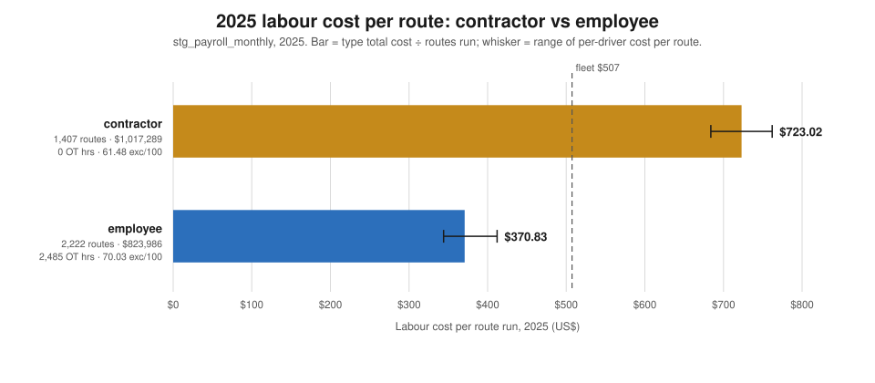
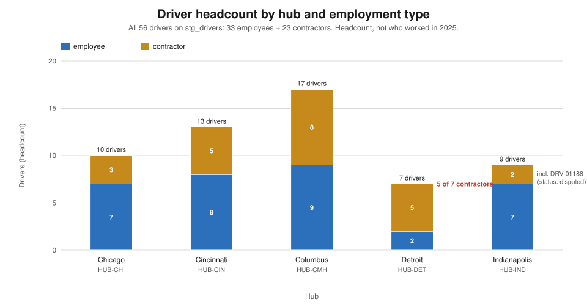
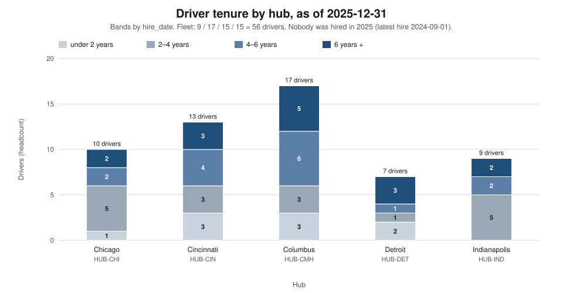
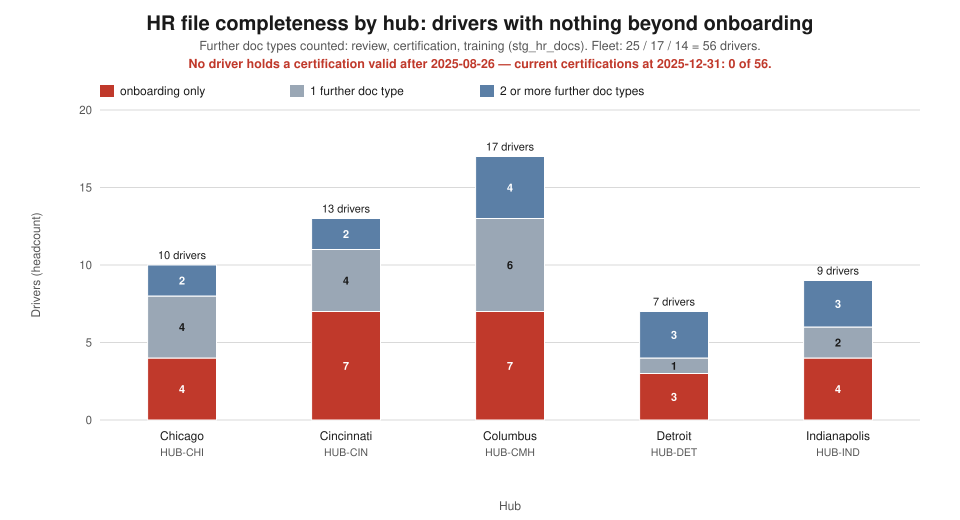
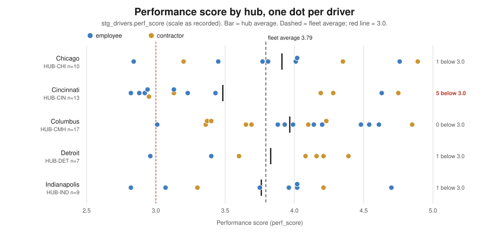
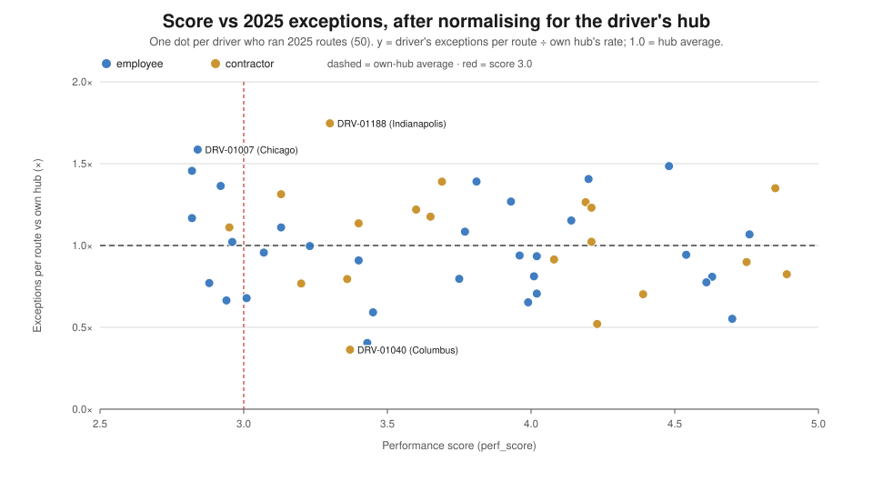
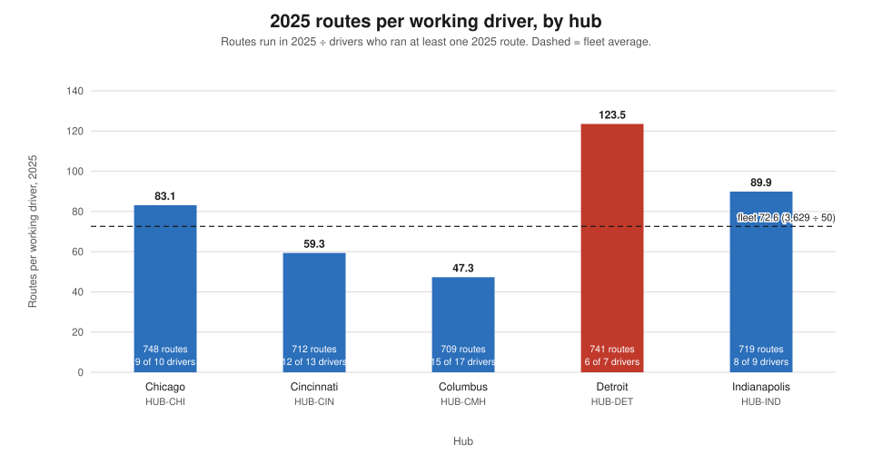

# People — the workforce behind the numbers, for the Head of People

*Persona report. Jaffle Logistics, 2025 review. Every figure comes from `execute_sql` queries run
through the dbt Platform remote MCP against `hive_metastore.dbt_smcintyre_jaffle_logistics_prod`
(data pack dated 2026-10-10; the data runs to 2025-12-31). The SQL for each figure is in the appendix.
Charts are generated by `scripts/persona_people_charts.py` from the same figures. Where a number below is
arithmetic on the query output (a ratio, a share, a difference), the calculation is shown.*

> **A correction to this report's own brief.** The brief assumed the warehouse holds **no wages, hours
> or overtime**. That is out of date: `stg_payroll_monthly` (2,954 rows, 56 drivers, 2018-05 to 2025-12,
> $8,673,526.80 total cost) now carries hours, hourly rate, gross pay, overtime, total cost and routes
> run per driver per month. So this report **answers the labour-cost question** it was expected to leave
> open, and the largest people finding in the data is a cost finding (§3.1). What is still missing is
> **benefits and absence**. There is still **no termination date**, so attrition below is inferred, not
> measured.

---

## 1. The two-minute read

- **What is fine.** The work gets done by the people we have. Every hub ran 709–748 routes in 2025, and
  quality does not follow employment type: within hubs, contractors are better on exceptions at two hubs
  and worse at three. Every driver has an onboarding record.
- **What is not.** The HR file has stopped being kept. **Not one of the 56 drivers holds a current
  certification** (the latest expires 2025-08-26). There was **no performance review in 2025**, and 37
  of 56 drivers have never had one. Six drivers listed `active` ran no route and earned nothing in 2025.
  Nobody was hired in 2025.
- **What it costs.** In 2025 a contractor route cost **$723.02** and an employee route **$370.83**:
  1.95×. Contractors ran 38.8% of routes and took 55.2% of the $1,841,275.07 payroll. Both types are
  booked at nine hours a route, so the gap is entirely the rate: about $80 an hour against $41. If
  contractor routes had been paid at the employee rate, 2025 payroll would have been **at most
  $495,531** lower. That is an upper bound, not a saving: employee cost here excludes benefits.
- **What is exposed.** Detroit (`HUB-DET`). Six working drivers ran 741 routes, **123.5 each, 2.6× a
  Columbus driver's load**. Four of those six are contractors, so Detroit is also the most expensive hub
  per route ($590.02). One absence there moves about 124 routes onto five people. Compliance is also
  exposed: four drivers whose DOT medical certificate lapsed between 2021 and 2023 still ran routes in
  2025.
- **What we do not know.** Who left, and when. Absence. Benefits. Whether `perf_score` measures
  driving. After normalising for hub and exposure, the score barely predicts a driver's exception or
  incident rate. Four in ten incidents carry no driver at all.

---

## 2. What this seat owns

The Head of People owns who drives for us and on what terms: hiring, retention, onboarding and
certification compliance, the employee/contractor mix, and labour cost. This seat reads an operational
failure as a possible staffing problem in disguise. It asks whether a bad number follows a person, a hub
or a gap in cover, and whether the HR record would stand up if a regulator, a court or a customer asked
for it. The brief describes labour as the largest cost line. This report measures that cost line but
does not test the "largest" claim, because the other cost lines are not in this data pack.

---

## 3. Findings

### 3.1 Contractors cost twice as much per route as employees, for work that is no better and no worse

**Claim.** In 2025 contractors cost **$723.02 per route** and employees **$370.83**, a ratio of 1.95.
The gap is a pay-rate gap and has nothing to do with productivity. Both types are booked at exactly nine
hours per route (contractors 12,663 h ÷ 1,407 routes; employees 19,998 h ÷ 2,222 routes), so the
difference is the hourly cost: $1,017,289.35 ÷ 12,663 h = **$80.34/h** for contractors against
$823,985.72 ÷ 19,998 h = **$41.20/h** for employees, overtime included. The split holds at driver level
too: every contractor sits between $684 and $762 per route and every employee between $344 and $412
(Q16). The two ranges do not overlap.



*What this says: the cheapest contractor route ($684) costs two-thirds more than the dearest employee
route ($412).*

**Evidence.** 2025 payroll by employment type (Q15):

| type | cost | hours | overtime hrs | routes | cost per route | exceptions per 100 routes (Q19) |
|---|---|---|---|---|---|---|
| contractor | $1,017,289.35 | 12,663 | 0 | 1,407 | **$723.02** | 61.48 |
| employee | $823,985.72 | 19,998 | 2,485 | 2,222 | **$370.83** | 70.03 |
| **total** | **$1,841,275.07** | **32,661** | **2,485** | **3,629** | $507 | 66.71 |

**Reconciliation.** Cost: $1,017,289.35 + $823,985.72 = **$1,841,275.07**, equal to the sum of the five
hubs' 2025 payroll in Q14. Routes: 1,407 + 2,222 = **3,629**, equal to 2025 routes in `stg_routes` (Q10)
and to `routes_run` in payroll (Q14). Hours: 12,663 + 19,998 = **32,661**, equal to the five hubs' 2025
hours. Overtime: all 2,485 hours are employee hours, equal to the five hubs' 2025 overtime (581 + 628 +
692 + 149 + 435).

**Quality does not follow employment type.** At fleet level contractors look better (61.48 vs 70.03
exceptions per 100 routes). That is a **hub-mix effect**: seven of Chicago's ten drivers are employees,
and Chicago's 2025 rate (124.47) is more than double every other hub's. Compare within each hub, using
the per-driver routes and exceptions in Q11:

| hub | contractor exc / 100 routes | employee exc / 100 routes | better |
|---|---|---|---|
| HUB-CHI | 98.8 (164 / 166) | 131.8 (767 / 582) | contractor |
| HUB-CIN | 57.7 (142 / 246) | 45.1 (210 / 466) | employee |
| HUB-CMH | 50.0 (160 / 320) | 53.7 (209 / 389) | contractor |
| HUB-DET | 52.7 (256 / 486) | 49.4 (126 / 255) | employee |
| HUB-IND | 75.7 (143 / 189) | 46.0 (244 / 530) | employee |

The within-hub figures reconcile to Q19: contractor exceptions 164 + 142 + 160 + 256 + 143 = 865 on
166 + 246 + 320 + 486 + 189 = 1,407 routes. The Indianapolis contractor figure is mostly one driver,
`DRV-01188` (94 exceptions on 100 routes), whose relationship ended in September (§3.3). **The data gives
no quality reason to pay the contractor premium.**

**What the premium amounts to (arithmetic, labelled).** 1,407 contractor routes × ($723.02 − $370.83) =
**$495,531**. This is the most the 2025 bill could have fallen if those routes had been paid at the
employee rate. It is **not** a saving estimate. Employee cost in this table carries no benefits, payroll
taxes or equipment, and contractor cost may include a vehicle or fuel that an employee would need us to
provide. Neither is in the data (§4).

**Detroit pays the premium most.** Detroit's 2025 cost per route is **$590.02**, the highest of the five
hubs (Chicago $448.46, Indianapolis $460.34, Cincinnati $495.54, Columbus $542.76; Q14). Detroit is
the only hub where contractors are the majority (5 of 7), and contractors ran 486 of its 741 routes. It
also logs the least overtime (149 hours), because contractors log none.

**Overtime is rising faster than work.** Fleet overtime went 1,120 → 1,452 → **2,485** hours over
2023–2025, up 71% in the last year, while booked hours rose 3% (31,689 → 32,661). Chicago (312 → 581),
Cincinnati (344 → 628) and Columbus (364 → 692) roughly doubled. This fits the silent attrition in §3.3,
with fewer working drivers covering the same routes. That link is inferred, not measured.

### 3.2 Headcount: 56 on the books, 50 actually driving, nobody hired in 2025

**Claim.** The roster holds 56 drivers: 33 employees and 23 contractors. Only **50 ran a route in
2025**. No driver was hired in 2025 (latest hire 2024-09-01), so tenure runs from 1.3 to 7.6 years and
30 of 56 drivers have been with us four years or more. The workforce is static and ageing, and it is
shrinking without being replaced.



*What this says: Columbus is the largest hub (17) and Detroit the smallest (7). Detroit is also the only
hub where contractors outnumber employees.*

**Evidence.** Headcount by hub and employment type (Q2, Q3), with average `perf_score`:

| hub | contractor | employee | total | avg score, contractor / employee |
|---|---|---|---|---|
| HUB-CHI | 3 | 7 | 10 | 4.15 / 3.81 |
| HUB-CIN | 5 | 8 | 13 | 3.86 / 3.25 |
| HUB-CMH | 8 | 9 | 17 | 3.83 / 4.09 |
| HUB-DET | 5 | 2 | 7 | 4.09 / 3.18 |
| HUB-IND | 2 (1 disputed) | 7 | 9 | 4.21 / 3.76 |
| **ALL** | **23** | **33** | **56** | |

**Reconciliation.** 23 + 33 = 56; hub totals 10 + 13 + 17 + 7 + 9 = 56. Every driver is `active` except
`DRV-01188` (HUB-IND, contractor, `disputed`).



*What this says: more than half the fleet (30 of 56) has four or more years' service. There is no 2025
intake behind them, and Indianapolis has nobody under two years.*

**Evidence.** Tenure bands by `hire_date`, as of 2025-12-31 (Q4):

| hub | <2y | 2–4y | 4–6y | 6y+ | total |
|---|---|---|---|---|---|
| HUB-CHI | 1 | 5 | 2 | 2 | 10 |
| HUB-CIN | 3 | 3 | 4 | 3 | 13 |
| HUB-CMH | 3 | 3 | 6 | 5 | 17 |
| HUB-DET | 2 | 1 | 1 | 3 | 7 |
| HUB-IND | 0 | 5 | 2 | 2 | 9 |
| **ALL** | **9** | **17** | **15** | **15** | **56** |

**Reconciliation.** 9 + 17 + 15 + 15 = 56, and each hub row sums to its Q2 headcount. The six drivers
in §3.3 who stopped working were all hired 2022–2024, so they sit in the two shortest bands. The
workforce actually driving is older than this chart shows.

### 3.3 Attrition, as far as the record honestly goes: one recorded exit, six silent ones

**Claim.** The HR file records **one** departure. Payroll and routes show **six more** drivers who have
stopped working while their `status` still says `active`. Taken together, 7 of 56 drivers on the roster
(12.5%) were not working at year end. This is a **proxy** for attrition: without a termination date, we
cannot say when the six left or why.

**The one recorded exit: `DRV-01188` (HUB-IND, contractor).** The HR documents (Q8) tell the whole
story in sequence:

| doc | date | record |
|---|---|---|
| `HR-6106` | valid to 2025-05-24 | Forklift certification, lapsed before what follows |
| `HR-9300` | 2025-08-15 | Verbal warning: incomplete routes / in-window failures |
| `HR-9301` | 2025-08-22 | Written warning: NO-CALL/NO-SHOW 08/21 (12 stops missed, unreachable) |
| `HR-9302` | 2025-09-08 | DEACTIVATION NOTICE: relationship deactivated for cause (driver disputes) |
| `HR-6127` | 2025-09-15 | EXIT RECORD: contractor relationship ended 2025-09-15; equipment, fuel card and app access returned; final settlement processed by D. Marchetti (People Ops) |

The roster still lists `DRV-01188` as `disputed`, not ended, three and a half months after the exit
record. Before the exit this driver ran 100 routes in 2025 with 94 exceptions. Relative to Indianapolis
that is the worst hub-normalised exception rate in the fleet (1.75× the hub; §3.5). Here, the
performance problem was real and was handled through the documents. This is the only case where the HR
file and the operational data tell the same story end to end.

**The six silent leavers.** These drivers ran **zero routes and earned zero pay in 2025**, while
`status = 'active'` (Q11, Q16). All six were hired 2022–2024 and ran routes in 2023–2024:

| driver | hub | type | perf_score | HR docs beyond onboarding |
|---|---|---|---|---|
| `DRV-01189` | HUB-CMH | contractor | 4.10 | review |
| `DRV-01190` | HUB-CHI | contractor | 4.35 | none |
| `DRV-01191` | HUB-IND | employee | 4.02 | none |
| `DRV-01192` | HUB-CIN | contractor | 4.28 | none |
| `DRV-01193` | HUB-DET | contractor | 4.16 | none |
| `DRV-01194` | HUB-CMH | employee | 3.88 | none |

All six score **above the fleet average of 3.79**. As far as `perf_score` can say anything (§3.5), the
people we lost without noticing were not the weak ones. None has an exit record, so the HR file cannot
say whether they resigned, were let go or are on leave.

**Other HR events on file (Q8, Q9).** There are 11 disciplinary records for 9 drivers. Four drivers
were disciplined in 2025: `DRV-01004` (HR-6051, 2025-01-04, verbal warning, late starts), `DRV-01023`
(HR-6058, 2025-04-22, coaching, POD compliance), `DRV-01047` (HR-6050, 2025-09-01, coaching, POD
compliance) and `DRV-01188` (above). The earlier records are `HR-6126` DRV-01021 (2021), `HR-6123`
DRV-01034 (2023), `HR-6124` DRV-01046 (2020), `HR-6125` DRV-01049 (2022) and `HR-6122` DRV-01031 (2024).
**There are no transfer records.** No `doc_type` covers a hub move, so transfers cannot be counted.

**What a termination-date field would add.** It would turn "seven people not working" into an
attrition rate by hub, type and tenure band, with a date. It would separate a 2024 leaver from a 2025
one. It would let us test whether overtime rose *after* each departure (§3.1) instead of only alongside
them. And it would stop one roster entry in eight being someone who no longer drives.

### 3.4 The HR file: everyone was onboarded, almost nobody has been kept current

**Claim.** Every driver has an onboarding record, and after that the file thins out fast. **25 of 56
drivers hold nothing beyond onboarding**: no review, no certification, no training. No certification is
current at 2025-12-31, and none has been *recorded* since 2023-08-27. There was no 2025 performance
review. This is a compliance risk, and it is the fastest of these problems to fix.



*What this says: at Cincinnati more than half the drivers (7 of 13) have only an onboarding file, and
no hub has a single current certification.*

**Evidence.** Document coverage (Q9):

| doc_type | records | drivers covered | first … latest |
|---|---|---|---|
| onboarding | 56 | 56 | 2018-05-09 … 2024-09-03 |
| review | 30 | 19 | 2019-06-22 … **2024-12-27** |
| certification | 20 | 15 | 2019-02-28 … **2023-08-27** |
| training | 15 | 12 | 2021-01-19 … 2025-12-20 |
| disciplinary | 11 | 9 | 2020-08-24 … 2025-09-08 |
| exit | 1 | 1 | 2025-09-15 |
| **total** | **133** | | |

**Reconciliation.** 56 + 30 + 20 + 15 + 11 + 1 = **133**, the full `stg_hr_docs` row count (Q1). Chart
split: 25 onboarding-only + 17 with one further doc type + 14 with two or more = **56**.

**Who has nothing beyond onboarding, by hub (Q7).** The ids below are the work list:

| hub | onboarding only | ids |
|---|---|---|
| HUB-CHI | 4 of 10 | `DRV-01005`, `DRV-01007`, `DRV-01011`, `DRV-01190` |
| HUB-CIN | 7 of 13 | `DRV-01003`, `DRV-01023`, `DRV-01025`, `DRV-01026`, `DRV-01029`, `DRV-01038`, `DRV-01192` |
| HUB-CMH | 7 of 17 | `DRV-01010`, `DRV-01013`, `DRV-01016`, `DRV-01030`, `DRV-01043`, `DRV-01049`, `DRV-01194` |
| HUB-DET | 3 of 7 | `DRV-01004`, `DRV-01022`, `DRV-01193` |
| HUB-IND | 4 of 9 | `DRV-01032`, `DRV-01042`, `DRV-01045`, `DRV-01191` |

**Certifications: 15 drivers ever certified, 0 current.** All 20 certification records have expired
(Q8). Four lapsed during 2025: `HR-6099` DRV-01028 forklift (2025-02-18), `HR-6106` DRV-01188 forklift
(2025-05-24), `HR-6107` DRV-01034 first aid/CPR (2025-07-23) and `HR-6112` DRV-01019 air brake
(2025-08-26, the latest of all). The rest lapsed between 2021 and 2024. The 41 drivers never certified
include every driver at Chicago except `DRV-01017` and `DRV-01035`.

**The sharpest compliance item: lapsed DOT medicals on drivers still driving.** Four drivers hold a DOT
medical certificate that has expired. All four ran routes in 2025:

| doc | driver | hub | DOT medical valid through | 2025 routes |
|---|---|---|---|---|
| `HR-6110` | `DRV-01039` | HUB-CMH | 2021-11-01 | 58 |
| `HR-6113` | `DRV-01001` | HUB-CMH | 2022-06-21 | 37 |
| `HR-6102` | `DRV-01035` | HUB-CHI | 2023-06-03 | 79 |
| `HR-6104` | `DRV-01017` | HUB-CHI | 2023-06-28 | 80 |

Whether these vehicles require a DOT medical is **not recorded** in the data. If they do, this table is
a regulatory exposure, and the 52 drivers with no DOT medical on file at all are a larger one. If they
do not, the gap is housekeeping. Either way it is a five-minute check for each driver.

**Reviews.** 19 of 56 drivers have ever been reviewed. Coverage by hub is Columbus 8 of 17, Detroit 4 of
7, Chicago 3 of 10, Cincinnati 3 of 13 and Indianapolis **1 of 9** (`DRV-01033`). The last review on file
is dated 2024-12-27. That means `perf_score` cannot come from a 2025 review, and its source and date are
unknown (§4).

**Training** is the only development record still being written in 2025 (latest 2025-12-20). It covers
12 drivers.

### 3.5 Does performance travel with the person? Barely, once hub and workload are taken out

**Claim.** The obvious ranking of "worst drivers" is really a ranking of hubs and workloads. After each
driver's exceptions and incidents are normalised for their route count and their own hub's rate, the
performance score shows only a **weak** link to how a driver actually performs. The eight drivers
scoring below 3.0 run about **20% more exceptions than their hubs would predict**, and the eight scoring
4.5 or above about 10% fewer. Across all 50 working drivers, though, the score barely ranks anyone
(correlation −0.12). Two of the five worst hub-normalised drivers score above 4.0. **Most of the effect
disappears under normalisation, and that is the finding.** This agrees with
`reports/columbus-damage-forensics.md` §4.5, which found that Columbus's most-implicated driver for
damage (`DRV-01028`) was "worth watching, not acting on" once exposure was counted.

**Method.** Normalised exception ratio = (driver's 2025 exceptions ÷ driver's 2025 routes) ÷ (driver's
hub's 2025 exceptions ÷ hub routes). A value of 1.0 means "exactly as their hub". The same is done for
2025 attributed incidents. Inputs are Q11, Q13 and Q10. Only the 50 drivers who ran 2025 routes are
included. **`perf_score` is itself a proxy.** It has no recorded source, method or date, and it cannot
come from a 2025 review because there were none.



*What this says: Cincinnati's scores sit lowest (5 of 13 below 3.0, out of 8 in the whole fleet) and
Columbus has none below 3.0. Contractors (amber) score above employees at four of five hubs (Q3, Q5,
Q6).*



*What this says: drivers at every score from 2.8 to 4.9 sit both above and below their hub's average.
The score does not sort them.*

**Evidence.**

1. **Unnormalised, the hub decides the ranking.** The six worst raw exception rates in the fleet all
   belong to Chicago drivers. They include `DRV-01035` (score 4.76; 132.9 per 100 routes) and `DRV-01005`
   (score 4.89; 102.6), two of the fleet's three top scorers. Chicago's whole-hub rate rose from 71.06 in
   2024 to 124.47 in 2025 (Q10). That is a hub event, not a cohort of bad drivers.
2. **Normalised, the score helps only at the extremes.** Grouping the 50 working drivers by score:

   | score group | drivers | routes | exceptions | expected at own-hub rate | observed ÷ expected |
   |---|---|---|---|---|---|
   | below 3.0 | 8 | 545 | 402 | 333.7 | **1.20** |
   | 4.5 and above | 8 | 497 | 331 | 369.3 | **0.90** |

   Across score quartiles the ratio runs 1.16 / 0.93 / 1.03 / 0.89, from lowest to highest score. It
   does not go steadily down as the score goes up. The correlation between score and normalised
   exception ratio is −0.12. Before normalisation it is −0.01.
3. **The worst after normalisation is a mixed list.** The highest ratios are `DRV-01188` 1.75 (score
   3.30, exited), `DRV-01007` 1.59 (2.84), `DRV-01015` 1.48 (**4.48**), `DRV-01008` 1.46 (2.82) and
   `DRV-01010` 1.41 (**4.20**). Two of these five are genuinely low scorers with high exceptions, and
   `DRV-01007` and `DRV-01008` are the people to look at. Two others are rated well above average.
4. **Cincinnati's low scores do not show up in Cincinnati's results.** Cincinnati holds 5 of the
   fleet's 8 sub-3.0 drivers (`DRV-01008`, `DRV-01025`, `DRV-01027`, `DRV-01029`, `DRV-01034`), yet its
   2025 exception rate (49.44) is the **lowest** of any hub (Q10). Two of those five (`DRV-01027` 0.66,
   `DRV-01029` 0.77) run fewer exceptions than their own hub. Either the score is set more harshly at
   Cincinnati, or it measures something other than route outcomes. This is an inference; the data does
   not say who sets the score.
5. **Incident involvement is mostly exposure.** A driver's 2025 attributed incidents track their 2025
   route count (correlation 0.48). The highest all-time incident counts belong to Detroit drivers carrying
   the heaviest loads: `DRV-01014` 11, `DRV-01037` 9, `DRV-01022` 8 (Q12), on 115, 123 and 143 routes
   in 2025. After normalisation the score has almost no link to incident rate (correlation −0.10). The
   individual ratios rest on 0–5 events each, too few to act on, which is the same conclusion the
   Columbus forensics reached for damage.
6. **"Consistently worst" cannot be tested across years.** The pack holds per-driver exceptions for
   2025 only, and per-driver incidents as 2025 plus all-time, with no per-driver route counts before 2025.
   So no driver can be shown to be persistently bad after normalisation. This is a named gap (§4).

**Incident attribution caps all of this.** 160 incidents carry no `driver_id` (Columbus 47, Chicago 31,
Indianapolis 28, Cincinnati 27, Detroit 27; Q12). Any "incidents per driver" figure is therefore an
under-count and a **proxy** for incident involvement. *Reconciliation note:* the corpus holds **384
incidents** (`stg_incidents`, Q1). Of these, **224 (58%) carry a driver** and **160 (42%) do not**.
This reconciles exactly with Q12, which attributes 224 incidents to 51 drivers and leaves 160 with no
driver: 224 + 160 = 384. It also matches the published Columbus figures: Columbus's 54 attributed plus
47 unattributed incidents equals the 24 + 30 + 47 = 101 that `columbus-damage-forensics.md` §4.1 counts
for 2023–2025.

### 3.6 Coverage and thin spots: Detroit runs on six people

**Claim.** Detroit ran 741 routes in 2025 with **six working drivers, 123.5 routes each**, against a
fleet average of 72.6 and 47.3 at Columbus. Detroit is where a single absence hurts. If one Detroit
driver is out for the year, the other five each carry 148.2 routes, a load no other hub's drivers come
near. Detroit also has the fewest active vehicles (4 active, 2 retired; Q18) for those six drivers.



*What this says: a Detroit driver carries roughly two and a half times the routes of a Columbus driver,
on the same nine-hour route.*

**Evidence.** 2025 routes (Q10) ÷ drivers who ran at least one 2025 route (Q11):

| hub | 2025 routes | headcount | working drivers | routes per working driver | active vehicles (Q18) |
|---|---|---|---|---|---|
| HUB-CHI | 748 | 10 | 9 | 83.1 | 8 |
| HUB-CIN | 712 | 13 | 12 | 59.3 | 7 |
| HUB-CMH | 709 | 17 | 15 | 47.3 | 10 |
| **HUB-DET** | **741** | **7** | **6** | **123.5** | **4** |
| HUB-IND | 719 | 9 | 8 | 89.9 | 8 |
| **ALL** | **3,629** | **56** | **50** | **72.6** | **37** |

**Reconciliation.** Routes 748 + 712 + 709 + 741 + 719 = 3,629. Working drivers 9 + 12 + 15 + 6 + 8 =
50, which is 56 headcount minus the 6 silent leavers (§3.3). Per-driver routes in Q11 sum to each hub's
total. Vehicles 8 + 7 + 10 + 4 + 8 = 37 active, of 44.

Detroit's individual loads are 143 (`DRV-01022`), 132 (`DRV-01021`), 123 (`DRV-01037`), 116
(`DRV-01004`), 115 (`DRV-01014`) and 112 (`DRV-01046`). Detroit's seventh driver, `DRV-01193`, is one of
the silent leavers. Columbus sits at the other end: 15 working drivers share a similar route volume.
Payroll books every route at nine hours, so a working Detroit driver was booked about 1,112 hours in
2025 against about 425 at Columbus (Q14 hours ÷ working drivers). The fleet-wide average of 653 booked
hours per working driver is about a third of a full-time year. Either most drivers are part-time, or
payroll hours record route time only. The data does not say which (§4).

*A note on route counts.* Q10 gives Columbus 666 routes in both 2023 and 2024. `columbus-damage-forensics.md`
§4.1 reported 712 and 684 for the same years. The 2025 figure (709) agrees. The difference is most likely
a reload of `stg_routes` alongside the payroll change. It does not touch any 2025 finding here or there,
but the forensics report's 2023–2024 damage rates per 100 routes would move slightly on the current data.

---

## 4. What the data cannot tell you

| gap | what is missing | decision it blocks |
|---|---|---|
| **Termination dates** | No end date on `stg_drivers`; `status` still says `active` for six non-working drivers and `disputed` for one exited driver | An attrition rate by hub, type or tenure; whether 2025 overtime followed departures; a backfill plan |
| **Absence records** | No sickness, leave or no-show log (the one no-show on file is in a disciplinary note, HR-9301) | Sizing the cover Detroit needs; telling a leaver from a long-term absence among the six silent drivers |
| **Benefits and employer on-costs** | Payroll carries gross pay and total cost, but no benefits, payroll tax or equipment cost | The real contractor-vs-employee comparison; the $495,531 bound in §3.1 cannot become a saving estimate without it |
| **Clocked hours** | Payroll hours are exactly nine per route at every hub in every year, so they appear to be imputed from routes, not clocked | Productivity per hour; fatigue and hours-of-service risk at Detroit; part-time vs full-time status |
| **What contractors are paid for** | Whether the contractor rate includes their own vehicle, fuel or insurance | Whether converting contractor routes to employee routes needs more vehicles (Detroit has 4 active) |
| **Source of `perf_score`** | No author, method or date; no 2025 review exists to produce it | Using the score for pay, discipline or retention decisions |
| **A driver-level quality measure** | Per-driver exceptions exist for 2025 only; 160 incidents name no driver; no per-driver pre-2025 route counts | Whether any driver is *consistently* worst after normalisation (§3.5 item 6) |
| **Certification requirements** | Which vehicles or routes legally require a DOT medical, air-brake or hazmat certificate | Whether the lapsed certificates in §3.4 are a regulatory breach or a housekeeping gap |
| **Transfers** | No transfer document type; one hub per driver | Whether thin hubs could be covered by moving drivers |

**What to demand, in priority order.** (1) A termination date and reason on every driver record, plus
a status fix for `DRV-01188` and the six silent leavers. (2) A list of the certificates each role
legally needs, checked against the four lapsed DOT medicals this week. (3) Clocked hours and an absence
log in payroll. (4) Benefits and employer on-costs per employee, so the contractor premium can be
priced. (5) A driver-level quality measure built from exceptions **per route, relative to the hub**, with
`driver_id` made mandatory on incidents. Do not use the raw incident count.

---

## 5. Appendix: the queries

All queries run through the **dbt Platform remote MCP `execute_sql` tool** against
`hive_metastore.dbt_smcintyre_jaffle_logistics_prod`. Derived figures (ratios, shares, normalised rates,
the $495,531 bound) are arithmetic on these outputs and are reproduced in
`scripts/persona_people_charts.py`, which embeds the per-driver rows.

**Q1. Corpus size and freshness** (D0)

```sql
SELECT 'stg_drivers' AS t, count(*) AS n, cast(min(hire_date) AS string) AS mn, cast(max(hire_date) AS string) AS mx FROM hive_metastore.dbt_smcintyre_jaffle_logistics_prod.stg_drivers
UNION ALL SELECT 'stg_hr_docs', count(*), cast(min(created_at) AS string), cast(max(created_at) AS string) FROM hive_metastore.dbt_smcintyre_jaffle_logistics_prod.stg_hr_docs
UNION ALL SELECT 'stg_routes', count(*), cast(min(service_date) AS string), cast(max(service_date) AS string) FROM hive_metastore.dbt_smcintyre_jaffle_logistics_prod.stg_routes
UNION ALL SELECT 'stg_incidents', count(*), cast(min(occurred_at) AS string), cast(max(occurred_at) AS string) FROM hive_metastore.dbt_smcintyre_jaffle_logistics_prod.stg_incidents
UNION ALL SELECT 'stg_payroll_monthly', count(*), cast(min(payroll_month) AS string), cast(max(payroll_month) AS string) FROM hive_metastore.dbt_smcintyre_jaffle_logistics_prod.stg_payroll_monthly
UNION ALL SELECT 'stg_vehicles', count(*), NULL, NULL FROM hive_metastore.dbt_smcintyre_jaffle_logistics_prod.stg_vehicles
```

Output (re-run 2026-10-10):

| relation | rows | window |
|---|---|---|
| stg_drivers | 56 | hire_date 2018-05-09 .. 2024-09-01 |
| stg_hr_docs | 133 | created_at 2018-05-09 .. 2025-12-20 |
| stg_routes | 10,488 | service_date 2023-01-01 .. 2025-12-31 |
| stg_incidents | 384 (224 with a driver_id, 160 without) | occurred_at 2023-01-04 .. 2025-12-31 |
| stg_payroll_monthly | 2,954 | payroll_month 2018-05 .. 2025-12 |
| stg_vehicles | 44 | — |

**Q2. Headcount by hub and employment type** (§3.2)

```sql
SELECT hub_id, employment_type, count(*) AS n FROM hive_metastore.dbt_smcintyre_jaffle_logistics_prod.stg_drivers GROUP BY 1,2 ORDER BY 1,2
```

**Q3. Hub × employment type × status with average perf** (§3.2)

```sql
SELECT hub_id, employment_type, status, count(*) AS n, round(avg(perf_score),2) AS avg_perf FROM hive_metastore.dbt_smcintyre_jaffle_logistics_prod.stg_drivers GROUP BY 1,2,3 ORDER BY 1,2,3
```

**Q4. Tenure bands by hub, as of 2025-12-31** (§3.2)

```sql
SELECT hub_id, count(*) AS n,
 sum(case when datediff('2025-12-31', hire_date) < 730 then 1 else 0 end) AS t_lt2y,
 sum(case when datediff('2025-12-31', hire_date) between 730 and 1459 then 1 else 0 end) AS t_2_4y,
 sum(case when datediff('2025-12-31', hire_date) between 1460 and 2189 then 1 else 0 end) AS t_4_6y,
 sum(case when datediff('2025-12-31', hire_date) >= 2190 then 1 else 0 end) AS t_ge6y
FROM hive_metastore.dbt_smcintyre_jaffle_logistics_prod.stg_drivers GROUP BY 1 ORDER BY 1
```

**Q5. Performance bands by hub** (§3.5)

```sql
SELECT hub_id, count(*) AS n,
 sum(case when perf_score < 3.0 then 1 else 0 end) AS lt3,
 sum(case when perf_score >= 3.0 and perf_score < 3.5 then 1 else 0 end) AS b3_35,
 sum(case when perf_score >= 3.5 and perf_score < 4.0 then 1 else 0 end) AS b35_4,
 sum(case when perf_score >= 4.0 and perf_score < 4.5 then 1 else 0 end) AS b4_45,
 sum(case when perf_score >= 4.5 then 1 else 0 end) AS ge45,
 round(min(perf_score),2) AS mn, round(avg(perf_score),2) AS av, round(max(perf_score),2) AS mx
FROM hive_metastore.dbt_smcintyre_jaffle_logistics_prod.stg_drivers GROUP BY 1 ORDER BY 1
```

Output, for reference (the dot plot below draws it per driver):

| hub | <3.0 | 3.0–3.5 | 3.5–4.0 | 4.0–4.5 | ≥4.5 | n | min | avg | max |
|---|---|---|---|---|---|---|---|---|---|
| HUB-CHI | 1 | 2 | 2 | 3 | 2 | 10 | 2.84 | 3.91 | 4.89 |
| HUB-CIN | 5 | 4 | 0 | 2 | 2 | 13 | 2.82 | 3.48 | 4.75 |
| HUB-CMH | 0 | 4 | 5 | 5 | 3 | 17 | 3.01 | 3.97 | 4.85 |
| HUB-DET | 1 | 1 | 1 | 4 | 0 | 7 | 2.96 | 3.83 | 4.39 |
| HUB-IND | 1 | 2 | 2 | 3 | 1 | 9 | 2.82 | 3.76 | 4.70 |

Reconciliation: 8 + 13 + 10 + 17 + 8 = 56 drivers across the bands; fleet min 2.82, average 3.79,
max 4.89.

**Q6. Per-driver roster** (§3.2, §3.5)

```sql
SELECT driver_id, hub_id, employment_type, status, cast(hire_date AS string) AS hire_date, round(perf_score,2) AS perf
FROM hive_metastore.dbt_smcintyre_jaffle_logistics_prod.stg_drivers ORDER BY hub_id, perf
```

**Q7. Per-driver document matrix** (§3.4)

```sql
SELECT d.driver_id, d.hub_id, d.employment_type, round(d.perf_score,2) AS perf,
 max(case when h.doc_type='onboarding' then 1 else 0 end) AS onb,
 max(case when h.doc_type='review' then 1 else 0 end) AS rev,
 max(case when h.doc_type='certification' then 1 else 0 end) AS cert,
 max(case when h.doc_type='training' then 1 else 0 end) AS trn,
 max(case when h.doc_type='disciplinary' then 1 else 0 end) AS disc,
 max(case when h.doc_type='exit' then 1 else 0 end) AS exit_doc
FROM hive_metastore.dbt_smcintyre_jaffle_logistics_prod.stg_drivers d
LEFT JOIN hive_metastore.dbt_smcintyre_jaffle_logistics_prod.stg_hr_docs h ON d.driver_id=h.driver_id
GROUP BY 1,2,3,4 ORDER BY 2,1
```

**Q8. HR document bodies: exit, disciplinary, certification, review** (§3.3, §3.4)

```sql
SELECT hr_doc_id, driver_id, doc_type, cast(created_at AS string) AS dt, author, body
FROM hive_metastore.dbt_smcintyre_jaffle_logistics_prod.stg_hr_docs
WHERE doc_type IN ('exit','disciplinary','certification','review') ORDER BY doc_type, driver_id, created_at
```

**Q9. Document type counts and windows** (§3.4)

```sql
SELECT doc_type, count(*) AS n, count(distinct driver_id) AS drivers, cast(min(created_at) AS string) AS mn, cast(max(created_at) AS string) AS mx
FROM hive_metastore.dbt_smcintyre_jaffle_logistics_prod.stg_hr_docs GROUP BY 1 ORDER BY 2 DESC
```

**Q10. Routes and exceptions by hub and year** (§3.1, §3.5, §3.6)

```sql
SELECT hub_id, substr(cast(service_date AS string),1,4) AS yr, count(*) AS routes, sum(exceptions_count) AS exc,
 round(100.0*sum(exceptions_count)/count(*),2) AS exc_per_100
FROM hive_metastore.dbt_smcintyre_jaffle_logistics_prod.stg_routes GROUP BY 1,2 ORDER BY 1,2
```

**Q11. Per-driver 2025 routes and exceptions** (§3.1, §3.3, §3.5, §3.6)

```sql
SELECT r.driver_id, r.hub_id, count(*) AS routes_all,
 sum(case when substr(cast(r.service_date AS string),1,4)='2025' then 1 else 0 end) AS routes_2025,
 sum(case when substr(cast(r.service_date AS string),1,4)='2025' then r.exceptions_count else 0 end) AS exc_2025
FROM hive_metastore.dbt_smcintyre_jaffle_logistics_prod.stg_routes r GROUP BY 1,2 ORDER BY 2,1
```

**Q12. Attributed incidents by driver, all-time** (§3.5)

```sql
SELECT coalesce(driver_id,'(none)') AS driver_id, coalesce(hub_id,'(none)') AS hub_id, count(*) AS incidents, sum(severity) AS sev
FROM hive_metastore.dbt_smcintyre_jaffle_logistics_prod.stg_incidents GROUP BY 1,2 ORDER BY 1
```

**Q13. Incidents by driver, 2025** (§3.5)

```sql
SELECT driver_id, count(*) AS inc_2025, sum(severity) AS sev_2025
FROM hive_metastore.dbt_smcintyre_jaffle_logistics_prod.stg_incidents
WHERE driver_id IS NOT NULL AND substr(cast(occurred_at AS string),1,4)='2025' GROUP BY 1 ORDER BY 1
```

**Q14. Payroll by year and hub** (§3.1, §3.6)

```sql
SELECT substr(cast(payroll_month AS string),1,4) AS yr, hub_id, round(sum(total_cost),2) AS cost,
 round(sum(hours_worked),0) AS hours, round(sum(overtime_hours),0) AS ot_hours, sum(routes_run) AS routes,
 round(sum(total_cost)/nullif(sum(routes_run),0),2) AS cost_per_route
FROM hive_metastore.dbt_smcintyre_jaffle_logistics_prod.stg_payroll_monthly GROUP BY 1,2 ORDER BY 1,2
```

Output, 2023–2025 (routes start in 2023):

| year | hub | cost | hours | OT hours | routes | cost per route |
|---|---|---|---|---|---|---|
| 2023 | HUB-CHI | $307,678.50 | 6,084 | 268 | 676 | $455.15 |
| 2023 | HUB-CIN | $326,670.39 | 5,868 | 200 | 652 | $501.03 |
| 2023 | HUB-CMH | $351,011.34 | 5,994 | 288 | 666 | $527.04 |
| 2023 | HUB-DET | $365,998.05 | 6,102 | 92 | 678 | $539.82 |
| 2023 | HUB-IND | $289,354.62 | 5,994 | 272 | 666 | $434.47 |
| 2024 | HUB-CHI | $322,752.95 | 6,219 | 312 | 691 | $467.08 |
| 2024 | HUB-CIN | $361,112.20 | 6,435 | 344 | 715 | $505.05 |
| 2024 | HUB-CMH | $357,822.44 | 5,994 | 364 | 666 | $537.27 |
| 2024 | HUB-DET | $434,716.35 | 6,570 | 96 | 730 | $595.50 |
| 2024 | HUB-IND | $307,662.69 | 6,471 | 336 | 719 | $427.90 |
| 2025 | HUB-CHI | $335,447.27 | 6,732 | 581 | 748 | $448.46 |
| 2025 | HUB-CIN | $352,827.15 | 6,408 | 628 | 712 | $495.54 |
| 2025 | HUB-CMH | $384,816.30 | 6,381 | 692 | 709 | $542.76 |
| 2025 | HUB-DET | $437,202.31 | 6,669 | 149 | 741 | $590.02 |
| 2025 | HUB-IND | $330,982.04 | 6,471 | 435 | 719 | $460.34 |

Year totals: 2023 $1,640,712.90 / 3,338 routes; 2024 $1,784,066.63 / 3,521 routes; 2025
$1,841,275.07 / 3,629 routes. Hours ÷ routes = 9.0 in every row.

**Q15. Payroll 2025 by employment type** (§3.1)

```sql
SELECT employment_type, round(sum(total_cost),2) AS cost, round(sum(hours_worked),0) AS hrs,
 round(sum(overtime_hours),0) AS ot, sum(routes_run) AS routes,
 round(sum(total_cost)/nullif(sum(routes_run),0),2) AS cpr
FROM hive_metastore.dbt_smcintyre_jaffle_logistics_prod.stg_payroll_monthly
WHERE substr(cast(payroll_month AS string),1,4)='2025' GROUP BY 1 ORDER BY 1
```

**Q16. Per-driver 2025 cost per route** (§3.1, §3.3)

```sql
SELECT driver_id, hub_id, employment_type, round(sum(total_cost),2) AS cost, round(sum(hours_worked),0) AS hrs,
 round(sum(overtime_hours),0) AS ot, sum(routes_run) AS routes,
 round(sum(total_cost)/nullif(sum(routes_run),0),2) AS cpr
FROM hive_metastore.dbt_smcintyre_jaffle_logistics_prod.stg_payroll_monthly
WHERE substr(cast(payroll_month AS string),1,4)='2025' GROUP BY 1,2,3 ORDER BY 1
```

**Q17. Payroll corpus** (correction box)

```sql
SELECT count(*) AS rows_n, count(distinct driver_id) AS drivers, cast(min(payroll_month) AS string) AS mn,
 cast(max(payroll_month) AS string) AS mx, round(sum(total_cost),2) AS total_cost,
 round(sum(hours_worked),0) AS hours, round(sum(overtime_hours),0) AS ot_hours
FROM hive_metastore.dbt_smcintyre_jaffle_logistics_prod.stg_payroll_monthly
```

**Q18. Vehicles by hub and status** (§3.6)

```sql
SELECT hub_id, status, count(*) AS n FROM hive_metastore.dbt_smcintyre_jaffle_logistics_prod.stg_vehicles GROUP BY 1,2 ORDER BY 1,2
```

**Q19. 2025 routes and exceptions by employment type** (§3.1)

```sql
SELECT d.employment_type, count(*) AS routes, sum(r.exceptions_count) AS exc,
 round(100.0*sum(r.exceptions_count)/count(*),2) AS exc_per_100
FROM hive_metastore.dbt_smcintyre_jaffle_logistics_prod.stg_routes r
JOIN hive_metastore.dbt_smcintyre_jaffle_logistics_prod.stg_drivers d ON r.driver_id=d.driver_id
WHERE substr(cast(r.service_date AS string),1,4)='2025' GROUP BY 1 ORDER BY 1
```
